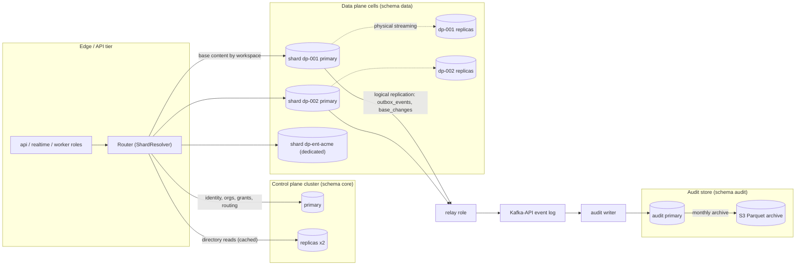
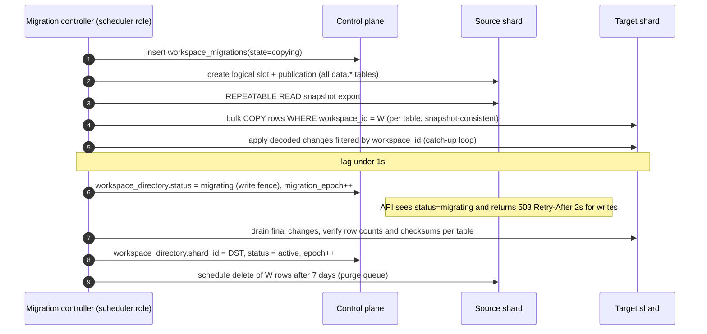
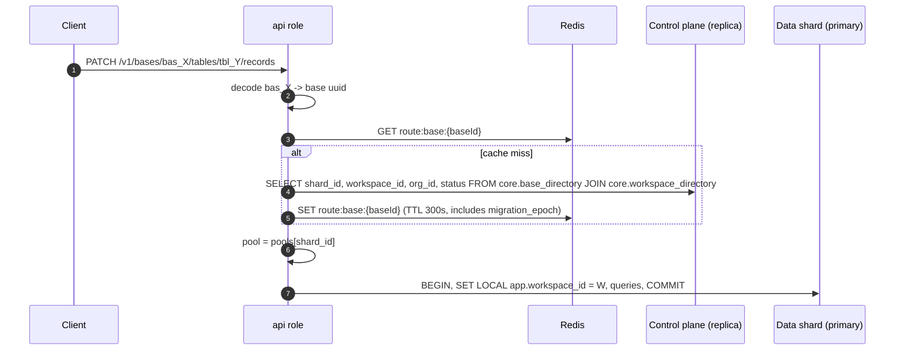
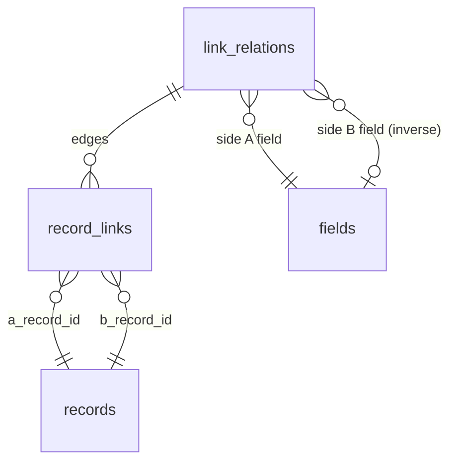
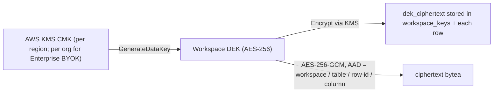

# 04 — Database Architecture

> **Status:** Proposed for architectural approval · **Owner:** Platform Architecture (Database) · **Date:** 2026-10-03
>
> **Sections covered:** Section 6 (Database Architecture): control plane vs data plane; shard/cell model and workspace affinity; routing; schemas and roles; UUIDv7 and public ID encoding; partitioning strategy per large table; JSONB usage policy; normalization decisions; storage of linked records, computed values, configuration documents, permissions, audit/revisions, notifications, attachments, integration credentials, API keys and webhooks; Row-Level Security; connection pooling; read replicas and read-your-writes; vacuum/bloat/HOT; TOAST; expected query patterns; backup/PITR; cross-shard concerns; proposed additions.
>
> **Normative inputs:** [00 — Canonical Decisions](00-canonical-decisions.md) (D2–D6, D10–D12, §3, §5, §13). **DDL:** [05 — Complete SQL Schema](05-sql-schema.md). **Inventory:** [32 — Table & Object Inventory](32-table-and-object-inventory.md).
>
> **Related (owned by other documents, not duplicated here):** record cell encoding & sidecar maintenance → [06](06-record-storage.md); link maintenance algorithms → [09](09-linked-record-engine.md); permission compilation → [19](19-permissions-and-multitenancy.md); revision/undo/trash semantics → [22](22-audit-history-undo-trash.md); field type codecs → [07](07-field-engine.md); filter compilation → [11](11-filter-sort-group.md); event relay → [15](15-events.md); migrations & transaction boundaries → [27](27-data-flows-transactions-migrations.md); ADRs → [33](33-architecture-decision-records.md).

Provenance: everything in this document is **[Ours]** unless labelled otherwise.

---

## 6.1 Goals and constraints

| Goal | Consequence for the database design |
|---|---|
| Users create tables/fields at will (thousands of schema changes per minute platform-wide) | **No dynamic DDL per user table.** User schema is *data* (`data.tables`, `data.fields`); user rows live in one physical `data.records` table per shard (D6). |
| Interactive grid latency (p95 < 150 ms for a 200-row window on ≤ 100k-record tables) | Per-table locality (`records` PK `(table_id, id)`, hash partitions by `table_id`), materialized computed values, typed index sidecars above `INDEX_SIDECAR_THRESHOLD`. |
| Strict tenant isolation in a shared schema | `workspace_id` on every data-plane row, RLS as defense in depth, workspace-affine shards, dedicated shards for Enterprise. |
| Per-base total order for realtime/undo/webhooks | `data.base_runtime.change_seq` allocated inside the write transaction; `data.base_changes (base_id, seq)`. |
| Reliable event delivery | Transactional outbox + logical replication (D11) — the DB *is* the event source of truth. |
| Horizontal growth to 10⁵+ workspaces and 10¹⁰+ records | Many independent shards ("cells"), each a normal PostgreSQL 16 primary + replicas; a tiny global control plane. |
| Operability by a small team | Plain PostgreSQL (RDS/Aurora compatible), no exotic extensions beyond `pg_partman`, `pg_trgm`, `btree_gin`, `pgcrypto`, `pg_stat_statements`. |

Non-goals: running arbitrary user SQL; cross-workspace joins on the hot path; global secondary indexes across shards.

---

## 6.2 Control plane vs data plane



| Plane | Holds | Size profile | Write rate | Why separate |
|---|---|---|---|---|
| **Control plane** (`core`) | identity, sessions, orgs, workspaces directory, routing (`workspace_directory`, `base_directory`, `shards`), grants, tokens, OAuth, SSO/SCIM, billing, usage, notifications, templates, flags | Small–medium (tens to hundreds of GB) | Moderate; spiky on login and notifications | Global facts needed **before** we know which shard to talk to (who is this user? which shard hosts this base?). Must be one consistent place. |
| **Data plane** (`data`) | everything inside a workspace: bases, schema, records, links, views, interfaces, automations + runs, comments, attachments metadata, contacts, change log, outbox | Large (each shard 0.5–4 TB target) | Very high (cell edits, imports, automations) | Scale-out unit; blast-radius containment; noisy-neighbour isolation; data residency (shard per region); dedicated shards for Enterprise. |
| **Audit store** (`audit`) | security/admin audit trail; SIEM export checkpoints | Append-only, large, cold | Append-only stream | Separate retention (up to 7 years), immutability controls, different access path (compliance), never on the hot path of user writes. |

**Decision rules for "which plane does a table go in?"**

1. If it must be read to *authenticate*, *authorize at org/workspace level*, *route*, or *bill* → control plane.
2. If it belongs to exactly one workspace and is read/written together with base content → data plane (same shard as its workspace).
3. If it is a compliance record that must outlive the tenant's data or be immutable → audit store.
4. User-scoped objects that span workspaces/orgs (notifications, notification preferences, sessions, tokens) → control plane, even though their *source* events originate on data plane shards.

**Tradeoff accepted:** Grants (`core.access_grants`) live in the control plane while restrictions (`tables.restrictions`, `fields.restrictions`, `views.visibility`) live with the base on the data plane. Permission evaluation therefore needs both; this is solved by the compiled **PermissionSnapshot** cached in Redis and invalidated by `perm_epoch` (see [19](19-permissions-and-multitenancy.md)). The alternative — grants on the data plane — would make "list all bases I can access across 40 workspaces" a 40-shard fan-out, which is the most common home-screen query.

---

## 6.3 Shard ("cell") model and workspace affinity

**Unit of placement = workspace** (D3). All bases of a workspace, its contact directory base, its automations, runs, attachments metadata, comments, outbox and change log live on one shard. Consequences:

* Every cross-table feature inside a workspace (links within a base, contact links from any base in the workspace to the workspace contact directory, automations that touch several bases of the workspace, base duplication) is a **single-database transaction**. No 2PC, no sagas for core editing.
* A shard hosts many workspaces (typ. 2k–20k small workspaces, or a handful of large ones).
* **Dedicated shards** (`core.shards.dedicated_org_id`) for Enterprise: same software, same DDL, a cluster used by one org; optionally its own KMS CMK and region.

### 6.3.1 Shard sizing targets (initial)

| Metric | Soft limit (stop placing new workspaces) | Hard limit (start draining) |
|---|---|---|
| Database size | 2 TB | 4 TB |
| `data.records` live tuples | 1.5 × 10⁹ | 3 × 10⁹ |
| Sustained write TPS (p95 over 1 h) | 6,000 | 10,000 |
| WAL generation | 50 MB/s | 100 MB/s |
| Largest workspace share of shard | 30 % | 50 % (→ move to dedicated) |

Instance baseline: `db.r7g.4xlarge` (16 vCPU, 128 GB) gp3/io2 storage, 2 replicas across AZs. Larger cells use `r7g.8xlarge`+.

### 6.3.2 Placement

New workspace → placement service chooses an `active` shard in the org's residency `region` with the most headroom (`capacity_weight`, size, TPS), unless the org has `dedicated_org_id` shards. Placement writes `core.workspace_directory(workspace_id, shard_id, status='active')` in the same control-plane transaction that creates `core.workspaces`. The data-plane `data.bases` rows are created later by the API on that shard.

### 6.3.3 Moving a workspace between shards (online)

Required for rebalancing, residency changes, and promotion to a dedicated shard. Tracked in `core.workspace_migrations` (**proposed addition**, §6.29).



The write fence typically lasts < 5 s. Because every data-plane row carries `workspace_id` and no FK crosses workspaces, the copy is a set of `COPY (SELECT … WHERE workspace_id = $1)` statements for metadata tables and per-table `COPY (SELECT … WHERE table_id = $1)` / per-relation statements for `records`, sidecars and `record_links` (which deliberately carry no `workspace_id` index). Sequences: there are none on the data plane (UUIDv7 everywhere; per-table/per-base counters are ordinary columns), so nothing needs re-seeding.

---

## 6.4 Routing



* `ShardResolver` resolves **base → (workspace, shard)** and **workspace → shard**. Directory rows are cached in-process (LRU, 30 s) and in Redis (`route:*`, 300 s). Invalidation: on directory change the control plane publishes on Redis pub/sub `route-invalidate`.
* **Write fencing during moves:** the migration controller sets `data.bases.write_fenced = true` for every base of the workspace on the source shard (and `workspace_directory.status = 'migrating'`). The write path reads `write_fenced` with the schema snapshot (it is part of the cached `bases` row, invalidated by `schema_version`) and re-checks it under the `base_runtime` row lock it already takes, so a stale router that reaches the old shard gets `WORKSPACE_MOVED` and retries after refreshing the route. Steady state costs no extra round-trip.
* Public URLs that arrive **without** a base/workspace in the path (share links, inbound webhooks) are routed through `core.public_link_directory` (**proposed addition**, §6.29): `sha256(token) → workspace_id, base_id`.
* Control-plane-only requests (login, org admin, notifications) never touch a shard.
* The connection pool map (`shard_id → pg.Pool via PgBouncer`) is built from `core.shards` at boot and refreshed every 60 s; DSNs are fetched from AWS Secrets Manager using `core.shards.dsn_secret_ref` (the table never stores credentials).

---

## 6.5 Schemas, roles and extensions

| Schema | Where | Contents |
|---|---|---|
| `core` | control plane cluster | all control-plane tables + helper functions `core.current_org_id()`, `core.current_user_id()` |
| `data` | every data-plane shard | all data-plane tables + `data.current_workspace_id()` |
| `audit` | audit cluster | `audit_events`, `audit_exports` |
| `partman` | every cluster | `pg_partman` objects |
| `public` | every cluster | extensions (`pg_trgm`, `btree_gin`, `pgcrypto`) and the `uuidv7()` polyfill (PG16) |

Roles (identical names on every cluster; passwords/IAM auth from Secrets Manager):

| Role | LOGIN | RLS | Used by | Privileges |
|---|---|---|---|---|
| `tabula_owner` | no | n/a | owns all objects | — |
| `tabula_migrator` | yes | **BYPASSRLS** | CI migration job only | member of `tabula_owner`; DDL |
| `app_rw` | yes | enforced | `api`, `realtime`, `worker` request-scoped work | DML on tenant tables; no DDL; no TRUNCATE |
| `app_admin` | yes | enforced, but has an explicit `USING (true)` policy | `scheduler` (purge, reconciler, partition maintenance glue), migration controller, support tooling | DML on all tenant rows; every session tagged with `application_name` and audited |
| `app_readonly` | yes | enforced | analytics exports, support read-only consoles | SELECT only |
| `tabula_relay` | yes | n/a | `relay` role | `rds_replication` (RDS) / `REPLICATION`; SELECT on outbox/base_changes |
| `tabula_partman` | yes | n/a | `scheduler` partition maintenance | member of `tabula_owner` (creates/drops partitions); no DML grants on tenant data beyond what partman needs |

Why `app_admin` is not BYPASSRLS: BYPASSRLS is a blanket switch that also bypasses `FORCE ROW LEVEL SECURITY` on tables we may later want to protect from maintenance code; an explicit permissive policy per table is greppable, reviewable and revocable per table. **BYPASSRLS is reserved for migrations** (`tabula_migrator`), which must be able to backfill across tenants.

Role defaults (set with `ALTER ROLE … SET`, which survives PgBouncer transaction pooling because PgBouncer opens server connections as that role):

```sql
ALTER ROLE app_rw    SET statement_timeout = '15s';
ALTER ROLE app_rw    SET lock_timeout = '3s';
ALTER ROLE app_rw    SET idle_in_transaction_session_timeout = '10s';
ALTER ROLE app_admin SET statement_timeout = '5min';
ALTER ROLE app_readonly SET default_transaction_read_only = on;
```

---

## 6.6 Identifiers: UUIDv7 and public IDs

**Storage:** `uuid` (16 bytes) for every primary key, generated in the application as **UUIDv7** (48-bit Unix ms timestamp + 74 random bits). PG16 lacks native `uuidv7()`; [05](05-sql-schema.md) ships a SQL polyfill named `public.uuidv7()` used only as a column default safety net; on PG18 the built-in `pg_catalog.uuidv7()` shadows it automatically.

Why UUIDv7 over alternatives:

| Option | Verdict |
|---|---|
| `bigint` identity/sequence | Requires a round trip to learn the ID; per-shard sequences collide across shards and break workspace moves; leaks volume. Rejected. |
| UUIDv4 | Random → B-tree page splits all over the index, poor cache locality for "recent rows", 2–5× more WAL on insert-heavy tables. Rejected. |
| **UUIDv7** | Time-ordered → right-append B-tree inserts, natural "recent first" locality, generated client-side (needed for outbox/idempotency/optimistic UI), globally unique across shards. **Chosen.** |
| ULID/KSUID text | Same benefits but 26–27 bytes as text; no native type. Rejected. |

Notes:

* Composite keys keep the low-cardinality locality column first: `records (table_id, id)`, `base_changes (base_id, seq, …)`. Inside one table the UUIDv7 suffix gives append-mostly behaviour.
* The UUIDv7 timestamp reveals creation time. Acceptable: IDs are not secrets. **Secrets are never IDs** — tokens, share secrets, webhook URL tokens are separate 256-bit random values stored hashed.
* Clock skew between app nodes (≤ a few ms with chrony) only affects ordering *between* IDs, never uniqueness; we never use ID order as a correctness signal (we use `change_seq`).

**Public ID encoding:** `<prefix>_<base62(uuid 128-bit big-endian)>`, left-padded to **22** chars with `0` (62²² > 2¹²⁸). Prefixes per spine §3 (`rec`, `tbl`, `fld`, …). Implemented in `@tabula/ids`:

```ts
const ALPHABET = '0123456789ABCDEFGHIJKLMNOPQRSTUVWXYZabcdefghijklmnopqrstuvwxyz';
export function encodeId(prefix: IdPrefix, uuid: string): string {
  let n = BigInt('0x' + uuid.replace(/-/g, ''));
  let s = '';
  while (n > 0n) { s = ALPHABET[Number(n % 62n)] + s; n /= 62n; }
  return `${prefix}_${s.padStart(22, '0')}`;
}
// decodeId(expectedPrefix, publicId): validates prefix, length 22, alphabet, value < 2^128,
// and UUID version nibble == 7 (or 4 for legacy/imported IDs) -> uuid string
```

Decoding happens **only** at the API/realtime boundary; inside the server, the database and the event log, IDs are raw UUIDs. Field **slots** (`smallint`) are internal and never exposed.

---

## 6.7 Partitioning strategy

PostgreSQL declarative partitioning; time partitions managed by **pg_partman 5.x** (run by the `scheduler` role's `maintenance` job calling `partman.run_maintenance_proc()` hourly — we do not rely on pg_cron so the same job works on every cluster). Hash partitions are created once at shard creation.

| Table | Plane | Method | Key | Partitions | Retention / lifecycle | Rationale |
|---|---|---|---|---|---|---|
| `records` | data | HASH | `table_id` | **64** per shard | soft delete → purge job | Keeps each table's rows in one partition (scans/`ORDER BY` within a table touch one partition); smaller per-partition indexes and autovacuum units; parallel vacuum; 64 balances planning overhead vs. size (≈ 25 M rows/partition at 1.5 B rows). |
| `record_links` | data | HASH | `relation_id` | **32** | follows records | All edges of one relation co-located; both direction indexes per partition. |
| `record_index_num` / `_text` / `_time` | data | HASH | `table_id` | **32** each | rebuilt on demand | Same locality as records; index-only scans for sort/filter. |
| `search_documents` | data | HASH | `base_id` | **32** | follows source | Search is base-scoped (permission-filtered by base). |
| `base_changes` | data | RANGE (pg_partman) | `created_at` | **daily** | **30 days** (`BASE_CHANGES_RETENTION`) → `DROP` partition | Retention by `DROP TABLE` (no vacuum debt); catch-up queries touch ≤ 30 small indexes. |
| `outbox_events` | data | RANGE | `created_at` | **daily** | **3 days** | Insert-only, consumed via logical decoding within seconds; partitions dropped after the relay checkpoint passes them. |
| `record_revisions` | data | RANGE | `created_at` | **monthly** | max plan retention (36 months; Enterprise configurable) + per-tenant delete job for shorter plans | Largest append-only table; monthly is the sweet spot for 3-year horizons (≤ 40 partitions). |
| `automation_runs` | data | RANGE | `trigger_at` | **monthly** | 12 months (plan-dependent display; older dropped) | See idempotency note below. |
| `automation_step_runs` | data | RANGE | `run_trigger_at` | **monthly** | aligned with runs | Same boundaries as parent run → aligned drops. |
| `webhook_deliveries` | data | RANGE | `created_at` | **monthly** | 3 months | |
| `ai_invocations` | data | RANGE | `created_at` | **monthly** | 13 months (billing disputes) | |
| `usage_events` | core | RANGE | `occurred_at` | **monthly** | 25 months | Raw metering; aggregates in `usage_counters`. |
| `notifications` | core | RANGE | `created_at` | **monthly** | 6 months | Inbox shows ≤ 90 days by default. |
| `notification_deliveries` | core | RANGE | `created_at` | **monthly** | 6 months | Aligned with notifications (extension of spine partitioning list; same table). |
| `audit_events` | audit | RANGE | `occurred_at` | **monthly** | hot 90 days in Postgres → Parquet in S3; Enterprise up to 7 years in S3 | |

**Partition-key-in-unique-key rule.** PostgreSQL requires every unique constraint on a partitioned table to include the partition key. Consequences we embrace explicitly:

* `base_changes` logical key is `(base_id, seq)`; physical PK is `(base_id, seq, created_at)`. Uniqueness of `(base_id, seq)` is guaranteed by the allocator (`UPDATE data.base_runtime SET change_seq = change_seq + 1 … RETURNING` under a row lock), not by the index.
* `automation_runs` idempotency: `trigger_at` is **the trigger event's `occurredAt`** (for scheduled triggers: the scheduled fire time), which is identical on every redelivery of that event. Therefore `UNIQUE (automation_id, run_key, trigger_at)` is a true dedupe key and `INSERT … ON CONFLICT DO NOTHING` works across retries.
* Time-partitioned rows use PK `(id, <time column>)`. Lookups by public ID decode the UUIDv7 timestamp and add `AND created_at BETWEEN ts - 1 min AND ts + 1 min` so the planner prunes to one partition (helper `public.uuidv7_time(uuid)` in [05](05-sql-schema.md)).
* **No foreign keys into time-partitioned tables.** Retention drops partitions; FKs would force `DETACH` validations and cascade work. Children reference parents by `(id, time)` columns and are dropped on aligned boundaries.

**Why not partition `records` by `workspace_id` or `base_id`?** Tables are the unit of every hot query (`WHERE table_id = $1`). Hashing by `table_id` spreads a large workspace's tables over many partitions (good for vacuum parallelism) while keeping each table's rows together. Workspace moves enumerate the workspace's `table_id`s / `relation_id`s from metadata and copy per table (`WHERE table_id = $1`), so the giant tables need no `workspace_id` index at all.

**Why not one partition per user table (LIST)?** Hundreds of thousands of tables per shard → catalog bloat and planning cost; that is dynamic DDL by another name.

---

## 6.8 JSONB usage policy

JSONB is a tool for **schema-less-by-design user data and versioned configuration documents**, not a way to skip modelling. Rules:

| Allowed (✓) | Where | Conditions |
|---|---|---|
| ✓ User cell values | `records.cells`, `records.computed`, `records.cell_meta` | Keys = field slots; values validated by the field type plugin; empty ⇒ key absent; no `null`s. |
| ✓ Configuration documents | `fields.config`, `views.config`, `interface_pages.layout`, `interface_versions.snapshot`, `automations.draft_definition`, `automation_versions.definition/compiled/references`, `sync_sources.config`, `import_jobs.mapping`, `bases.settings`, `tables.settings`, `organization_policies.value`, `plans.limits/features` | Always paired with a `*_schema_version smallint` column; validated by Zod at write; `CHECK (jsonb_typeof(x) = 'object')`. |
| ✓ Restriction overlays | `tables.restrictions`, `fields.restrictions` | Small, read with the schema snapshot, never queried by SQL predicates. |
| ✓ Operation payloads & snapshots | `base_changes.ops/inverse_ops`, `outbox_events.payload`, `record_revisions.before/after`, `automation_runs.trigger_payload`, `automation_step_runs.input/output`, `long_operations.params/result`, `audit_events.details` | Immutable or append-only; size-capped (64 KB inline; larger bodies to S3 with a pointer). |
| ✓ Small provider-specific blobs | `attachments.metadata`, `notifications.body`, `contact_activities.payload`, `ai_invocations` (none), `webhook_subscriptions.spec` | Never joined on; at most filtered with GIN `jsonb_path_ops` when a pattern is listed below. |

| Not allowed (✗) | Instead |
|---|---|
| ✗ Anything we join on, enforce uniqueness on, or reference by FK | Real columns (e.g., `link_relations.a_table_id`, `fields.slot`). |
| ✗ Links between records | `record_links` (normalized, indexed both directions). |
| ✗ Grants / memberships | `core.access_grants`, `organization_members`, `team_members`. |
| ✗ Status/lifecycle fields used by workers | Real `text` columns with `CHECK` (indexes, partial indexes, `SKIP LOCKED` queues). |
| ✗ Timestamps used for retention/ordering | Real `timestamptz` columns. |
| ✗ Secrets | `bytea` ciphertext columns with envelope metadata. |
| ✗ Unbounded arrays that grow with usage (e.g., "list of watchers" in a record) | Child tables (`record_subscriptions`, `mentions`). |

GIN indexes on JSONB are used sparingly:

* **Not** on `records.cells` by default: a GIN on a column changed by every cell edit makes every update non-HOT and generates heavy GIN pending-list churn. Large tables get **typed sidecars** instead (D6). An optional per-shard experiment flag `records_cells_gin` exists for spike measurements only (see risk register in 34).
* `webhook_subscriptions.spec`, `automation_versions.references` (`jsonb_path_ops`) — used by "which automations reference field X" impact analysis during schema changes.

### 6.8.1 Configuration documents: schema_version, validation, migration

Every configuration JSONB column has a sibling `…_schema_version smallint NOT NULL`. The TypeScript side owns a registry:

```ts
// @tabula/config-docs
export const viewConfig = defineDoc('view.config', {
  current: 4,
  schemas: { 1: ViewConfigV1, 2: ViewConfigV2, 3: ViewConfigV3, 4: ViewConfigV4 }, // Zod
  upgrades: { 1: v1to2, 2: v2to3, 3: v3to4 },  // pure functions, unit-tested with fixtures
});
```

* **Write path:** documents are always written at `current` version after Zod validation (and JSON Schema export used by the public API/OpenAPI).
* **Read path (lazy upgrade):** a doc at version `k < current` is upgraded in memory through the chain; the next write persists the new version.
* **Background rewrite:** a `maintenance` job iterates `WHERE config_schema_version < current` in batches of 500 per shard (indexed by a partial index when the population is large) so old upgrade functions can be deleted after two releases.
* **Down-migration** is not supported; rollouts are additive (readers accept `current` and `current-1` during a deploy; feature flag flips writers to `current`).
* Immutable snapshots (`interface_versions.snapshot`, `automation_versions.definition`) are **never rewritten**; they are upgraded on read only, preserving what was actually published.

---

## 6.9 Normalized vs denormalized decisions

| Data | Choice | Why |
|---|---|---|
| User cell values | Denormalized JSONB per record (`cells`) | One row read per record; no EAV joins; no DDL. See [06](06-record-storage.md) for the EAV/columnar comparison. |
| Computed values | Denormalized, materialized (`computed`) | Grid reads must not evaluate formulas/rollups; recompute on write (D7). |
| Links | **Normalized** (`record_links`) | Bidirectional, set semantics, counting, integrity, both-direction indexes; a link stored in both records' JSON would require dual writes and drift. |
| Lookup/rollup values | Denormalized into `computed` of the *source* record | Read-heavy; maintained by Compute Engine via `field_dependencies`. |
| Select option labels | Normalized into `fields.config.options[]`; cells hold option IDs | O(1) rename. |
| Collaborator names | Cells hold user UUIDs; names come from the user directory cache | Rename/avatars propagate for free. |
| Attachment metadata | Normalized (`attachments`), cells hold attachment UUIDs | Scan status, variants, sizes, storage accounting. |
| Comment counts per record | Derived on read (`comments` index) in MVP; V1 counter in `cell_meta._c` if needed | Avoid write amplification on records. |
| Base/workspace name | Denormalized copy in `core.base_directory.name` | Home screen lists bases across shards without fan-out; refreshed on `base.updated`. |
| Permission state | Grants normalized; compiled snapshot denormalized in Redis | Writes are rare, reads constant. |
| Record count per table | Approximate counter `tables.record_count` | Exact `count(*)` is O(n); UI shows approximate, exact on demand. |
| Usage | Raw events + aggregated counters | Metering correctness and fast limit checks. |

---

## 6.10 Linked-record storage (many-to-many)



* **One `link_relations` row per bidirectional link pair** (side A = the field created first; side B = its inverse, nullable for one-way links). Cardinality per side: `cardinality ∈ {many_to_many, one_to_many, many_to_one, one_to_one}` (A-side perspective).
* **One `record_links` row per edge**: `(relation_id, a_record_id, b_record_id, a_order, b_order)`. `a_order` orders B records inside A's cell; `b_order` orders A records inside B's cell (fractional index strings). Both directions have their own covering index, so "cells of A" and "cells of B" are equally cheap.
* Every link type (including many-to-many) is the same table — one-to-one/one-to-many are many-to-many with an application-enforced cardinality check under a row lock (`SELECT … FOR UPDATE` on the target record), described in [09](09-linked-record-engine.md).
* Self-links (`a_table_id = b_table_id`) and contact links (`kind = 'contact'`, B-side in the workspace's contact directory base) use the same structure.
* Soft-deleting a record stamps its edges with the record's `deletion_batch_id` (hidden from reads by partial indexes `WHERE deletion_batch_id IS NULL`); restore clears it. Purge deletes edges physically.
* Link cell values are **not** stored in `records.cells`; the grid fetch assembles them with one index range scan per visible link field over the page's record IDs (`= ANY($ids)`), and primary-field labels of targets come from the targets' `cells`/`computed` (batched).

---

## 6.11 Formula / computed storage

* `records.computed jsonb` holds materialized outputs of `formula`, `lookup`, `rollup`, `count`, `ai_generated`, and watched `modified_time`/`modified_by` keyed by slot.
* `data.field_dependencies` stores graph edges (`field_id → depends_on_field_id [via_link_field_id]`); the Compute Engine loads the base graph with the schema snapshot.
* Deferred recompute (fan-out > `COMPUTE_SYNC_FANOUT_LIMIT`) writes markers into `data.computed_stale (table_id, record_id, field_id)`; the `compute` worker drains with `FOR UPDATE SKIP LOCKED`. Stale state is surfaced to clients via `cell_meta` flag `{ "s": 1 }` per slot.
* Writes from the Compute Engine update `computed` and **also bump `records.version`** (per [06](06-record-storage.md) §11: `version` changes on every API-visible change, so `If-Match` semantics are "nothing you could observe changed"). Strict API clients that race with background recompute receive `412` and re-read; `cell_meta` is not touched for computed slots (computed slots have no meta).

---

## 6.12 View, automation and interface configuration storage

| Object | Mutable draft | Immutable published | Notes |
|---|---|---|---|
| View | `views.config` (+ `version` for `If-Match`) | — | Personal overrides in `view_user_state.state`. Locked views reject config writes without `view.lock`. |
| Interface | `interface_pages.layout` per page (element tree) | `interface_versions.snapshot` (all pages + element permissions) | `interfaces.published_version_id` points to the live snapshot; viewers only ever read snapshots. |
| Automation | `automations.draft_definition` (+ `draft_revision`) | `automation_versions.definition` + `compiled` + `references` | Runs pin `automation_version_id`; editing never affects in-flight runs. |

All three use the schema-version mechanism of §6.8.1. Interface element IDs (`elm_…`) are stable UUIDs *inside* the layout JSON; they are not rows (an element is never queried independently of its page). Element-level permissions are part of the snapshot.

---

## 6.13 Permission storage

* **Grants** (additive roles): `core.access_grants (resource_type, resource_id, principal_type, principal_id, role)`; org roles in `core.organization_members.role`; team membership in `core.team_members`.
* **Restrictions** (deny-style): JSONB on the resource (`data.tables.restrictions`, `data.fields.restrictions`), view locking via `data.views.visibility`, interface element permissions inside `interface_versions.snapshot`, Enterprise row policies inside `tables.restrictions.rowPolicies`.
* **Epochs:** `data.base_runtime.perm_epoch` bumps on any restriction change in the base; grant changes bump it through an outbox event handled by the permission module (control plane writes → `grant.changed` → shard update). The compiled snapshot key `perm:{principalId}:{baseId}:{permEpoch}` therefore self-invalidates.
* **Share links** are capability tokens with their own scope (`data.share_links.permissions`) and never create grants.

---

## 6.14 Audit and revision storage

| Store | Content | Write path | Retention |
|---|---|---|---|
| `data.base_changes` | Every committed mutation batch per base: forward `ops`, `inverse_ops`, actor, via, `client_mutation_id` | Same transaction as the mutation | 30 days (D10) |
| `data.record_revisions` | Cell-level history per record (`changed_slots`, `before`, `after` restricted to changed slots) | Same transaction (small) or async from `base_changes` for bulk imports (`via='import'` coalesced) | Plan: 14 d → 3 y |
| `audit.audit_events` | Security/admin events (logins, grants, exports, policy changes, API token lifecycle, share link creation, admin reads) | Async via `tabula.audit.v1` topic; at-least-once, deduped on `id` | Hot 90 d, archive to S3 Parquet (Object Lock in Enterprise) |

Record content changes are **not** audit events (volume); they are revisions. The audit trail records *that* a bulk export or deletion happened. See [22](22-audit-history-undo-trash.md) for undo/trash semantics.

---

## 6.15 Notification storage

`core.notifications` (monthly partitions) — one row per (recipient, event), user-scoped (RLS by `app.user_id`), with `group_key` for collapsing ("5 new comments on Record X"). Unread counts use a partial index `WHERE read_at IS NULL AND archived_at IS NULL`. Channel attempts are in `core.notification_deliveries`; suppression in `core.email_suppressions`; preferences in `core.notification_preferences` resolved most-specific-scope-wins (base > workspace > org > global). Data-plane events reach the notification router via the event log, so notifications are written to the control plane asynchronously (seconds), never inside a data-plane transaction.

---

## 6.16 Attachment metadata

Bytes in S3 (D15); metadata in `data.attachments` with `status` lifecycle `uploading → scanning → ready | rejected → deleted`, `scan_status`, `object_key` (`{workspaceId}/{baseId}/{attachmentId}/original`), `checksum_sha256`, dimensions, `size_bytes`. Variants in `data.attachment_variants`. Cells reference attachment UUIDs; an attachment belongs to exactly one owner (cell / comment / interface asset / form upload) so permission checks are a single lookup. Storage accounting per base = `sum(size_bytes) WHERE status='ready' AND deleted_at IS NULL` maintained incrementally in `bases.storage_bytes` (exact recompute nightly).

---

## 6.17 Integration credential & secret storage — envelope encryption



* One **data encryption key (DEK) per workspace** (`data.workspace_keys`, **proposed addition**), generated by KMS `GenerateDataKey` under the region CMK (or the org's dedicated CMK). Rotation creates `key_version + 1`; old versions stay `decrypt_only` until a re-encryption job finishes.
* Each encrypted row stores: `ciphertext bytea` (`nonce(12) ‖ ct ‖ tag(16)`), `key_id text` (KMS CMK ARN used to wrap the DEK), `dek_ciphertext bytea` (the wrapped DEK — duplicated on the row so a row restored from backup or moved to another shard is self-describing), `dek_version int`.
* **AAD** binds ciphertext to its location: `workspace_id ‖ table ‖ row id ‖ column`. Copy-pasting a ciphertext into another row or tenant fails authentication.
* Decrypted DEKs are cached in process memory for ≤ 5 minutes (never in Redis); plaintext credentials exist only in the step executor / integration client memory.
* **Crypto-shredding:** deleting a workspace schedules DEK destruction (wrapped DEKs deleted after trash retention); for BYOK, disabling the customer CMK renders all their secrets undecryptable immediately.
* Applies to: `data.integration_connections` (OAuth access/refresh tokens, API keys), `data.secrets`, `data.webhook_subscriptions` (HMAC signing secret), `data.inbound_webhooks` (HMAC verification secret), `core.user_mfa_factors.totp_secret_*` and `audit.audit_exports` credentials (control-plane/audit equivalents use a platform DEK wrapped by the platform CMK, same columns).

---

## 6.18 API key storage

* Token format (owned by [17](17-api-architecture.md) §5.2): `tpat_<tokenId 22 base62>_<secret 43 base62>`; `tsvc_…` for service accounts; `toat_…` for OAuth access tokens.
* `core.api_tokens` stores `id` (= tokenId), `kind`, owner, `secret_hash bytea` = **SHA-256(secret)** (256-bit random secrets make a slow KDF unnecessary; an optional server-side pepper is supported through `hash_version`: v1 = SHA-256, v2 = HMAC-SHA-256 with a KMS-protected pepper), `display_hint` (first 4 + last 4 chars of the secret), scopes, `resource_restrictions`, `expires_at`, `revoked_at`.
* Lookup by PK, then constant-time compare. The full token is **displayed once** at creation and never stored or logged (pino redaction on `authorization`, `*token*`, `*secret*`).
* Same pattern for sessions (`sessions.token_hash`), SCIM tokens, invitation tokens, share links (`share_links.token_hash`), inbound webhook URL tokens, OAuth codes/refresh tokens. Low-entropy secrets (passwords, share-link passwords) use **Argon2id** (PHC string in `text`).

---

## 6.19 Webhooks

| Table | Role |
|---|---|
| `data.webhook_subscriptions` | Outbound API webhooks per base: `spec` (data types, table/field filters, filter AST), `notification_url`, signing secret (envelope-encrypted), `cursor_seq` (last `base_changes.seq` acknowledged), status, expiry, failure counters. |
| `data.webhook_deliveries` | One row per delivery attempt (ping-style "changes available" + payload pull model or push payload), HTTP status, latency, next retry. |
| `data.inbound_webhooks` | Endpoints that trigger automations: `url_token_hash`, HMAC secret (encrypted), rate counters. |

Webhook payload lists are served from `base_changes` by cursor, which is why `base_changes` retention (30 d) bounds webhook catch-up; subscriptions whose cursor falls behind retention are moved to `status='expired'` and must resync.

---

## 6.20 Row-Level Security design

RLS is **defense in depth** — the application already scopes every query by `workspace_id`/`base_id`/`table_id` through the repository layer. RLS catches the bug where a developer forgets.

**Session context** — set per transaction, never per connection:

```sql
BEGIN;
SELECT set_config('app.workspace_id', $1, true);   -- true = LOCAL (transaction-scoped), same as SET LOCAL
SELECT set_config('app.user_id',      $2, true);   -- for user-scoped policies & triggers
SELECT set_config('app.request_id',   $3, true);   -- surfaces in pg_stat_activity / logs
-- ... tenant queries ...
COMMIT;
```

Using `set_config(…, true)` (equivalent to `SET LOCAL`, but parameterizable) is mandatory with PgBouncer transaction pooling: the value disappears at `COMMIT/ROLLBACK`, so it can never leak to the next client of the same server connection. The Kysely wrapper `withTenantTx(workspaceId, fn)` is the **only** way repositories obtain a data-plane connection; a lint rule forbids raw pool access.

**Policy shape** (generated for every data-plane table by `data.apply_tenant_rls()`):

```sql
ALTER TABLE data.records ENABLE ROW LEVEL SECURITY;
ALTER TABLE data.records FORCE ROW LEVEL SECURITY;
CREATE POLICY tenant_rw ON data.records FOR ALL TO app_rw, app_readonly
  USING      (workspace_id = (SELECT data.current_workspace_id()))
  WITH CHECK (workspace_id = (SELECT data.current_workspace_id()));
CREATE POLICY admin_all ON data.records FOR ALL TO app_admin USING (true) WITH CHECK (true);
```

* `(SELECT fn())` turns the call into an InitPlan evaluated once per query instead of per row.
* When `app.workspace_id` is unset, `current_workspace_id()` returns `NULL` and the policy matches **nothing** (fail closed).
* **Control plane** uses the same mechanism with three policy families (DDL in [05](05-sql-schema.md) §7.3):
  * *Org-scoped* tables (`organization_members`, `workspaces`, `access_grants`, `teams`, `subscriptions`, …): `org_id = core.current_org_id()` **or** `app.scope = 'cross_org'`. The cross-org scope is set only by an allow-listed set of repositories (home-screen directory, routing, billing aggregation) through `withCrossOrgTx()`, which is lint-enforced and must itself filter by the caller's principal IDs.
  * *User-scoped* tables (`sessions`, `user_identities`, `user_mfa_factors`, `user_preferences`, `notifications`, `notification_preferences`, `notification_deliveries`): `user_id = core.current_user_id()` **or** `app.scope = 'identity'` (set only by the auth module during login/session resolution, before a user context exists).
  * *Global catalogs* (`plans`, `feature_flags`, `shards`, `templates`, `email_suppressions`, `users`, `oauth_clients`, …): no RLS; `app_rw` has `SELECT` only where needed; writes go through `app_admin`.
  * Fan-out writers (notification router, usage aggregator) write rows for many users/orgs and therefore run as `app_admin`.
* RLS here protects against *forgotten predicates*, not against malicious server code (which could set any GUC). Malicious-code containment is the job of process roles, code review and the sandbox (D21).
* **Partitions:** policies are attached to the partitioned parent and apply to queries through the parent. Application roles receive privileges **only on parents**, never on partitions, so a partition cannot be queried directly to bypass a policy.
* **FK checks bypass RLS** (PostgreSQL behaviour). The write path therefore validates parent objects through RLS-protected reads (the schema snapshot), and nightly reconciliation verifies `child.workspace_id = parent.workspace_id`.
* Cost: measured overhead of a simple equality policy on indexed tenant columns is < 2 % CPU on pgbench-style workloads; we keep policies to equality predicates only (no subqueries).

---

## 6.21 Connection pooling

Topology: app pods → **PgBouncer 1.21+** (sidecar-less, a dedicated `pgbouncer` Deployment per shard, 2–3 replicas behind an NLB, or RDS Proxy as buy-alternative) → Postgres.

| Setting | Value | Why |
|---|---|---|
| `pool_mode` | `transaction` | Thousands of app connections multiplex onto ~150–300 server connections per shard. |
| `max_prepared_statements` | `200` | PgBouncer ≥ 1.21 tracks protocol-level named prepared statements per server connection, so the `pg` driver's prepared statements work in transaction mode. |
| `default_pool_size` | 40 per (db, user) | `app_rw` and `app_admin` pools separated to protect interactive traffic from maintenance. |
| `server_reset_query` | (empty) | Not used in transaction mode. |
| `query_wait_timeout` | 10 s | Shed load instead of piling up. |

Implications of transaction mode, codified in the data-access layer:

* ✓ `SET LOCAL` / `set_config(…, true)` — transaction-scoped, safe.
* ✗ Session `SET`, session advisory locks (`pg_advisory_lock`), `LISTEN/NOTIFY`, temp tables surviving a transaction, `WITH HOLD` cursors. Use `pg_advisory_xact_lock` instead.
* ✓ Protocol-level prepared statements **only with PgBouncer ≥ 1.21** and `max_prepared_statements > 0`; SQL-level `PREPARE` is forbidden. Prefer unnamed statements for dynamic grid queries (high cardinality of shapes would thrash the per-connection cache); the driver uses named statements only for a fixed allow-list of hot static statements.
* Long-running work (imports, purges, workspace copies) uses `app_admin` with its own pool and explicit batching (≤ 5 s per transaction).
* The `relay` and migration controller connect **directly** (replication protocol cannot go through PgBouncer).

---

## 6.22 Read replicas and read-your-writes

Each shard has ≥ 2 physical streaming replicas (one per AZ). Usage:

| Traffic | Target |
|---|---|
| All writes; reads inside write transactions; permission-critical reads right after a grant change | Primary |
| Grid window fetches, record expands, search (MVP), exports, history browsing, run logs, API `GET`s | **Replica if fresh enough**, else primary |
| Analytics/exports > 30 s | Dedicated replica (`hot_standby_feedback=off`, `max_standby_streaming_delay=5min`) |

**Read-your-writes via base change watermark.** Every write response (HTTP and WebSocket ack) returns the committed `base_seq`. The client (and the server-side session cache) remembers `minSeq[baseId]`. A read for base B carries `X-Tabula-Min-Seq` (the SPA sets it automatically). The router:

1. Looks up each replica's applied watermark for B. Replicas don't know `change_seq` directly, so we track **LSN**: the write path records `pg_current_wal_insert_lsn()` after commit into Redis `wm:{baseId} → (seq, lsn)` (cheap, fire-and-forget).
2. Replica health poller samples `pg_last_wal_replay_lsn()` every 100 ms per replica.
3. If `replica_lsn ≥ lsn(minSeq)` → replica; else primary (or wait ≤ 50 ms then primary).

For API clients without the header, reads within 2 s of the same token's last write to that base go to the primary (sticky window). Replica lag alarm at 1 s, removal from rotation at 5 s.

---

## 6.23 Vacuum, bloat, HOT updates on hot tables

`data.records` is the hottest table: cell edits are UPDATEs of a wide row. Design choices:

* **HOT-friendly indexing:** indexes on `records` cover only columns that rarely change: `(table_id, id)` PK, `(table_id, row_number)`, partial `(table_id, manual_order, id)`, `(table_id, created_at, id)`, partial on `deletion_batch_id`, partial `external_ref`. **No index on `cells`, `computed`, `cell_meta`, `updated_at`, `version`, `last_change_seq`.** A cell edit therefore changes no indexed column and qualifies for a **HOT update** if the page has room.
* **`fillfactor = 80`** on every `records` partition (set per partition; partitioned parents don't accept storage parameters) leaves room for HOT tuple versions on the same page. `computed_stale` and `base_runtime` use `fillfactor = 50/70` (tiny, extremely hot).
* `cell_meta` (per-slot `{seq, by, at}`) is in the same row by design: it is always written together with `cells`, so splitting it out would double the writes. It is kept compact (`{"4":{"seq":18233,"by":"<uuid>","at":"…"}}`, ~80 bytes/slot touched, lz4-compressed; format owned by [06](06-record-storage.md) §11.4) and pruned of slots that no longer exist during field purge.
* **Autovacuum per partition** (`records_pXX`): `autovacuum_vacuum_scale_factor = 0.02`, `autovacuum_vacuum_threshold = 5000`, `autovacuum_analyze_scale_factor = 0.02`, `autovacuum_vacuum_cost_limit = 2000`; cluster-wide `autovacuum_max_workers = 8`, `maintenance_work_mem = 2GB`. 64 partitions let several workers vacuum `records` in parallel.
* **Insert-only tables** (`base_changes`, `outbox_events`, `record_revisions`, `*_runs`): `autovacuum_vacuum_insert_scale_factor` tuned for visibility map maintenance (index-only scans) and anti-wraparound freezing ahead of time; retention is via `DROP` partition → zero delete bloat.
* **Queue-like tables** (`computed_stale`, `long_operations`, `idempotency_keys`, `automation_schedules`): small, high churn; aggressive autovacuum (`scale_factor 0.0`, `threshold 1000`) and `SKIP LOCKED` consumers.
* Bloat monitoring: `pgstattuple_approx` weekly per partition; `pg_repack` (online) available for partitions over 40 % bloat.
* Long transactions are the #1 bloat cause: `idle_in_transaction_session_timeout`, statement timeouts, and replica `hot_standby_feedback` only on the interactive replicas (analytics replica has it off).
* `base_runtime.change_seq` is an UPDATE per write transaction on one row per base → many dead tuples on a tiny table; HOT + `fillfactor = 50` keeps it on one page, and autovacuum on that table runs every few seconds under load (cost limit high, table tiny).

---

## 6.24 TOAST and large JSONB

* PostgreSQL compresses and moves values > ~2 KB out of line (TOAST). Typical record `cells` is 200 B–2 KB (inline); records with long text or many fields exceed it.
* **Compression:** `lz4` for `cells`, `computed`, `ops`, `inverse_ops`, `snapshot`, `layout`, `definition` (set per column; cluster `default_toast_compression = lz4`). lz4 decompresses ~3–5× faster than pglz at similar ratios for JSON.
* **Write amplification:** updating one key of a toasted JSONB rewrites the whole value (TOAST is not chunk-addressable for JSONB). Mitigations: 100k-char cap on `long_text`, rich-text collaborative docs in `record_rich_docs` (separate row), attachment metadata out of `cells`, `json` fields capped at 64 KB.
* **Read amplification:** grid fetches request only needed slots — when > 50 % of a wide table's fields are hidden, the compiler projects `jsonb_build_object('1', cells->'1', …)` server-side to cut network bytes (detoast cost is still paid once per row).
* `toast_tuple_target` stays at default; we measured no benefit from lowering it for our access pattern (full-row reads).

---

## 6.25 Expected query patterns per table (summary)

Detailed per-table comments are in the DDL ([05](05-sql-schema.md)); headline patterns:

| Table | Dominant reads | Dominant writes | Index that serves it |
|---|---|---|---|
| `records` | page of a table by `row_number`/`manual_order`; fetch by `(table_id, id = ANY)`; filter by JSONB predicate on ≤ 20k rows | single-row UPDATE of `cells`; batched INSERT; soft delete | PK `(table_id,id)`, `(table_id,row_number)` |
| `record_index_*` | range/sort per `(table_id, field_slot)` | upsert per changed indexed slot | `(table_id, field_slot, value/sort_key, record_id)` |
| `record_links` | edges of a set of A or B records | insert/delete edges | `(relation_id, a_record_id, a_order)` / `(relation_id, b_record_id, b_order)` |
| `base_changes` | `WHERE base_id = $1 AND seq > $2 ORDER BY seq LIMIT 500` | 1 INSERT per write tx | PK |
| `outbox_events` | none on hot path (logical decoding) | INSERT | PK only |
| `fields`/`tables`/`views` | whole base schema load (cached by `schema_version`) | rare | `(base_id)` |
| `automation_runs` | runs by automation (newest first); reconciler by status/lease | insert per trigger; status updates | `(automation_id, trigger_at DESC)`, partial `(lease_expires_at) WHERE status IN (…)` |
| `comments` | thread for one record | insert | `(table_id, record_id, created_at)` |
| `core.access_grants` | grants of principal(s); grants on a resource | rare | `(principal_type, principal_id)`, unique resource key |
| `core.sessions` | by `token_hash` | insert; touch `last_seen_at` coarsely | unique `token_hash` |
| `core.notifications` | inbox page per user; unread count | insert (fan-out) | `(user_id, created_at DESC)`, partial unread |

---

## 6.26 Backup, PITR and restore

| Layer | Mechanism | RPO | RTO |
|---|---|---|---|
| Cluster | RDS automated backups (daily snapshot + continuous WAL archiving), 35-day PITR window; cross-region snapshot copy daily into `tabula-backups` region | ≤ 5 min (cross-AZ Multi-AZ: 0 for AZ loss) | AZ failover 60–120 s; PITR full cluster 1–4 h by size |
| Logical | Weekly `pg_dump` of control plane (small) to S3; data plane: per-workspace logical export tool (same as migration copy) | 7 d | — |
| Base-level | `data.base_snapshots` (user-visible; data in `tabula-snapshots`) | user-defined | minutes, restored **into a new base** |
| Object storage | S3 versioning + replication on `tabula-attachments` and `tabula-snapshots` | ~15 min | — |

**Restoring a single workspace** (the common real-world request) uses a PITR clone of the shard to a temporary instance, then the workspace-move copy tool targeting either the original shard (after confirmation) or a fresh workspace. Never PITR a whole shared shard to fix one tenant.

Quarterly restore drills per environment; the drill restores a random shard to a scratch instance and runs the reconciliation suite against it.

---

## 6.27 Cross-shard and cross-plane concerns

* **No cross-shard FKs; no cross-plane FKs.** Data-plane rows reference control-plane objects (users, teams, orgs, workspaces) by UUID only.
* **Integrity strategy:**
  1. *Write-time*: the API validates referenced control-plane objects through cached directories (e.g., collaborator cell → user must be a member with access).
  2. *Event-time*: control-plane events (`user.deactivated`, `workspace.deleted`, `member.removed`) are consumed on shards to update dependent state (e.g., revoke `view_user_state`, schedule base deletion).
  3. *Reconciliation jobs* (`maintenance` queue, nightly per shard): `base_directory` ↔ `data.bases` (missing/extra), `workspace_directory.shard_id` ↔ actual presence, orphan `record_links` (missing records), orphan sidecar rows, `attachments` without owner > 24 h, `child.workspace_id = parent.workspace_id`, records whose `table_id` has no `tables` row. Findings go to a metrics counter and an ops report; auto-repair only for safe classes (orphans after purge).
* **Cross-workspace operations** (copying a base to another workspace possibly on another shard) are implemented as export → import long operations, not distributed transactions.
* **Global uniqueness** across shards relies on UUIDv7 (no coordination).
* **Global listings** (all my bases) use `core.base_directory` (control plane), refreshed by events; slight staleness (seconds) is acceptable.

---

## 6.28 Database-side triggers policy

We use **no business-logic triggers**. Allowed DB-side automation is limited to: `updated_at` maintenance is done by the application (explicit columns in UPDATE), partition maintenance via pg_partman, and generated columns (`search_documents.tsv`). Rationale: triggers hide work from the write-path budget, complicate bulk operations, and make logical-replication/migration tooling harder to reason about.

---

## 6.29 Proposed additions

These tables are **not** in the spine inventory (§5) and are proposed for reconciliation. Their DDL is included in [05](05-sql-schema.md) under "Proposed additions" so the schema is runnable as a whole.

| Proposed table | Plane | Justification |
|---|---|---|
| `core.public_link_directory` | control | Share-link URLs and inbound-webhook URLs carry only an opaque token, not a base/workspace ID. Routing them to the right shard needs a global `sha256(token) → (workspace_id, base_id, kind)` map; without it we would have to embed workspace IDs in public URLs (leaks structure, breaks on workspace moves) or fan out to all shards. |
| `core.workspace_migrations` | control | State machine and audit for online workspace moves between shards (§6.3.3): source/target shard, phase, LSNs, checksums, fence timestamps. Required by D3 ("online migration tool"). |
| `data.workspace_keys` | data | Registry of per-workspace DEKs (wrapped by KMS CMK) with versions for rotation and crypto-shredding (§6.17). Rows in encrypted tables carry `dek_version` + a copy of `dek_ciphertext`; this table is the authority for "current key" and for rotation progress. |

Proposed by other documents and **included in the canonical DDL** ([05](05-sql-schema.md) §7.13) so the schema is runnable as one unit:

| Proposed table | Owner doc | Purpose |
|---|---|---|
| `data.attachment_blobs` | [18](18-search-attachments-collaboration.md) §18.2 | Content-addressed blobs per workspace (dedupe, refcount GC); `attachments.blob_id` points to it |
| `data.view_record_orders` | [10](10-view-engine.md) §5.4 | Per-view manual record order / kanban stack order |
| `data.view_watches`, `data.view_match_state` | [10](10-view-engine.md) §10 | "Record enters/leaves view" automation trigger state |
| `data.relay_checkpoints` | [15](15-events.md) §7.8 | Per-shard relay LSN checkpoint for slot-loss recovery (infrastructure state, no RLS) |

Proposed **column** additions (no new table), all present in the DDL and marked `[proposed column]`: `data.records.external_ref` (stable upsert key for sync tables and keyed imports; partial unique per table); `data.bases.storage_bytes`; `data.bases.write_fenced` (shard-move fence); `data.tables.tombstoned_slots`, `data.fields.index_state/index_progress/conversion`, `data.records.last_change_seq/created_via`, `data.base_runtime.record_count` (from [06](06-record-storage.md)); `data.base_runtime.automation_index_version`, automation run/step lease and dedupe columns (from [14](14-automation-engine.md) §30); `core.api_tokens.kind/oauth_grant_id` (from [17](17-api-architecture.md) §5.1); comment/mention/subscription/search-document columns (from [18](18-search-attachments-collaboration.md)); `base_changes.client_mutation_id/correlation_id/causation_depth/schema_version` and `outbox_events.topic/partition_key` (from [15](15-events.md)); `share_links.settings_secret_*` (from [10](10-view-engine.md)). Not adopted yet: `core.users.perm_epoch` (proposed by [19](19-permissions-and-multitenancy.md)/[18](18-search-attachments-collaboration.md); a Redis counter is sufficient — revisit if cold-start invalidation proves flaky).
