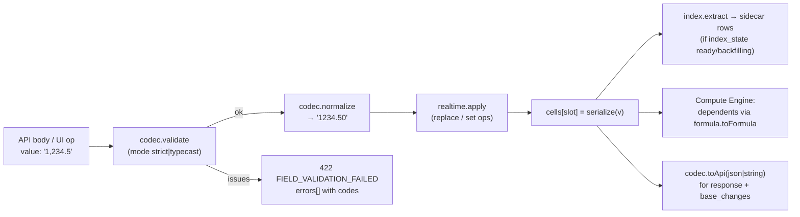

# 07 — Field Engine

> **Status:** Proposed · **Owner:** Core Data team · **Conforms to:** [00 — Canonical Decisions](00-canonical-decisions.md) (§4 field types, D6, D8, D9)
>
> **Sections covered:** Section 9 (Field Engine) and original Part 4 (field type plugin system).
>
> Related: [06 — Record Storage](06-record-storage.md) · [08 — Formula Engine](08-formula-engine.md) · [09 — Linked Record Engine](09-linked-record-engine.md) · [10 — View Engine](10-view-engine.md) · [11 — Filter, Sort & Group](11-filter-sort-group.md) · [16 — Realtime](16-realtime.md) · [17 — API Architecture](17-api-architecture.md) · [20 — Import/Export](20-import-export-sharing-integrations.md) · [24 — Frontend & Grid](24-frontend-grid-state-design-system.md) · [28 — Testing](28-testing-and-edge-cases.md)

---

## 0. Summary

**[Ours]** Every field type is a **plugin**: one folder implementing a `FieldTypeDefinition` composed of independent **concerns** (config, codec, display, ordering, filters, index, dependencies, evaluator, conversion, import, formula mapping, realtime, permissions). Everything type-specific in the product — API validation, storage, grid rendering, filter UI and SQL, sort keys, sidecar projections, CSV import, formula typing, type conversion, realtime merge — goes through this one registry. Core code never `switch`es on a type key.

Two packages:

| Package | Runs on | Contents |
|---|---|---|
| `@tabula/field-types` | server **and** browser (isomorphic, no Node/DOM deps) | definitions: Zod config schemas, codecs, formatters, comparators, in-memory filter evaluators, converters, importers, formula mappings, realtime op semantics. SQL compiler hooks live in a server-only sub-entry `@tabula/field-types/sql` so the browser bundle stays small. |
| `@tabula/field-ui` | browser | canvas cell renderers, React editors, config panels, filter operand editors, form inputs; registered against the same keys |

Why isomorphic: the client uses the same validation, formatting, comparison and filter evaluation for optimistic edits, local sort/filter of the loaded window, and formula preview ([08](08-formula-engine.md)); the server remains authoritative.

---

## 1. Design goals and non-goals

Goals:

1. **One place per type.** Adding a type = adding one folder + its UI folder + tests. No edits to the query compiler, API layer or grid.
2. **Concern separation.** A codec does not know about SQL; a SQL hook does not format strings. Each concern is unit-testable in isolation and contract-testable as a whole.
3. **Semantic equivalence across executors.** For every operator: SQL on JSONB, SQL on sidecars, and the in-memory evaluator must agree (enforced by differential property tests, §6).
4. **Deterministic canonical storage.** Every stored value has exactly one canonical form, so equality is byte equality and change detection is cheap.
5. **Locale/time-zone correctness** in display and parsing; storage is locale-independent.

Non-goals: user-defined field types at runtime (third-party custom fields would be **extensions** rendering on top of `json` fields, [20](20-import-export-sharing-integrations.md)); per-tenant code.

---

## 2. Core types

```ts
// @tabula/field-types/src/core/types.ts

export type Uuid = string & { readonly __brand: 'Uuid' };
export type Slot = number;                                  // fields.slot (smallint), JSONB key = String(slot)
export type JsonValue = null | boolean | number | string | JsonValue[] | { [k: string]: JsonValue };

export type FieldTypeKey =
  | 'text' | 'long_text' | 'number' | 'currency' | 'percent' | 'date' | 'datetime' | 'duration'
  | 'checkbox' | 'single_select' | 'multi_select' | 'email' | 'phone' | 'url' | 'rating'
  | 'collaborator' | 'attachment' | 'barcode' | 'link' | 'contact'
  | 'formula' | 'lookup' | 'rollup' | 'count' | 'autonumber'
  | 'created_time' | 'modified_time' | 'created_by' | 'modified_by'
  | 'button' | 'ai_generated' | 'json';

/** Sentinel for "no value" — never stored (spine §4: empty ⇒ key absent). */
export const EMPTY: unique symbol = Symbol.for('tabula.empty');
export type Empty = typeof EMPTY;

/** A stored reference whose target no longer exists (deleted option, purged attachment). */
export interface Dangling { readonly dangling: true; readonly raw: JsonValue }

export type Result<T, E> = { ok: true; value: T } | { ok: false; error: E };

export interface ValueIssue {
  code:                                  // stable machine codes, surfaced in problem+json errors[]
    | 'TYPE_MISMATCH' | 'TOO_LONG' | 'OUT_OF_RANGE' | 'INVALID_FORMAT' | 'UNKNOWN_OPTION'
    | 'UNKNOWN_USER' | 'UNKNOWN_RECORD' | 'PRECISION_EXCEEDED' | 'NOT_EDITABLE' | 'TOO_MANY_ITEMS';
  message: string;                       // English developer message; UI localizes by code
  path?: (string | number)[];            // element index for arrays
  detail?: Record<string, JsonValue>;
}

export type StorageClass = 'cell' | 'link' | 'computed' | 'record_column' | 'none';
export type FieldCategory =
  | 'text' | 'number' | 'datetime' | 'choice' | 'people' | 'relation' | 'media'
  | 'computed' | 'system' | 'action' | 'advanced';

export interface FieldTypeMeta {
  key: FieldTypeKey;
  category: FieldCategory;
  storageClass: StorageClass;
  multiValued: boolean;                  // arrays / sets (multi_select, attachment, link, lookup…)
  userEditable: boolean;                 // false for computed/system/button
  primaryFieldEligible: boolean;         // may be a table's primary field
  supportsDefaultValue: boolean;
  maxStoredBytes: number;                // hard cap of serialized JSON per cell
  availability: 'ga' | 'beta' | 'internal';
  planFeature?: string;                  // e.g. 'ai_fields' (gated via core.plans.limits)
}

/** Field metadata as seen by plugins (from the schema snapshot). */
export interface FieldDef<C = unknown> {
  id: Uuid;
  tableId: Uuid;
  slot: Slot;
  name: string;
  type: FieldTypeKey;
  config: C;
  configVersion: number;
  isPrimary: boolean;
}

export interface BaseLocaleSettings {
  locale: string;                        // BCP-47, e.g. 'en-US', 'de-DE'
  timeZone: string;                      // IANA, base default
  collation: string;                     // ICU collation for text sort keys, default 'und'
}

export interface SchemaSnapshot {        // immutable, cached by schema:{baseId}:{schemaVersion}
  baseId: Uuid;
  schemaVersion: number;
  settings: BaseLocaleSettings;
  table(id: Uuid): TableSchema;
  field(id: Uuid): FieldDef;
  fieldBySlot(tableId: Uuid, slot: Slot): FieldDef | undefined;
  linkRelation(id: Uuid): LinkRelationDef;
}

export interface FieldContext<C = unknown> {
  field: FieldDef<C>;
  schema: SchemaSnapshot;
  locale: string;                        // viewer locale (display) or base locale (server default)
  timeZone: string;                      // viewer tz for display; field tz when configured
  now: () => Temporal.Instant;           // injectable clock (tests, volatile formulas)
  actor?: { type: string; userId?: Uuid };
  resolvers: Resolvers;
}

export interface Resolvers {
  users: { byIds(ids: Uuid[]): Promise<Map<Uuid, UserSummary>>; byEmail(email: string): Promise<UserSummary | null>;
           isWorkspaceMember(id: Uuid): Promise<boolean> };
  attachments: { byIds(ids: Uuid[]): Promise<Map<Uuid, AttachmentSummary>> };
  records: { titles(tableId: Uuid, ids: Uuid[]): Promise<Map<Uuid, string>>;
             matchPrimary(tableId: Uuid, texts: string[]): Promise<Map<string, Uuid[]>> };
}
```

Resolvers are **batched** (DataLoader-style per request) so validation of a 1,000-record batch issues one user lookup, not 1,000.

---

## 3. The `FieldTypeDefinition` interface (split by concern)

```ts
// @tabula/field-types/src/core/definition.ts

export interface FieldTypeDefinition<
  C = unknown,          // config
  S extends JsonValue = JsonValue,   // canonical stored value (cells / computed JSON)
  A = unknown,          // API value (cellFormat=json)
> {
  readonly contractVersion: 1;           // version of THIS interface; registry rejects mismatches
  readonly meta: FieldTypeMeta;

  readonly config: ConfigConcern<C>;
  readonly codec: ValueCodec<C, S, A>;
  readonly display: DisplayFormatter<C, S>;
  readonly ordering: OrderingConcern<C, S>;
  readonly filters: FilterConcern<C, S>;
  readonly index: IndexStrategy<C, S>;
  readonly conversion: ConversionConcern<C, S>;
  readonly importer: ImportCoercion<C, S>;
  readonly formula: FormulaTypeMapping<C, S>;
  readonly realtime: RealtimeSemantics<C, S>;
  readonly permissions: PermissionHints;

  // computed types only
  readonly dependencies?: DependencyConcern<C>;
  readonly evaluator?: ComputedEvaluator<C, S>;
}
```

### 3.1 Config concern

```ts
export type ConfigChangeImpact =
  | 'none'          // label/description/format-only change (e.g. number display separators)
  | 'metadata'      // option renamed/recolored: schema_version++ only
  | 'revalidate'    // narrowing that leaves stored values valid-or-dangling (option deleted)
  | 'convert'       // stored values must be rewritten (currency precision ↓): long_operation (06 §15)
  | 'recompute'     // computed: dependents/values must be recomputed (formula text changed)
  | 'reindex';      // sidecar projection changes (option reorder, collation): 06 §13.3

export interface ConfigConcern<C> {
  readonly version: number;                         // config schema version
  readonly schema: z.ZodType<C>;                    // strict; unknown keys rejected
  readonly apiSchema: TSchema;                      // TypeBox for OpenAPI (17/31); generated from Zod where possible
  defaults(ctx: { table: TableSchema; settings: BaseLocaleSettings }): C;
  migrate?(raw: unknown, fromVersion: number): C;   // read-time upgrade of stored fields.config
  /** Cross-object validation: link target exists, formula compiles & type-checks, no dependency cycle… */
  validateInSchema?(config: C, ctx: SchemaValidationContext): ConfigIssue[];
  /** Classify a config change to decide what the platform must do. */
  impact(prev: C, next: C): ConfigChangeImpact[];
  /** Public/API representation (option ids → public opt_ ids etc.). */
  toApi(config: C, ctx: ApiContext): unknown;
  fromApi(input: unknown, prev: C | undefined, ctx: ApiContext): Result<C, ConfigIssue[]>;
}
```

### 3.2 Value codec

```ts
export type CellFormat = 'json' | 'string';

export interface ValueCodec<C, S extends JsonValue, A> {
  /**
   * Validate untrusted input (API body, UI edit, automation, import already parsed) and produce the
   * canonical stored value. mode 'typecast' = API `typecast: true`: lenient coercion (string → number,
   * unknown option label → create option if permitted). Returns EMPTY for empty-equivalents.
   */
  validate(input: unknown, ctx: FieldContext<C>, mode: 'strict' | 'typecast'): Promise<Result<S | Empty, ValueIssue[]>>;

  /** Canonicalize an already-valid value (idempotent). E.g. sort multi_select by option order, trim text. */
  normalize(v: S, ctx: FieldContext<C>): S;

  isEmpty(v: unknown): boolean;
  equals(a: S, b: S): boolean;                       // default: canonical JSON byte equality

  /** Storage <-> memory. Most types are identity; deserialize must accept every historic shape. */
  serialize(v: S): JsonValue;
  deserialize(raw: JsonValue | undefined, ctx: FieldContext<C>): S | Empty | Dangling;

  /** API output. 'json' = typed JSON; 'string' = display string in the request's locale/tz. */
  toApi(v: S | Empty | Dangling, format: CellFormat, ctx: FieldContext<C>): A | string | null;

  byteSize(v: S): number;                            // for maxStoredBytes and 06 §20 caps
}
```

### 3.3 Display formatter

```ts
export interface DisplayContext<C> extends FieldContext<C> {
  purpose: 'grid' | 'detail' | 'export' | 'title' | 'search' | 'notification';
  maxLength?: number;                                // grid truncation
}

export type DisplayPart =
  | { kind: 'text'; text: string }
  | { kind: 'chip'; text: string; color?: string; refId?: string }   // options, users, records
  | { kind: 'link'; text: string; href: string }
  | { kind: 'error'; code: string };

export interface DisplayFormatter<C, S> {
  /** Plain string: cellFormat=string, CSV export, primary-field record titles, search documents. */
  format(v: S | Empty | Dangling, ctx: DisplayContext<C>): string;
  /** Structured parts for rich renderers (chips, links). Optional; default = one text part. */
  parts?(v: S | Empty | Dangling, ctx: DisplayContext<C>): DisplayPart[];
}
```

Locale formatting uses `Intl.NumberFormat`, `Intl.DateTimeFormat` with `Temporal` values, and `Intl.ListFormat` for arrays; formatter instances are memoized per (locale, options) because `Intl` constructors are expensive (~20–50 µs).

### 3.4 Ordering: comparator and sort key encoder

```ts
export type SortKey =
  | { k: 'num'; v: string }            // decimal string → record_index_num.value (numeric)
  | { k: 'text'; v: Uint8Array; eq: string }   // ICU collation key → sort_key; eq → value_eq
  | { k: 'time'; v: string };          // ISO instant → record_index_time.value

export interface OrderContext<C> extends FieldContext<C> {
  collator: Intl.Collator;             // client; server uses ICU4C collator with the same rules
}

export interface SqlCellRef {
  alias: string;                       // records alias in the compiled query, e.g. 'r'
  source: 'cells' | 'computed' | 'column';
  slot?: Slot;                         // for cells/computed
  column?: 'row_number' | 'created_at' | 'updated_at' | 'created_by' | 'updated_by';
}
export type SqlExpr = import('kysely').RawBuilder<unknown>;

export interface OrderingConcern<C, S> {
  /** Total order on non-empty values. Empties are placed by the caller (always last, both directions). */
  compare(a: S, b: S, ctx: OrderContext<C>): number;
  /** Must be monotone with compare: compare(a,b) < 0 ⇒ sortKey(a) ≤ sortKey(b) (≤ due to truncation). */
  sortKey(v: S, ctx: OrderContext<C>): SortKey;
  /** Unindexed SQL sort expression over JSONB (server only, from '@tabula/field-types/sql'). */
  sqlSortExpr(ref: SqlCellRef, ctx: SqlContext<C>): SqlExpr;
  /** Grouping: one key per value; multi-valued types may group by the whole set or each element. */
  groupKeys(v: S | Empty, ctx: OrderContext<C>, mode: 'whole' | 'each'): string[];
}
```

Text collation: the browser `Intl.Collator(locale, { sensitivity: 'base', numeric: true })` and the server ICU collator are configured identically (`numeric: true` so "Item 2" < "Item 10"). Server sort keys are produced with ICU4C (`full-icu` Node build) so sidecar `sort_key` bytes order exactly as `compare`.

### 3.5 Filter operators

```ts
/** Canonical operator vocabulary — identical to the enum in 11 §2/§4.1 (11 is normative for the AST). */
export type OperatorKey =
  // generic
  | 'is_empty' | 'is_not_empty'
  // equality / text
  | 'eq' | 'neq' | 'contains' | 'not_contains' | 'starts_with' | 'ends_with'
  // numeric / decimal
  | 'gt' | 'gte' | 'lt' | 'lte' | 'is_between'
  // date / datetime (DateOperand / PeriodOperand, 11 §5)
  | 'is' | 'is_not' | 'is_before' | 'is_after' | 'is_on_or_before' | 'is_on_or_after' | 'is_within'
  // single choice / single user
  | 'is_any_of' | 'is_none_of'
  // sets (multi_select, multi collaborator, links by record id, lookup arrays)
  | 'has_any_of' | 'has_all_of' | 'has_none_of' | 'is_exactly'
  // checkbox
  | 'is_checked' | 'is_not_checked'
  // attachment
  | 'has_file_type';
// "is me" = is_any_of / has_any_of with valueRef {type:'currentUser'} (bound by `bind`).
// Formula errors are treated as empty by every operator (11 §4.2); filter on errors via a formula ISERROR().

/** Operand schemas are Zod + generated JSON Schema; values use storage-native shapes (opt ids, ISO dates). */
export interface FilterOperatorDef<C, S, O = unknown> {
  key: OperatorKey;
  arity: 'unary' | 'binary';
  operand?: z.ZodType<O>;
  operandUi?: 'text' | 'number' | 'date' | 'relative_date' | 'options' | 'users' | 'records' | 'duration';
  /** Resolve context-dependent operands at query time: 'me' → user id; relative dates → absolute range. */
  bind?(operand: O, ctx: FilterBindContext<C>): BoundOperand<O>;
  /** In-memory evaluator (client local filtering, compute engine, base cache, differential tests). */
  evaluate(v: S | Empty | Dangling, operand: BoundOperand<O>, ctx: FieldContext<C>): boolean;
  /** SQL over records.cells / computed / columns (server only). */
  sql(ref: SqlCellRef, operand: BoundOperand<O>, ctx: SqlContext<C>): SqlExpr;
  /** SQL over the typed sidecar (only used when fields.index_state = 'ready'). */
  sidecarSql?(ref: SidecarRef, operand: BoundOperand<O>, ctx: SqlContext<C>): SqlExpr;
  /** Rough fraction of rows matched (planner hint, 11). */
  selectivity?(operand: BoundOperand<O>, stats?: FieldStats): number;
  /** True if the result depends on now()/actor — affects view result caching (10). */
  contextDependent?: boolean;
}

export interface FilterConcern<C, S> {
  operators: Partial<Record<OperatorKey, FilterOperatorDef<C, S, any>>>;
  defaultOperator: OperatorKey;
}

export interface SidecarRef {
  table: 'record_index_num' | 'record_index_text' | 'record_index_time';
  alias: string;                     // the compiler joins/EXISTS-es with this alias
  slot: Slot;
}
```

The filter AST (`{op: 'and'|'or', conditions: [...]}` with leaves `{fieldId, operator, value}`) is owned by [11](11-filter-sort-group.md); the field engine owns **which operators each type supports** and **how each compiles/evaluates**. Unknown operator for the type ⇒ `422 FILTER_OPERATOR_NOT_SUPPORTED`.

### 3.6 Index strategy (sidecars)

```ts
export type SidecarEntry =
  | { table: 'num';  ord: number; value: string }                                   // decimal string
  | { table: 'text'; ord: number; sortKey: Uint8Array; valueEq: string; trigram: boolean }
  | { table: 'time'; ord: number; value: string };                                  // ISO instant

export interface IndexStrategy<C, S> {
  kind: 'none' | 'num' | 'text' | 'time' | 'num+text';
  /** Sidecar rows for one cell; [] for empty. ord = element index in canonical order (multi-valued). */
  extract(v: S | Empty | Dangling, ctx: OrderContext<C>): SidecarEntry[];
  /** Config impacts that require a sidecar rebuild (e.g. option reorder for single_select ranks). */
  rebuildOn: ConfigChangeImpact[];
  /** Max elements indexed per cell (multi-valued); excess elements are not indexed (06 §25). */
  maxElements?: number;
}
```

### 3.7 Dependencies and evaluator (computed types)

```ts
export interface DependencyDecl {
  dependsOnFieldId: Uuid;               // a field in THIS table, or in the linked table when via is set
  viaLinkFieldId?: Uuid;                // link field in this table through which the dependency flows
  kind: 'same_record' | 'via_link' | 'record_meta';   // = field_dependencies.kind (05)
  metaKey?: 'created_time' | 'modified_time' | 'record_id' | 'row_number';   // in-memory only (snapshot), not persisted
  // Link membership: a computed field reading through link L also declares {dependsOn: L, kind: 'same_record'},
  // so link add/remove on L (which updates cell_meta of L's slot) dirties it like any same-record input.
}

export interface DependencyConcern<C> {
  declare(config: C, ctx: SchemaContext): DependencyDecl[];   // persisted to field_dependencies (08 §9)
  volatility(config: C): 'none' | 'minute' | 'day';           // NOW()/TODAY() buckets (D7)
}

export interface EvalRecordView {               // read-only projection of one record for evaluation
  id: Uuid; rowNumber: number; createdAt: string; updatedAt: string; createdBy?: Uuid; updatedBy?: Uuid;
  get(fieldId: Uuid): FValue;                   // via formula mapping; computed deps already evaluated
}

export interface LinkedValues {                 // preloaded by the compute engine in batch (09 §7)
  ids(linkFieldId: Uuid): Uuid[];               // in link order
  values(linkFieldId: Uuid, targetFieldId: Uuid): FValue[];
}

export interface PreparedEvaluator<S> {
  /** What must be loaded: same-record fields and (link field → target fields) pairs. */
  inputs: { fields: Uuid[]; links: { linkFieldId: Uuid; targetFieldIds: Uuid[] }[]; meta: string[] };
  evaluate(rec: EvalRecordView, linked: LinkedValues, env: EvalEnv): S | Empty | ErrorValue;
  /** Optional SQL push-down (rollup SUM/COUNT over large fan-in, 09 §8.3). */
  sqlAggregate?(ctx: SqlContext<unknown>): { sql: SqlExpr; postProcess(v: unknown): S | Empty } | null;
}

export interface ComputedEvaluator<C, S> {
  resultFieldType(config: C, ctx: SchemaContext): { type: FieldTypeKey; config: unknown }; // drives display/sort/filter
  prepare(config: C, ctx: SchemaContext): PreparedEvaluator<S>;   // cached by (fieldId, schemaVersion)
}
```

Computed fields **delegate** display/ordering/filters/index to their *result type* (e.g. a formula producing `currency` sorts exactly like a currency field). Their definitions implement those concerns as thin delegators: `ordering = delegateTo(resultFieldType)`.

### 3.8 Conversion concern

```ts
export type ConversionFidelity = 'identity' | 'lossless' | 'lossy' | 'parse' | 'match' | 'async' | 'clear';

export interface ConvertResult<S> {
  value: S | Empty;
  lost?: boolean;                        // value changed meaning or was dropped (counted in preview)
  reason?: 'UNPARSEABLE' | 'TRUNCATED' | 'ROUNDED' | 'NO_MATCH' | 'AMBIGUOUS_MATCH' | 'UNSUPPORTED';
}

export interface Converter<S> {
  fidelity: ConversionFidelity;
  convert(sourceStored: JsonValue, ctx: ConvertContext): Promise<ConvertResult<S>> | ConvertResult<S>;
  /** SQL expression computing the new value from the old slot — enables dual-read filter/sort (06 §15). */
  sqlExpr?(oldRef: SqlCellRef): SqlExpr;
  /** Schema side-effects decided from data before conversion, e.g. create select options. */
  planConfig?(samples: AsyncIterable<JsonValue>, target: unknown): Promise<unknown>;
}

export interface ConversionConcern<C, S> {
  /** Converter from (sourceType, sourceConfig) into this type with targetConfig; null = not direct. */
  convertFrom(source: { type: FieldTypeKey; config: unknown }, target: C, ctx: SchemaContext): Converter<S> | null;
  /** Suggest a target config from data (e.g. distinct texts → options; detect currency precision). */
  suggestConfig?(source: { type: FieldTypeKey; config: unknown }, sample: JsonValue[], ctx: SchemaContext): Partial<C>;
}
```

Converter resolution order (`resolveConverter(src, dst)` in the core):

1. `src.type === dst.type` → `dst.conversion.convertFrom(src)` (config-only change; often identity or lossy rounding).
2. Direct converter `dst.conversion.convertFrom(src)` if non-null.
3. **Via text**: `src.display.format(v, purpose:'export')` → `dst.importer.parse(text)` (fidelity `parse`).
4. Otherwise `clear` (values dropped; old slot retained for undo, [06 §15](06-record-storage.md)).

### 3.9 Import coercion

```ts
export interface ImportContext<C> extends FieldContext<C> {
  sourceLocale: string;                  // decimal/thousand separators, date order (DMY/MDY)
  dateOrder?: 'DMY' | 'MDY' | 'YMD';
  listSeparator: string;                 // default ',' (quoted CSV lists supported)
  createOptions: boolean;                // unknown option labels create options (import/typecast)
}

export interface ImportCoercion<C, S> {
  /** Parse one CSV/XLSX/clipboard string into a stored value. Must never throw. */
  parse(raw: string, ctx: ImportContext<C>): Promise<Result<S | Empty, ValueIssue>> | Result<S | Empty, ValueIssue>;
  /** Native spreadsheet cell (XLSX numbers/dates/booleans) — avoids string round trips. */
  parseNative?(v: number | boolean | Date, ctx: ImportContext<C>): Result<S | Empty, ValueIssue>;
  /** Type inference for import mapping: score 0..1 that a column of samples is this type. */
  detect?(samples: string[], ctx: ImportContext<C>): { score: number; suggestedConfig?: Partial<C> };
}
```

Paste into the grid uses the same `importer.parse` (with the viewer's locale), so paste and CSV import behave identically.

### 3.10 Formula type mapping

```ts
// FType is defined in @tabula/formula (08 §5); repeated here for reference
export type FType =
  | { t: 'number' } | { t: 'currency'; code: string; scale: number } | { t: 'percent' }
  | { t: 'text' } | { t: 'bool' } | { t: 'date' } | { t: 'datetime' } | { t: 'duration' }
  | { t: 'array'; of: FType } | { t: 'record_ref'; tableId: Uuid } | { t: 'blank' } | { t: 'error' } | { t: 'any' };

export interface FormulaTypeMapping<C, S> {
  /** Static type of a reference {Field} in a formula. */
  ftype(config: C): FType;
  /** Runtime value for evaluation; EMPTY → BLANK. */
  toFormula(v: S | Empty | Dangling, ctx: FieldContext<C>): FValue;
  /** Only for types usable as a formula *result format* (number, currency, percent, date, datetime,
   *  duration, text, checkbox): convert the formula result into this type's stored value. */
  fromFormula?(v: FValue, ctx: FieldContext<C>): S | Empty | ErrorValue;
}
```

### 3.11 Realtime op semantics

```ts
export type CellOp =
  | { kind: 'replace'; value: JsonValue | null }                // null = clear
  | { kind: 'set_add'; items: JsonValue[] }                     // multi_select ids, user ids, attachment ids
  | { kind: 'set_remove'; items: JsonValue[] }
  | { kind: 'list_move'; item: JsonValue; afterItem: JsonValue | null }  // attachment order
  | { kind: 'link_add'; recordIds: Uuid[]; position?: { after: Uuid | null } }
  | { kind: 'link_remove'; recordIds: Uuid[] }
  | { kind: 'link_move'; recordId: Uuid; after: Uuid | null }
  | { kind: 'text_crdt'; update: Uint8Array };                  // Yjs update (rich long_text, V1+)

export interface RealtimeSemantics<C, S> {
  supported: CellOp['kind'][];
  /** Apply op to current stored value under the record row lock (server) or optimistically (client). */
  apply(current: S | Empty, op: CellOp, ctx: FieldContext<C>): S | Empty;
  /** Inverse ops for undo (stored in base_changes.inverse_ops, D25). Set ops invert to the opposite op
   *  restricted to items that actually changed, so undo never removes an item someone else added. */
  invert(before: S | Empty, op: CellOp, ctx: FieldContext<C>): CellOp[];
}
```

Merge properties (D9): `replace` is last-writer-wins at the cell; `set_add`/`set_remove` commute with each other on different items, and for the same item the later op wins; `link_*` are applied to `record_links` by the link engine ([09 §10](09-linked-record-engine.md)).

### 3.12 Permission hints

```ts
export interface PermissionHints {
  /** Can a principal with record.update write this field (subject to fields.restrictions)? */
  writable: 'user' | 'system';                          // computed/system types: 'system'
  /** Extra capability needed to write (attachment upload token, automation.run for buttons, ai.use). */
  requiresAction?: 'attachment.upload' | 'automation.run' | 'ai.use';
  /** Field exposes data of another table: readers need read access to target table/fields (19). */
  crossTableRead?: boolean;
  /** Personal data classification: masking in public shares, AI data policy, export redaction. */
  pii?: 'email' | 'phone' | 'person' | 'free_text' | 'none';
  /** Values safe to render in anonymous public shares (collaborator emails are not). */
  publicShareRendering: 'full' | 'name_only' | 'hidden';
}
```


---

## 4. Registry

```ts
// @tabula/field-types/src/core/registry.ts
export class FieldTypeRegistry {
  #defs = new Map<FieldTypeKey, FieldTypeDefinition<any, any, any>>();
  #frozen = false;

  register(def: FieldTypeDefinition<any, any, any>): void {
    if (this.#frozen) throw new Error('registry frozen');
    if (def.contractVersion !== 1) throw new Error(`contract mismatch for ${def.meta.key}`);
    if (this.#defs.has(def.meta.key)) throw new Error(`duplicate field type ${def.meta.key}`);
    assertConsistent(def);            // computed ⇔ evaluator present; storageClass rules; operators exist
    this.#defs.set(def.meta.key, def);
  }
  get<K extends FieldTypeKey>(key: K): FieldTypeDefinition<ConfigOf<K>, StoredOf<K>, ApiOf<K>> {
    const d = this.#defs.get(key);
    if (!d) throw new UnknownFieldTypeError(key);
    return d as any;
  }
  list(): readonly FieldTypeDefinition<any, any, any>[] { return [...this.#defs.values()]; }
  freeze(): this { this.#frozen = true; return this; }
}

// @tabula/field-types/src/index.ts — the single place types are enumerated
export const fieldTypes = new FieldTypeRegistry();
[text, longText, number, currency, percent, date, datetime, duration, checkbox, singleSelect, multiSelect,
 email, phone, url, rating, collaborator, attachment, barcode, link, contact, formula, lookup, rollup, count,
 autonumber, createdTime, modifiedTime, createdBy, modifiedBy, button, aiGenerated, json]
  .forEach((d) => fieldTypes.register(d));
fieldTypes.freeze();

// Type-level map, so core code gets precise types without switches:
export interface FieldTypeMap {
  text: { config: TextConfig; stored: string; api: string };
  currency: { config: CurrencyConfig; stored: string; api: string };
  // … one entry per key (generated by a codegen step from the definitions)
}
export type ConfigOf<K extends FieldTypeKey> = FieldTypeMap[K]['config'];
```

`assertConsistent` checks, at startup and in CI:

* `storageClass === 'computed'` ⇔ `evaluator` and `dependencies` exist.
* `userEditable === false` ⇒ `permissions.writable === 'system'` and `realtime.supported` is empty.
* every operator in `filters.operators` is in the 11 §4.1 compatibility matrix for the type's family.
* `index.kind !== 'none'` ⇒ `ordering.sortKey` is defined for all non-empty values (checked by property tests, §6).

**Server consumers** (all type-agnostic): `RecordService` (validate/normalize), `QueryCompiler` ([11](11-filter-sort-group.md)), `SidecarMaintainer` ([06 §12.3](06-record-storage.md)), `ComputeEngine` ([08](08-formula-engine.md)), `FieldConversionJob` ([06 §15](06-record-storage.md)), `ImportPipeline` ([20](20-import-export-sharing-integrations.md)), `ApiSerializer` ([17](17-api-architecture.md)), `SearchIndexer` (`display.format(purpose:'search')`).
**Client consumers**: `RecordStore` optimistic apply (`realtime.apply`), local sort/filter of the loaded window (`ordering.compare`, `filters.evaluate`), clipboard (`importer.parse`, `display.format`), formula preview.

### 4.1 Request-time flow (one cell write)



---

## 5. Adding a field type (plugin layout)

```text
packages/field-types/src/types/currency/
  index.ts              # export const currency: FieldTypeDefinition<CurrencyConfig, string, string>
  meta.ts               # FieldTypeMeta
  config.ts             # Zod schema, defaults, migrate, impact()
  codec.ts              # validate / normalize / toApi / deserialize
  display.ts            # Intl.NumberFormat currency formatting
  ordering.ts           # compare (big.js), sortKey (decimal string), groupKeys
  filters.ts            # operators: eq neq gt gte lt lte is_between is_empty is_not_empty
  filters.sql.ts        # server-only SQL hooks (imported via '@tabula/field-types/sql')
  index-strategy.ts     # kind 'num'
  conversion.ts         # convertFrom(number|percent|text|…)
  import.ts             # parse "€1.234,50", "(1,234.50)", "1234.5 USD"
  formula.ts            # ftype {t:'currency'}, toFormula → Decimal, fromFormula
  realtime.ts           # replace only
  __tests__/
    fixtures.ts         # valid/invalid inputs, locale cases, arbitraries
    contract.test.ts    # runFieldTypeContract(currency, fixtures)
    sql.pg.test.ts      # differential tests against Postgres (testcontainers)
    import.test.ts      # locale-specific parsing table
packages/field-ui/src/types/currency/
  renderer.ts           # canvas draw(): right-aligned, tabular numerals
  editor.tsx            # inline editor; uses importer.parse for live validation
  config-panel.tsx      # currency code, precision, negative style
  filter-operand.tsx    # number input with currency adornment
  index.ts              # registerFieldUi('currency', {...})
```

Checklist for a new type (enforced by CI script `pnpm fieldtypes:check`):

1. Add key to `FieldTypeKey` + `FieldTypeMap` (codegen) and to the spine §4 table (architecture review — new keys are a public API change).
2. Implement all concerns; computed types also `dependencies` + `evaluator`.
3. Fixtures + contract suite pass; differential SQL tests pass for every operator × {JSONB path, sidecar path}.
4. Register UI in `@tabula/field-ui`; Storybook stories for renderer/editor/config panel; visual regression snapshots.
5. Add the type's rows/columns to the conversion matrix (§9) and implement converters or explicitly declare `clear`.
6. OpenAPI regenerated (`apiSchema`), public docs page generated from definition metadata.
7. Feature-flag the type (`availability: 'beta'`) until migration/backfill and performance tests pass.

---

## 6. Test contract (property-based)

`runFieldTypeContract(def, fixtures)` (Vitest + fast-check) asserts, for generated values `v` from `fixtures.arbitrary` and generated configs from `fixtures.configArbitrary`:

| # | Property | Statement |
|---|---|---|
| P1 | Normalize idempotent | `normalize(normalize(v)) ≡ normalize(v)` |
| P2 | Validate accepts canonical | `validate(serialize(v), strict) = ok(v)` |
| P3 | Storage round trip | `deserialize(serialize(v)) ≡ v` |
| P4 | API JSON round trip | `validate(toApi(v,'json'), strict) = ok(v)` |
| P5 | String round trip (lossless types) | `importer.parse(display.format(v, export)) = v` for types declaring `stringRoundTrip: true` (text, number, date, …) |
| P6 | Emptiness | `isEmpty(x) ⇔ validate(x) = ok(EMPTY)`; `serialize` is never called with EMPTY |
| P7 | Total order | `compare` is antisymmetric, transitive, reflexive-zero on equal values |
| P8 | Sort key monotone | `compare(a,b) < 0 ⇒ bytes(sortKey(a)) ≤ bytes(sortKey(b))` (memcmp for text, numeric for num, instant for time) |
| P9 | Sidecar ≡ compare | sorting by `index.extract()` rows (as Postgres would) equals sorting by `compare` (modulo truncation ties) |
| P10 | SQL ≡ evaluator | For random tables (≤ 200 rows) and random operands, `SELECT id WHERE sql(...)` = `{r | evaluate(r)}` on JSONB path **and** sidecar path (Postgres 16 in testcontainers; seeds recorded for replay) |
| P11 | Set ops commute | `apply(apply(s, a), b) ≡ apply(apply(s, b), a)` for set ops on distinct items; `apply(apply(s, op), invert(s, op)) ≡ s` |
| P12 | Size bound | `byteSize(v) ≤ meta.maxStoredBytes` for all accepted values; inputs beyond are rejected with `TOO_LONG`/`TOO_MANY_ITEMS` |
| P13 | Formula mapping | `fromFormula(toFormula(v)) ≡ v` for types usable as result formats |
| P14 | Conversion | for each declared converter with fidelity `lossless`: `convert` then reverse converter returns `v`; `parse`/`lossy` converters never throw and report `lost` accurately |
| P15 | Locale safety | `display.format` with 6 locales (en-US, de-DE, fr-FR, ja-JP, ar-EG, hi-IN) never throws; `importer.parse(format(v, L), L)` round-trips for numeric/date types |

Golden tests: formatted outputs per locale snapshot; known-tricky inputs (`"1,5"` in de-DE, `"03/04/2026"` MDY vs DMY, `"+1 (415) 555-0100"`, IDN emails, URLs without scheme). Fuzzing: `validate` with arbitrary JSON (must return issues, never throw).

---

## 7. Frontend registration (`@tabula/field-ui`)

```ts
export interface CellDrawArgs<S, C> {
  ctx: CanvasRenderingContext2D;
  rect: { x: number; y: number; w: number; h: number };
  value: S | Empty | Dangling;
  field: FieldDef<C>;
  theme: GridTheme;                    // design tokens (24)
  state: { selected: boolean; editing: boolean; stale: boolean; error?: string };
  fmt: DisplayFormatter<C, S>;         // from @tabula/field-types
  images: ImageCache;                  // thumbnails for attachment/collaborator avatars
}

export interface FieldUiDefinition<C = unknown, S = unknown> {
  key: FieldTypeKey;
  icon: IconName;
  renderer: {
    draw(a: CellDrawArgs<S, C>): void;                          // canvas grid (24): no React per cell
    hitTest?(a: CellDrawArgs<S, C>, x: number, y: number): CellHit | null;  // chips, links, checkbox toggles
    measureHeight?(a: CellDrawArgs<S, C>, width: number): number;          // expanded row heights
  };
  Editor?: React.ComponentType<CellEditorProps<S, C>>;           // overlay editor in grid
  DetailEditor?: React.ComponentType<CellEditorProps<S, C>>;     // record expand / interfaces / forms
  ConfigPanel: React.ComponentType<ConfigPanelProps<C>>;
  FilterOperandEditor?: React.ComponentType<OperandEditorProps>;
  toggleOnClick?: boolean;                                       // checkbox, rating: no editor overlay
}

registerFieldUi(currencyUi);   // registry mirrors FieldTypeRegistry; startup asserts every key has UI
```

UI never reimplements validation: editors call `codec.validate`/`importer.parse` from `@tabula/field-types` and render `ValueIssue` codes via i18n.

---

## 8. Field type walkthrough (every spine type)

Conventions: *Stored* = canonical `cells`/`computed` JSON (spine §4). *API json* = `cellFormat=json`; *API string* = `cellFormat=string` (viewer locale/tz). Operators use the 11 §4.1 vocabulary; every type also supports `is_empty`/`is_not_empty` unless stated. *Index* = sidecar kind ([06 §13](06-record-storage.md)). Configs shown as TS (Zod-equivalent).

### 8.1 `text`
* **Config:** `{ maxLength?: number /* ≤ 10000, default 10000 */; defaultValue?: string }`
* **Stored:** `"Acme renewal"` — leading/trailing whitespace trimmed (whitespace-only ⇒ empty, consistent with [06 §14](06-record-storage.md)); Unicode NFC normalized; control characters except `\t` stripped; newlines replaced by spaces (single line).
* **API:** json `"Acme renewal"`; string same.
* **Operators:** `eq`, `neq` (case-insensitive, NFC + casefold), `contains`, `not_contains`, `starts_with`, `ends_with`.
* **Sort:** ICU collation (`numeric: true`, base sensitivity), ties by record id. **Index:** `text` (sort_key, value_eq casefolded, trigram flag).
* **Conversion:** source of most parse conversions; to `single_select`/`multi_select` creates options from distinct values (≤ 1,000 distinct, else preview warns and the rest are cleared); to `link` matches target primary field ([09 §12](09-linked-record-engine.md)).
* **Formula:** `text`. **Realtime:** `replace`. **PII:** `free_text`.

### 8.2 `long_text`
* **Config:** `{ richText: boolean; maxLength?: number /* ≤ 100000 */ }`
* **Stored:** plain `"…"`; rich `{ "doc": <ProseMirror-compatible JSON>, "plain": "…" }` (`plain` derived server-side; never trusted from the client). V1+ collaborative rich text keeps Yjs state in `record_rich_docs` and debounced snapshots in cells ([06 §19.2](06-record-storage.md)).
* **API:** json plain string, or for rich `{ "markdown": "…", "plain": "…" }` (we expose Markdown, not our internal doc JSON); string = plain.
* **Operators:** `contains`, `not_contains`, `eq`, `neq` on `plain`. **Sort:** collation on first 512 chars of `plain`. **Index:** `text` on 512-char prefix (trigram flag set).
* **Conversion:** plain ↔ rich lossless (plain → paragraphs); rich → plain lossy (formatting dropped); to `text` truncates to 10k and replaces newlines (lossy).
* **Formula:** `text` (plain). **Realtime:** `replace` (plain), `text_crdt` (rich, V1+). **PII:** `free_text`.

### 8.3 `number`
* **Config:** `{ precision: 0..8; allowNegative: boolean; format: 'decimal' | 'integer' | 'compact'; thousandsSeparator?: 'locale'|'none' }`
* **Stored:** JSON number rounded half-even to `precision` decimals at write; `-0` → `0`; NaN/±∞ rejected; |v| ≤ 9.007e15 (safe integer magnitude).
* **API:** json `1200.5`; string `"1,200.50"` (locale).
* **Operators:** `eq`, `neq`, `gt`, `gte`, `lt`, `lte`, `is_between`. **Sort:** numeric. **Index:** `num`.
* **Conversion:** to `currency` lossless (decimal string); precision decrease ⇒ `convert` long op (rounding is lossy).
* **Import:** locale-aware (`1.234,5` in de-DE), accepts `1e3`, `(123)` as negative, strips spaces/NBSP. **Formula:** `number`. **Realtime:** `replace`.

### 8.4 `currency`
* **Config:** `{ currencyCode: ISO4217; precision: 0..8 /* default from ISO minor units */; negativeStyle: 'minus'|'parentheses' }`
* **Stored:** decimal **string** with exactly `precision` fractional digits: `"1234.50"`; max 28 significant digits; validated with `big.js` (no float on the server path).
* **API:** json `"1234.50"` (string to preserve precision; documented); string `"$1,234.50"`.
* **Operators:** numeric family (decimal) as `number`. **Sort:** exact decimal compare. **Index:** `num` (Postgres `numeric`, exact).
* **Conversion:** from `number` lossless if |v| representable; to `number` lossy for > 15 significant digits. Precision increase: no rewrite (re-padded on read); decrease: `convert`.
* **Formula:** `currency{code, scale}` → `Decimal` values in formulas ([08 §7](08-formula-engine.md)). **Realtime:** `replace`.

### 8.5 `percent`
* **Config:** `{ precision: 0..8; showBar?: boolean }`
* **Stored:** JSON number, fraction (`0.25` = 25%). Precision applies to the *displayed* percent (stored rounded to `precision + 2` decimals).
* **API:** json `0.25`; string `"25%"`. Import accepts `"25%"` → 0.25 and bare `"25"` → 0.25 when the column is detected as percent (configurable in import mapping), `"0.25"` → 0.25.
* **Operators/Sort/Index:** as `number` (`num`). **Formula:** `percent` (numerically a number). **Realtime:** `replace`.

### 8.6 `date`
* **Config:** `{ format: 'local'|'iso'|'us'|'eu'|'friendly' }`
* **Stored:** `"2026-10-03"` (a calendar date, no time zone; year 0001–9999).
* **API:** json `"2026-10-03"`; string per format (`10/3/2026` en-US).
* **Operators:** `is`, `is_not`, `is_before`, `is_after`, `is_on_or_before`, `is_on_or_after`, `is_within`, `is_between` with `DateOperand`/`PeriodOperand` (`today`, `days_ago n`, `exact_date`, `this_week`, `past_month`…; 11 §5), bound with the view/base time zone.
* **Sort:** lexicographic on ISO = chronological. **Index:** `num` (epoch day).
* **Conversion:** to `datetime` = midnight in the target field's `timeZone` (lossless); from `datetime` = local date in the source field's time zone (lossy). **Import:** `dateOrder` from import context; Excel serial numbers via `parseNative`.
* **Formula:** `date` (Temporal.PlainDate). **Realtime:** `replace`.

### 8.7 `datetime`
* **Config:** `{ timeZone: IANA | 'viewer'; dateFormat; timeFormat: '12h'|'24h'; showTimeZone: boolean }`
* **Stored:** UTC ISO-8601 with millisecond precision: `"2026-10-03T14:05:00.000Z"` (fixed width ⇒ string order = time order).
* **API:** json same; string formatted in field tz (or viewer tz when `'viewer'`), e.g. `"10/3/2026 4:05pm CEST"`.
* **Operators:** date operators evaluated on the local date in the field tz (`is today` means today *in that zone*), plus range comparisons on the instant. **Sort:** chronological. **Index:** `time`.
* **Conversion:** to `date` uses field tz (lossy); to `text` formatted ISO with offset.
* **Import:** strings with offset honoured; naive strings interpreted in the field tz (or import-mapped tz); DST gaps resolved forward ("compatible" disambiguation in Temporal).
* **Formula:** `datetime` (Temporal.Instant). **Realtime:** `replace`.

### 8.8 `duration`
* **Config:** `{ format: 'h:mm' | 'h:mm:ss' | 'h:mm:ss.s' | 'h:mm:ss.ss' | 'h:mm:ss.sss' }`
* **Stored:** JSON number of seconds (may be fractional, ≥ −10^9, ≤ 10^9).
* **API:** json `5400`; string `"1:30"`.
* **Operators/Sort/Index:** numeric, `num`. **Import:** `"1:30"` (h:mm), `"1:30:15"`, `"90m"`, `"1.5h"`. **Formula:** `duration` (seconds; arithmetic with numbers yields duration/number per 08 §5 rules). **Realtime:** `replace`.

### 8.9 `checkbox`
* **Config:** `{ icon: 'check'|'star'|'heart'|'flag'; color }`
* **Stored:** `true`; unchecked ⇒ absent.
* **API:** json `true`/`false` (always present in json output since `false` is meaningful to clients); string `"checked"`/`""`.
* **Operators:** `is_checked`, `is_not_checked`. **Sort:** unchecked < checked. **Index:** `num` (value 1; absence = 0 via anti-join).
* **Import:** `true/yes/y/1/x/✓/checked/on` (locale lists, e.g. `ja` はい) ⇒ true; everything else empty. **Formula:** `bool` (`BLANK` → false in boolean context). **Realtime:** `replace`.

### 8.10 `single_select`
* **Config:** `{ options: { id: OptId; name: string /* ≤ 255, unique ci */; color: ColorToken; order: FracKey }[] /* ≤ 1,000 */; sortBy: 'option_order' | 'alphabetical' }`
* **Stored:** `"opt_…"` (internal uuid-based option id string). Rename/recolor ⇒ `metadata` impact only.
* **API:** json `{ "id": "opt_…", "name": "Open", "color": "blue" }` (input accepts id or name; name with `typecast` may create an option if the actor has `field.update`); string `"Open"`.
* **Operators:** `is_any_of`, `is_none_of`, `eq`, `neq`; text `contains` on option names is compiled to `is_any_of` of matching option ids at bind time (no per-row string ops).
* **Sort:** by option order (default) or alphabetical name. **Index:** `num+text` (rank in num, option id in text `value_eq`); option reorder ⇒ `reindex` ([06 §13.1](06-record-storage.md)).
* **Dangling** (deleted option): treated as empty; cleaned on next write.
* **Conversion:** from text: distinct values → options (`planConfig`); to `multi_select` lossless (wrap); from `multi_select` lossy (first in option order).
* **Formula:** `text` (option name). **Realtime:** `replace`.

### 8.11 `multi_select`
* **Config:** as `single_select` + `{ maxSelected?: number /* ≤ 100 */ }`.
* **Stored:** `["opt_a","opt_c"]` deduplicated and **sorted by option order** (canonical); max 100 items.
* **API:** json `[{id,name,color}, …]`; string `"A, C"` (names containing commas are quoted `"A, \"B, C\""`).
* **Operators:** `has_any_of`, `has_all_of`, `has_none_of`, `is_exactly`. **Sort:** lexicographic by option-rank tuple. **Group:** by whole set (default) or each element.
* **Index:** `num+text`, multi-valued (one row per element, ord = position).
* **Conversion:** to text = joined names; from text = split on separator, trimmed, options created.
* **Formula:** `array<text>` (names). **Realtime:** `replace`, `set_add`, `set_remove` (commuting; canonical order restored after apply).

### 8.12 `email`
* **Config:** `{}`
* **Stored:** `"ana@example.com"` — trimmed, domain lowercased + IDNA-normalized (local part case preserved), validated against a pragmatic RFC 5322 subset (≤ 254 chars).
* **API:** json/string same. **Operators:** text family. **Sort/Index:** text (casefolded).
* **Conversion:** to `collaborator` matches workspace users by email; to `contact` matches `contact_identifiers` ([12](12-contacts.md)).
* **Formula:** `text`. **Realtime:** `replace`. **PII:** `email` (masked in public shares when configured; excluded from AI by policy).

### 8.13 `phone`
* **Config:** `{ defaultCountry?: ISO3166 }`
* **Stored:** `{ "e164": "+14155550100", "raw": "(415) 555-0100" }` when parseable (libphonenumber-js), else `"raw string"` (string form) — both shapes accepted by `deserialize`.
* **API:** json `"(415) 555-0100"` by default (raw) with `"+14155550100"` available via `phoneFormat=e164`; string = raw.
* **Operators:** text family on raw; `eq` compares `e164` when both sides parse. **Index:** text (`value_eq` = e164 or digits-only).
* **Conversion:** from `text`/`number` parse; to `contact` matches by e164. **PII:** `phone`.

### 8.14 `url`
* **Config:** `{}`
* **Stored:** `"https://example.com/path"` (≤ 2,048 chars; scheme added if missing — `example.com` → `https://example.com`; `javascript:`/`data:` schemes **rejected**).
* **API:** json/string same. **Operators:** text family. **Index:** text.
* **Conversion:** to `attachment` = async fetch through the file pipeline (SSRF-safe egress, scan) — fidelity `async`.
* **Formula:** `text`. **Realtime:** `replace`.

### 8.15 `rating`
* **Config:** `{ max: 1..10 /* default 5 */; icon: 'star'|'heart'|'thumb'|'flag'; color }`
* **Stored:** integer 1..max (0 ⇒ empty).
* **API:** json `4`; string `"4"` (or `"★★★★☆"` with `stringStyle=icons`).
* **Operators/Sort/Index:** numeric / `num`. **Conversion:** from number rounds and clamps to [1, max] (lossy). **Formula:** `number`.

### 8.16 `collaborator`
* **Config:** `{ allowMultiple: boolean; notifyOnAssign: boolean; restrictTo?: { teamIds?: Uuid[] } }`
* **Stored:** `"<user uuid>"` or `["<uuid>", …]` (≤ 100, sorted by uuid for canonical form; display order = by name).
* **Validation:** users must be members (any role) of the base's workspace or have a base grant at write time; removed users remain stored (historic) and display as former collaborators.
* **API:** json `{ "id": "usr_…", "email": "…", "name": "…" }` (email omitted for share-link/anonymous contexts per `publicShareRendering: 'name_only'`); input accepts `usr_` id or email.
* **Operators:** single: `is_any_of`/`is_none_of` (incl. `currentUser`); multi: `has_*`, `is_exactly`. **Sort:** display name collation. **Index:** text (`value_eq` = uuid; sort_key = name key; rebuilt by a job on user rename — rare).
* **Conversion:** from text/email matches users by email, then exact display name (ambiguous ⇒ unmatched). **Events:** setting a user emits `record.assigned` ([15](15-events.md)) when `notifyOnAssign`.
* **Formula:** `text` (name) / `array<text>`. **Realtime:** single `replace`; multi `set_add`/`set_remove`. **PII:** `person`.

### 8.17 `attachment`
* **Config:** `{ allowedTypes?: ('image'|'video'|'audio'|'pdf'|'document'|…)[]; maxFiles?: number /* ≤ 100 */ }`
* **Stored:** `["<attachment uuid>", …]` in user order (order is meaningful; not canonicalized). Metadata in `attachments`/`attachment_variants` ([18](18-search-attachments-collaboration.md)).
* **Validation:** each id must reference an `attachments` row in the same base, uploaded by the actor (or via an upload token) and in status `clean` or `scanning` (scanning files are shown with a pending badge; `rejected` files are removed by the scan callback).
* **API:** json `[{ "id": "att_…", "filename", "size", "type", "url" /* signed, expiring */, "thumbnails": {small, large} }]`; string `"file.pdf (https://…)"`.
* **Operators:** `is_empty`, `is_not_empty`, `has_file_type`, `contains` (file name). **Sort:** by count. **Index:** none.
* **Conversion:** from `url`/`text` (URLs) ⇒ `async` import; to `text` lossy (names + URLs; URLs expire). **Formula:** `array<text>` (filenames). **Realtime:** `set_add`, `set_remove`, `list_move`. **Permissions:** `requiresAction: 'attachment.upload'`.

### 8.18 `barcode`
* **Config:** `{}`
* **Stored:** `{ "text": "4006381333931", "symbology"?: "ean13" }`.
* **API:** json same object; string = `text`. **Operators:** text family on `.text`. **Index:** text.
* **Conversion:** ↔ text lossless (symbology dropped/absent). **Formula:** `text`.

### 8.19 `link`
* **Config:** `{ linkRelationId: Uuid; targetTableId: Uuid; inverseFieldId: Uuid | null; allowMultiple: boolean; viewIdForSelection?: Uuid; selectionFilter?: FilterAST }`
* **Stored:** none in cells; rows in `record_links` ([09](09-linked-record-engine.md)); `cell_meta[slot]` tracks modifications.
* **API:** json `[{ "id": "rec_…", "name": "<primary display>" }]` (name optional via `includeLinkNames`); writes accept `["rec_…"]` (replace semantics) or set ops on dedicated endpoints; string `"Acme, Globex"`.
* **Operators:** `is_empty`, `is_not_empty`, `has_any_of`, `has_all_of`, `has_none_of`, `is_exactly` (record ids), `contains`/`not_contains` (primary text of linked records). **Sort:** by primary display of first linked record (11 §8). **Index:** none directly (use a `count`/lookup field).
* **Conversion:** text → link by primary match (`match`); link → text joined primary values; retarget to a different table = `match` via primary text.
* **Formula:** `array<record_ref>`; referencing a link field in a formula yields the primary display values (`array<text>`). **Realtime:** `link_add`, `link_remove`, `link_move`. **Permissions:** `crossTableRead: true`.

### 8.20 `contact`
* **Config:** `{ linkRelationId; allowMultiple; inverseFieldId: Uuid | null; roles?: string[] }` — target is the workspace contact directory table ([12](12-contacts.md)).
* **Stored:** `record_links` (relation to the contact directory table on the same shard; spine D3 guarantees co-location).
* **API:** json `[{ "id": "ctc_…", "name", "primaryEmail" }]`; input accepts `ctc_` ids, emails (resolved through `contact_identifiers`, optional create).
* **Operators:** as `link`. **Conversion:** email/phone/text → contact by identifier match then name. **PII:** `person`.

### 8.21 `formula`
* **Config:** `{ expression: string /* canonical, field refs by id (08 §3) */; resultFormat?: { type: 'number'|'currency'|'percent'|'date'|'datetime'|'duration'|'text'|'checkbox'; config } ; timeZone?: IANA }`
* **Stored (computed):** per result type, e.g. `"156250.00"`; errors absent + `cell_meta[slot].err`.
* **API:** per result type; errors json `{ "error": "#DIV_ZERO" }`; string `"#DIV_ZERO"`.
* **Operators/Sort/Index:** delegated to the result type (formula text sorts as text…). Indexable via sidecar when used in views on large tables (maintained wherever `computed` is written).
* **Dependencies:** from the AST ([08 §9](08-formula-engine.md)); volatility from `NOW()`/`TODAY()`.
* **Conversion:** to stored types materializes current values through the result type's converter.

### 8.22 `lookup`
* **Config:** `{ linkFieldId: Uuid; targetFieldId: Uuid; filter?: FilterAST; sort?: SortSpec; limit?: number /* ≤ 1000 */ }`
* **Stored (computed):** `[v1, v2, …]` target stored values in link order (flattened one level when target is multi-valued; deduplicated only if configured).
* **API:** array of the *target type's* API values. **Operators:** `array<F>` family (11 §4.1). **Sort:** first element. **Index:** element type, multi-valued, ≤ 64 elements.
* **Dependencies:** `{dependsOn: targetFieldId, via: linkFieldId, kind: 'via_link'}` + `{dependsOn: linkFieldId, kind: 'same_record'}` (link membership).
* **Permissions:** `crossTableRead: true` (hidden target fields under Enterprise field restrictions render as redacted).

### 8.23 `rollup`
* **Config:** `{ linkFieldId; targetFieldId; aggregate: 'sum'|'avg'|'min'|'max'|'count'|'counta'|'count_unique'|'concat'|'array_unique'|'and'|'or'|'formula'; expression?: string /* over VALUES, when aggregate = 'formula' */; filter?: FilterAST; resultFormat? }`
* **Stored (computed):** scalar per result type (sum of currency ⇒ decimal string).
* **Evaluation:** in-memory over loaded linked values, or SQL push-down for `sum|count|min|max|avg` over large fan-in ([09 §8.3](09-linked-record-engine.md)).
* **Operators/Sort/Index:** result type.

### 8.24 `count`
* **Config:** `{ linkFieldId; filter?: FilterAST }`
* **Stored (computed):** integer, **0 stored explicitly** ([06 §18](06-record-storage.md)).
* **Operators/Sort/Index:** number / `num`. Maintained by the link engine on every link add/remove (cheap delta: ±n) and verified by recompute.

### 8.25 `autonumber`
* **Config:** `{ prefix?: string; padTo?: number }` (display only).
* **Stored:** `records.row_number` (record column). **API:** json number; string with prefix/padding.
* **Operators:** numeric. **Sort/Index:** `records_rownum` index. **Conversion:** to number/text lossless; from anything: not allowed (autonumber cannot be assigned) — converting *to* autonumber simply exposes `row_number`.

### 8.26 `created_time` / `modified_time`
* **Config:** `{ timeZone; dateFormat; timeFormat; watchFields?: Uuid[] /* modified_time only */ }`
* **Stored:** `created_at` column; `modified_time` without `watchFields` = `updated_at` column; with `watchFields` = computed `max(cell_meta[slot].at)` over watched slots (ISO string).
* **Operators:** datetime family. **Sort/Index:** `records_created` index for created; `time` sidecar for modified (no `updated_at` index to keep HOT, [06 §11.1](06-record-storage.md)).
* **Note:** `modified_time` changes on *user-visible* changes, not on recompute of computed fields (configurable `includeComputed: false` default).

### 8.27 `created_by` / `modified_by`
* **Stored:** `created_by`/`updated_by` columns, or computed from `cell_meta[slot].by` with `watchFields`. Non-user actors ⇒ empty value with `actor` detail available via record history.
* **Operators/Sort/Index:** as single `collaborator`.

### 8.28 `button`
* **Config:** `{ label: string; style; action: { kind: 'open_url'; urlFormula: string } | { kind: 'run_automation'; automationId: Uuid } | { kind: 'run_script'; extensionId: Uuid } }`
* **Stored:** none. **API:** json `{ "label": "…", "url"?: "…" }` (computed URL for `open_url`). **Operators:** none (not filterable/sortable). **Events:** `button.clicked` ([14](14-automation-engine.md)).
* **Permissions:** `requiresAction: 'automation.run'` for automation/script actions.

### 8.29 `ai_generated`
* **Config:** `{ promptTemplateId; inputs: { fieldId; as: string }[]; outputType: 'text'|'single_select'|'multi_select'|'number'|'json'; modelTier: 'fast'|'standard'; autoRun: 'on_input_change'|'manual' }`
* **Stored (computed, async):** `{ "value": …, "status": "ok"|"pending"|"error", "inv": "<ai_invocations uuid>" }`.
* **API:** json `{ value, status }`; string = value display. **Operators:** family of `outputType` applied to `.value`; `status ≠ ok` ⇒ empty (11 §3).
* **Evaluation:** never in the write transaction: dependency change marks `computed_stale` + enqueues `ai` queue ([21](21-ai-architecture.md)). **Permissions:** `requiresAction: 'ai.use'`; inputs subject to workspace AI data policy (`pii` hints decide redaction).

### 8.30 `json` (internal/advanced)
* **Config:** `{ schema?: JSONSchema /* optional validation, draft 2020-12, ajv compiled */ }`
* **Stored:** any JSON ≤ 64 KB (canonicalized: object keys sorted — RFC 8785 JCS — so equality is byte equality).
* **API:** json as-is; string = compact JSON. **Operators:** `is_empty`, `is_not_empty` only (11 family `opaque`). **Index:** none.
* **Use:** integration/sync payloads, extension storage. **Formula:** `text` (serialized) plus `JSON_GET(value, path)` function ([08 §6](08-formula-engine.md)).

### 8.31 Summary table

| Type | Class | Index | Sort basis | Formula type | Realtime ops | Primary-eligible |
|---|---|---|---|---|---|---|
| text | cell | text | collation | text | replace | ✓ |
| long_text | cell | text (prefix) | collation | text | replace / text_crdt | ✓ |
| number | cell | num | numeric | number | replace | ✓ |
| currency | cell | num | decimal | currency | replace | ✓ |
| percent | cell | num | numeric | percent | replace | ✓ |
| date | cell | num | chronological | date | replace | ✓ |
| datetime | cell | time | chronological | datetime | replace | ✓ |
| duration | cell | num | numeric | duration | replace | ✓ |
| checkbox | cell | num | false<true | bool | replace | ✗ |
| single_select | cell | num+text | option order | text | replace | ✓ |
| multi_select | cell | num+text (multi) | rank tuple | array<text> | replace, set_add/remove | ✗ |
| email / phone / url | cell | text | collation | text | replace | ✓ |
| rating | cell | num | numeric | number | replace | ✗ |
| collaborator | cell | text | name collation | text / array<text> | replace / set ops | ✗ |
| attachment | cell | none | count | array<text> | set ops, list_move | ✗ |
| barcode | cell | text | collation | text | replace | ✓ |
| link / contact | link | none | first primary | array<record_ref> | link_add/remove/move | ✗ |
| formula | computed | result | result | result | — | ✓ |
| lookup | computed | element (multi) | first element | array<F> | — | ✗ |
| rollup / count | computed | result / num | result | result / number | — | ✓ / ✗ |
| autonumber | record_column | records index | numeric | number | — | ✓ |
| created/modified_time | record_column / computed | records idx / time | chronological | datetime | — | ✓ |
| created/modified_by | record_column / computed | text | name | text | — | ✗ |
| button | none | none | — | — | — | ✗ |
| ai_generated | computed (async) | text (if string) | output type | output type | — | ✗ |
| json | cell | none | — | text | replace | ✗ |

---

## 9. Type conversion matrix

Legend:

| Code | Fidelity | Meaning |
|---|---|---|
| `=` | identity | same type; config-only change (may become `T` when narrowing precision) |
| `L` | lossless | direct converter, every value preserved |
| `T` | lossy | direct converter that rounds/truncates/keeps first element/derives truthiness |
| `P` | parse | parse from the source's text form; unparseable values cleared (counted in preview) |
| `O` | options | distinct source values become select options (`planConfig`), then lossless mapping |
| `M` | match | match target records/users/contacts by primary text / email / phone; unmatched cleared (optionally create, for link/contact) |
| `A` | async | URLs fetched into attachments through the file pipeline (scan, SSRF-safe egress) |
| `✗` | clear | no meaningful conversion; values cleared (old slot retained for undo, [06 §15](06-record-storage.md)) |
| `C` | to computed | user values discarded (old slot retained for undo); values computed by the new definition |

Rows = source type, columns = target type. Abbreviations: txt text · ltx long_text · num number · cur currency · pct percent · dat date · dtm datetime · dur duration · chk checkbox · ss single_select · ms multi_select · eml email · phn phone · url url · rat rating · col collaborator · att attachment · bar barcode · lnk link · ctc contact · jsn json · cmp any computed type (formula, lookup, rollup, count, ai_generated, autonumber, created/modified_*, button).

| src \ dst | txt | ltx | num | cur | pct | dat | dtm | dur | chk | ss | ms | eml | phn | url | rat | col | att | bar | lnk | ctc | jsn | cmp |
|---|---|---|---|---|---|---|---|---|---|---|---|---|---|---|---|---|---|---|---|---|---|---|
| **text** | = | L | P | P | P | P | P | P | P | O | O | P | P | P | P | M | A | L | M | M | P | C |
| **long_text** | T | = | P | P | P | P | P | P | P | O | O | P | P | P | P | M | A | T | M | M | P | C |
| **number** | L | L | = | L | L | ✗ | ✗ | L | T | O | O | ✗ | P | ✗ | T | ✗ | ✗ | L | M | ✗ | L | C |
| **currency** | L | L | T | = | L | ✗ | ✗ | L | T | O | O | ✗ | ✗ | ✗ | T | ✗ | ✗ | L | M | ✗ | L | C |
| **percent** | L | L | L | L | = | ✗ | ✗ | ✗ | T | O | O | ✗ | ✗ | ✗ | T | ✗ | ✗ | L | M | ✗ | L | C |
| **date** | L | L | ✗ | ✗ | ✗ | = | L | ✗ | T | O | O | ✗ | ✗ | ✗ | ✗ | ✗ | ✗ | L | M | ✗ | L | C |
| **datetime** | L | L | ✗ | ✗ | ✗ | T | = | ✗ | T | O | O | ✗ | ✗ | ✗ | ✗ | ✗ | ✗ | L | M | ✗ | L | C |
| **duration** | L | L | L | ✗ | ✗ | ✗ | ✗ | = | T | O | O | ✗ | ✗ | ✗ | ✗ | ✗ | ✗ | L | M | ✗ | L | C |
| **checkbox** | L | L | L | ✗ | ✗ | ✗ | ✗ | ✗ | = | O | O | ✗ | ✗ | ✗ | L | ✗ | ✗ | ✗ | ✗ | ✗ | L | C |
| **single_select** | L | L | P | P | P | P | P | P | T | = | L | P | P | P | P | M | ✗ | L | M | M | L | C |
| **multi_select** | L | L | ✗ | ✗ | ✗ | ✗ | ✗ | ✗ | T | T | = | ✗ | ✗ | ✗ | ✗ | M | ✗ | T | M | M | L | C |
| **email** | L | L | ✗ | ✗ | ✗ | ✗ | ✗ | ✗ | T | O | O | = | ✗ | ✗ | ✗ | M | ✗ | L | M | M | L | C |
| **phone** | L | L | ✗ | ✗ | ✗ | ✗ | ✗ | ✗ | T | O | O | ✗ | = | ✗ | ✗ | ✗ | ✗ | L | M | M | L | C |
| **url** | L | L | ✗ | ✗ | ✗ | ✗ | ✗ | ✗ | T | O | O | ✗ | ✗ | = | ✗ | ✗ | A | L | M | ✗ | L | C |
| **rating** | L | L | L | ✗ | ✗ | ✗ | ✗ | ✗ | T | O | O | ✗ | ✗ | ✗ | = | ✗ | ✗ | L | M | ✗ | L | C |
| **collaborator** | L | L | ✗ | ✗ | ✗ | ✗ | ✗ | ✗ | T | O | O | T | ✗ | ✗ | ✗ | = | ✗ | ✗ | M | M | L | C |
| **attachment** | T | T | ✗ | ✗ | ✗ | ✗ | ✗ | ✗ | T | ✗ | ✗ | ✗ | ✗ | ✗ | ✗ | ✗ | = | ✗ | ✗ | ✗ | L | C |
| **barcode** | L | L | P | P | P | P | P | P | T | O | O | P | P | P | P | ✗ | ✗ | = | M | M | L | C |
| **link** | L | L | ✗ | ✗ | ✗ | ✗ | ✗ | ✗ | T | O | O | ✗ | ✗ | ✗ | ✗ | ✗ | ✗ | T | M | M | L | C |
| **contact** | L | L | ✗ | ✗ | ✗ | ✗ | ✗ | ✗ | T | O | O | T | T | ✗ | ✗ | M | ✗ | T | M | = | L | C |
| **json** | L | L | P | P | P | P | P | P | T | O | O | P | P | P | P | ✗ | ✗ | P | M | M | = | C |
| **button** | ✗ | ✗ | ✗ | ✗ | ✗ | ✗ | ✗ | ✗ | ✗ | ✗ | ✗ | ✗ | ✗ | ✗ | ✗ | ✗ | ✗ | ✗ | ✗ | ✗ | ✗ | C |

Notes on specific cells:

* **→ checkbox (`T`)**: truthiness — non-empty / non-zero ⇒ checked; text uses the importer's truthy word list (so text→checkbox is `P`).
* **number → percent (`L`)**: the stored value is kept (`0.25` stays `0.25` = 25%); the preview warns when values look like whole percentages (median > 1), offering "divide by 100".
* **date ↔ datetime**: date→datetime is midnight in the target field's time zone; datetime→date takes the local date in the *source* field's time zone.
* **multi_select → single_select (`T`)**: keeps the first option in option order; preview lists records that lose options.
* **collaborator → email (`T`)**: the user's primary email at conversion time (multi ⇒ first).
* **link → link (`M`)**: retargeting to another table re-matches via primary display text; same-table link config changes (`allowMultiple` false) truncate to the first link in link order (`T`, handled by [09 §5.3](09-linked-record-engine.md)).
* **attachment → text (`T`)**: `filename (url)`; URLs are expiring signed URLs, so the result is informational only.
* **any → link/contact (`M`)**: driven by [09 §12](09-linked-record-engine.md): split on separators (multi), normalize, match target primary field (contacts: identifiers first), optional "create missing records".
* **Conversions *from* computed types** first materialize the current computed value through the result type's mapping, then follow that type's row. **Conversions *to* computed types** discard user cells (retained in the old slot until purge) — the UI warns explicitly.

### 9.1 Conversion preview

Before confirmation, the API runs `converter.convert` on a deterministic sample (first 1,000 records by `row_number` + 1,000 random) and returns:

```json
{
  "fidelity": "parse",
  "sampled": 2000,
  "estimatedTotal": 182340,
  "converted": 1931,
  "lost": 69,
  "lossReasons": { "UNPARSEABLE": 64, "ROUNDED": 5 },
  "examples": [
    { "recordId": "rec_…", "before": "N/A", "after": null, "reason": "UNPARSEABLE" },
    { "recordId": "rec_…", "before": "12.345", "after": 12.35, "reason": "ROUNDED" }
  ],
  "configSuggestion": { "precision": 2 },
  "dependents": { "formulasBroken": ["fld_…"], "viewsAffected": 3 },
  "mode": "background"
}
```

`mode` is `sync` when the table has ≤ `SYNC_CONVERT_LIMIT` (5,000) records ([06 §15](06-record-storage.md)).

---

## 10. Realtime op semantics per type (summary)

| Ops | Types | Server application | Commutativity |
|---|---|---|---|
| `replace` | all cell types | LWW at cell under row lock; `cell_meta[slot]` updated | later commit wins |
| `set_add` / `set_remove` | multi_select, multi collaborator, attachment | read current array under row lock, add/remove items, `normalize` (canonical order) | commute for distinct items; same item ⇒ later wins |
| `list_move` | attachment | move item after anchor; missing anchor ⇒ append | LWW on position |
| `link_add` / `link_remove` / `link_move` | link, contact | `record_links` insert/delete/update order key ([09 §10](09-linked-record-engine.md)) | add/remove commute; idempotent (`ON CONFLICT DO NOTHING`) |
| `text_crdt` | rich long_text (V1+) | Yjs update merged in `record_rich_docs`, snapshot debounced into cells | CRDT |

Inverse ops (undo, D25) are generated by `realtime.invert` with the **effective** delta only: undoing `set_add ["opt_a","opt_b"]` where `opt_a` was already present produces `set_remove ["opt_b"]`.

---

## 11. Performance notes

| Operation | Budget | Technique |
|---|---|---|
| `validate`+`normalize` per cell | ≤ 20 µs (scalar), ≤ 200 µs (arrays with resolver hits cached) | precompiled Zod schemas per config (cached by `(fieldId, schemaVersion)`), batched resolvers |
| `display.format` per cell | ≤ 5 µs | memoized `Intl` formatters per (locale, options) |
| `sortKey` (text) | ≤ 10 µs | ICU collator instance per (collation, strength); keys truncated to 128 bytes |
| `filters.evaluate` per cell | ≤ 2 µs | operands pre-bound (`bind`) once per query; option-name `contains` precompiled to id sets |
| Converter per cell | ≤ 50 µs | pure functions, no I/O except `match`/`async` converters (batched) |

---

## 12. Proposed additions

| Kind | Name | Purpose |
|---|---|---|
| Package | `@tabula/field-types` (+ `/sql` server entry), `@tabula/field-ui` | plugin system (to be listed in [26](26-architecture-style-stack-repo-services.md) repo layout) |
| Column | `fields.config_version smallint` | config schema version for `config.migrate` (could live inside `fields.config` as `_v` if 05 prefers no column) |
| Constant | `SYNC_CONVERT_LIMIT = 5000` (shared with 06) | sync vs background conversion |
| Constant | `MAX_SELECT_OPTIONS = 1000`, `MAX_MULTI_ITEMS = 100`, `MAX_ATTACHMENTS_PER_CELL = 100` | per-type limits |
| API params | `includeLinkNames`, `returnEmptyFields`, `phoneFormat`, `includeDangling` | serialization options documented in [17](17-api-architecture.md) |
| Error codes | `FIELD_VALIDATION_FAILED` (with per-item `ValueIssue.code`), `FILTER_OPERATOR_NOT_SUPPORTED`, `FIELD_CONVERSION_IN_PROGRESS` | problem+json `code`s |

## 13. TableOS amendment: Record ID is a real field on every table (2026-10)

* Every table has a **Record ID** field (`type = 'record_id'`, read-only, value = the record's public id `rec_…`). New tables get it from `bootstrap-default-table.ts`; existing tables were backfilled by migration `0064_record_id_on_every_table.sql` (name falls back to "Record ID (system)" on a clash). Field ids are UUIDv7 (`0065`).
* It can be hidden per view from the **Fields** panel like any other field, but the last Record ID field of a table can't be deleted or converted to another type (`409 RECORD_ID_REQUIRED`).
* Filters accept the virtual field id `__record_id__` (`eq`, `contains`, `startsWith`, …). Exact matches depend on SQL `data.encode_public_id` producing the same id as the JS encoder; `0067_encode_public_id_div.sql` fixed a rounding bug there (numeric `/` → `div`/`mod`).
