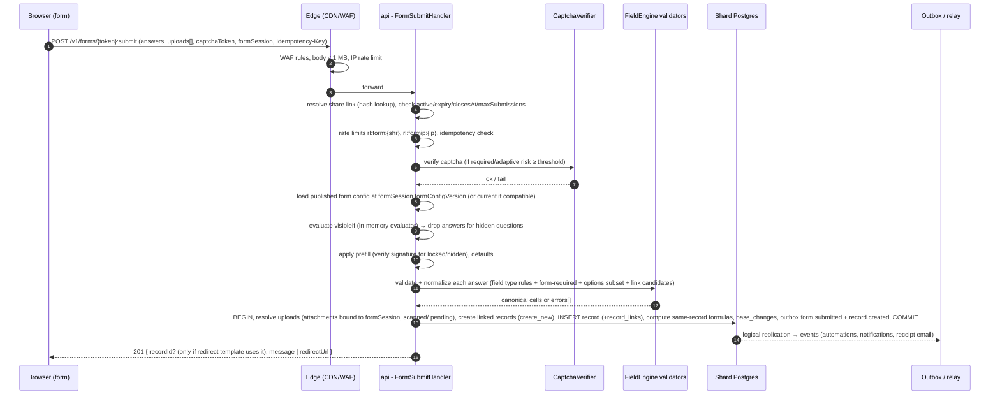

# 10 — View Engine

> **Status:** Proposed · **Owner:** Data Experience team · **Date:** 2026-10-03
> **Conforms to:** [`00-canonical-decisions.md`](./00-canonical-decisions.md) (normative). Where this document and the spine disagree, the spine wins.

**Sections covered:** §12 View engine (Part 7) — view types (grid, kanban, calendar, gallery, timeline, gantt, form, list; charts decision), configuration model (`ViewConfigBase` + typed `layout`), config versioning & migrations, database representation (`views`, `view_sections`, `view_user_state`), ownership & visibility, state placement (DB vs user prefs vs client vs URL), query execution pipeline, ordering stability & cursors, records entering/leaving a view, summary-bar aggregations, caching, concurrent config edits, deletion/restore, dangling references, forms (public submission pipeline), shared views.

**Related documents:** [`06-record-storage.md`](./06-record-storage.md) · [`07-field-engine.md`](./07-field-engine.md) · [`08-formula-engine.md`](./08-formula-engine.md) · [`09-linked-record-engine.md`](./09-linked-record-engine.md) · [`11-filter-sort-group.md`](./11-filter-sort-group.md) (Filter AST, operators, SQL translation, sort & group — **the view engine delegates all query semantics there**) · [`13-interface-builder.md`](./13-interface-builder.md) · [`16-realtime.md`](./16-realtime.md) · [`17-api-architecture.md`](./17-api-architecture.md) · [`19-permissions-and-multitenancy.md`](./19-permissions-and-multitenancy.md) · [`24-frontend-grid-state-design-system.md`](./24-frontend-grid-state-design-system.md)

---

## 1. Purpose, scope and principles

A **view** is a *named, persisted, typed presentation* of the records of exactly one table: a query (filter, sort, group), a field layout, and a type-specific visual layout. Views never own data and never grant access to data that the principal could not otherwise read (with one deliberate exception — **share links**, §15 — which grant scoped anonymous read access *through* the view's query).

Design principles **[Ours]**:

1. **One query model everywhere.** The view's `query` section uses the canonical Filter AST / Sort / Group specification from [`11-filter-sort-group.md`](./11-filter-sort-group.md). The same AST is used by the public `records:query` API (D16), interface elements ([`13`](./13-interface-builder.md)), automation conditions, and the in-memory evaluator for realtime membership checks. No view type invents its own filter dialect.
2. **Common base + typed layout.** Every view config = `ViewConfigBase` (query, field layout, row presentation, color rules, open mode, search scope) + exactly one type-specific `layout` object. This kills the classic "flat bag of 80 optional keys" problem: type-specific options are discriminated, validated by type, and migrated by type.
3. **Config is data with a schema version.** `schemaVersion` on every config; pure, forward-only migrations; lazy upgrade on read plus a background sweep.
4. **Semantic ops, not blobs.** Clients mutate configs with small, intention-revealing ops (`setFilter`, `moveField`, `setFieldWidth` …) carrying the `configVersion` they were based on. Most ops commute; the server rebases and broadcasts.
5. **IDs, never names.** All references to fields, options, users, records inside configs are by internal ID. Renames never touch view configs. Deleted references become *dangling* and are surfaced, not silently dropped (§14).
6. **The server is authoritative for membership and order; the client is authoritative for nothing but presentation.** The client may *predict* membership/order for latency hiding (using the shared in-memory evaluator and comparator), but reconciles with the server.

Non-goals: views do not define per-record permissions (that is Enterprise row policies / interfaces, see [`19`](./19-permissions-and-multitenancy.md), [`13`](./13-interface-builder.md)); views do not store data (no "view-local columns").

---

## 2. View type catalogue and decisions

| Type key | Purpose | Requires | Supports grouping | Manual record order | Notes |
|---|---|---|---|---|---|
| `grid` | Spreadsheet presentation; primary editing surface | — | Yes (≤ 3 levels) | Yes (when no sort) | Canvas grid ([`24`](./24-frontend-grid-state-design-system.md)) |
| `kanban` | Cards in stacks by a single-valued field | stack field: `single_select`, `collaborator` (single), `link` (single, `allowMultiple:false`) | Stacks = level-0 group; no extra grouping | Yes (per stack) | Moving a card = cell write |
| `calendar` | Records placed on dates | ≥ 1 `date`/`datetime` (or date-typed formula/lookup/rollup — read-only placement) | No (color/filter instead) | No | Multiple date ranges per view |
| `gallery` | Card grid with large cover | — | No (V1: optional single level) | Yes (when no sort) | |
| `timeline` | Horizontal bars over time, swimlanes | start date field (+ end or duration) | Swimlanes (1 level) | No | **Gantt is a timeline mode** (`layout.mode = "gantt"`) adding dependencies |
| `form` | Data entry; create records | — | n/a | n/a | Submission pipeline §16; public via `share_links` |
| `list` | Dense, multi-line rows; optional hierarchy (parent/child via self-link) | — | Yes (≤ 3 levels) | Yes | Good for mobile & outlines |

### 2.1 Decision: Gantt is a timeline mode, not a separate type

**Option A — separate `gantt` view type.** Pros: separate config surface, separate UI entry. Cons: ≈90% of config (date fields, scale, swimlanes, bar label, colors) duplicated; switching between "timeline" and "gantt" on the same data would require conversion.

**Option B — `timeline` with `mode: "timeline" | "gantt"`.** Gantt adds a left task table pane, a dependency field (self-link "Blocked by"/"Depends on"), dependency arrows, optional critical-path highlight and (V2) auto-scheduling.

**Recommendation: B.** The data contract is identical (start/end per record); the difference is presentation plus one extra reference (the dependency link). A view switch between modes is a one-op config change. The UI may still show "Gantt" as its own entry in the "create view" menu (it creates `type: "timeline"`, `layout.mode: "gantt"`).

### 2.2 Decision: charts belong to interfaces/dashboards, not to views

**Option A — `chart` as a view type.** Pros: quick charts next to a grid. Cons: a chart is an *aggregation* over a query (group-by + measures), not a presentation of *records*; it does not support record-level operations (open, edit, reorder, select) that every other view type shares; every view capability (row ordering, cursors, membership events, field layout, form submission) would need a "not applicable" branch; dashboards need multiple charts and cross-filtering, which a single-chart view can't do.

**Option B — charts are interface elements** ([`13`](./13-interface-builder.md) §10), backed by a shared **Aggregation Query** service (§11.3 here, and [`13`](./13-interface-builder.md)), which the view summary bar *also* uses.

**Recommendation: B.** Views stay "record presentations"; the aggregation engine is shared. To keep the "quick chart" UX, the grid offers **"Chart this view"**, which creates (or opens) a personal dashboard interface page with a chart element whose data source is `{ tableId, baseViewId: <this view> }`. That is a link, not a copy, so the chart tracks the view's filter.

### 2.3 Shared views

"Shared view" is not a view type; it is a **share link** (`share_links`, prefix `shr`) targeting a view (`kind = 'view'`), giving read-only (or for forms, submit-only) access to a sanitized projection of the view. Details in §15.

---

## 3. Configuration model

All types live in `@tabula/view-model` (isomorphic package, used by server, web client, and the API SDK). The canonical Filter/Sort/Group types are imported from `@tabula/query` (defined in [`11-filter-sort-group.md`](./11-filter-sort-group.md) §2).

### 3.1 Identifiers inside configs

Internally configs store **internal UUIDs** for fields/options/users/records (as strings); the API boundary encodes/decodes them to public IDs (`fld_…`, `opt_…`, `usr_…`, `rec_…`) per D5. In the TypeScript below, `FieldId`, `OptionId`, `UserId`, `RecordId`, `AttachmentId` are branded string types. JSON examples in this document use public IDs for readability (this is also exactly what the public API returns).

### 3.2 `ViewConfigBase`

```ts
// @tabula/view-model/src/config.ts
import type { FilterNode, SortSpec, GroupSpec } from '@tabula/query';

export type ViewType = 'grid' | 'kanban' | 'calendar' | 'gallery' | 'timeline' | 'form' | 'list';

export const CURRENT_VIEW_SCHEMA_VERSION = 3 as const;

export interface ViewConfigBase<T extends ViewType, L> {
  schemaVersion: number;              // config document format version (§4)
  type: T;                            // duplicated from views.type for self-describing JSON; must match

  query: ViewQuery;                   // what records, in what order, grouped how
  fieldLayout: FieldLayoutEntry[];    // ordered; every non-deleted field of the table appears exactly once after normalization
  presentation: Presentation;         // row height, wrap defaults, density
  colorRules: ColorRules | null;      // record coloring
  recordOpen: RecordOpenConfig;       // how a record opens from this view
  search: SearchScope;                // which fields the in-view search scans
  layout: L;                          // type-specific
}

export interface ViewQuery {
  filter: FilterNode | null;          // canonical Filter AST (11 §2). null = all records
  sorts: SortSpec[];                  // ≤ 10 levels (11 §9)
  groups: GroupSpec[];                // ≤ 3 levels (11 §11). Kanban/calendar/gallery/timeline: constrained per type
  timeZone?: string | 'viewer';       // IANA tz for date semantics; default resolution in 11 §4.3
  includeStaleComputed?: boolean;     // default true: computed values pending recompute are shown with a stale marker
}

export interface FieldLayoutEntry {
  fieldId: FieldId;
  visible: boolean;
  width?: number;                     // px, 60..1200; grid/list only. Absent = type default
  wrap?: boolean;                     // wrap cell text in tall rows (grid/list)
  label?: string;                     // NOT for grid (field names are global); used by card types as "hide label" flag via labelMode
  labelMode?: 'show' | 'hide';        // cards (kanban/gallery/timeline bars)
  frozen?: boolean;                   // grid: only a prefix of entries may be frozen; primary field is always frozen
  aggregate?: SummaryAggregate | null;// summary bar aggregate for this column (§11.2)
}

export interface Presentation {
  rowHeight: 'short' | 'medium' | 'tall' | 'extra_tall'; // grid/list (maps to 32/56/88/128 px)
  density?: 'comfortable' | 'compact';
  showRowNumbers?: boolean;           // grid
  showFieldDescriptions?: boolean;
}

export type ColorRules =
  | { mode: 'select_field'; fieldId: FieldId }                      // color = option color of a single_select
  | { mode: 'conditions'; rules: Array<{ id: string; color: ColorToken; filter: FilterNode }> }; // first match wins, ≤ 20 rules

export type ColorToken =
  | 'gray' | 'blue' | 'cyan' | 'teal' | 'green' | 'yellow' | 'orange' | 'red' | 'pink' | 'purple'
  | `${'gray'|'blue'|'cyan'|'teal'|'green'|'yellow'|'orange'|'red'|'pink'|'purple'}_${'light'|'dark'}`;

export interface RecordOpenConfig {
  mode: 'expanded_modal' | 'side_panel' | 'full_page' | 'none';  // 'none' e.g. forms
  layoutFieldOrder?: 'view' | 'table';                          // expanded record uses this view's field order or table order
  showHiddenFields?: 'collapsed' | 'hidden' | 'shown';           // hidden-in-view fields in expanded record
}

export interface SearchScope {
  mode: 'visible_fields' | 'all_fields' | 'fields';
  fieldIds?: FieldId[];               // when mode = 'fields'
}

export type SummaryAggregate =
  | 'none' | 'count_all' | 'count_empty' | 'count_filled' | 'count_unique' | 'percent_empty' | 'percent_filled'
  | 'sum' | 'avg' | 'median' | 'min' | 'max' | 'range' | 'std_dev'
  | 'checked' | 'unchecked' | 'percent_checked'
  | 'earliest' | 'latest' | 'date_range_days';
```

### 3.3 Type-specific `layout` sections

```ts
// ---------- grid ----------
export interface GridLayout {
  manualOrder: boolean;               // true when no sorts and the user has dragged rows (order in view_record_orders, §5.4)
  summaryBar: boolean;
  groupHeaderAggregates: boolean;     // show per-group aggregates in group headers (uses fieldLayout[].aggregate)
  multiValueGrouping: 'combination' | 'split'; // 11 §11.4
}
export type GridViewConfig = ViewConfigBase<'grid', GridLayout>;

// ---------- kanban ----------
export interface KanbanLayout {
  stackFieldId: FieldId;              // single_select | collaborator(single) | link(single)
  stackOrder: Array<StackKey>;        // explicit stack order; absent keys appended in field option order
  hiddenStacks: StackKey[];
  showEmptyStack: boolean;            // "Uncategorized"
  emptyStackPosition: 'first' | 'last';
  card: CardSpec;
  manualOrderWithinStack: boolean;    // card order in view_record_orders (scope = stack key)
  stackLimit?: number;                // WIP display hint (not enforced as a constraint), 1..1000
}
export type StackKey = { kind: 'option'; optionId: OptionId } | { kind: 'user'; userId: UserId }
                     | { kind: 'record'; recordId: RecordId } | { kind: 'empty' };

export interface CardSpec {
  cover: CoverSpec | null;
  titleFieldId?: FieldId;             // default: primary field
  // card fields come from fieldLayout (visible entries, in order) — not duplicated here
  maxFieldsShown?: number;            // 1..20, default 6
  showEmptyFields: boolean;
}
export interface CoverSpec {
  fieldId: FieldId;                   // attachment field (or url field with image URL, V1)
  fit: 'crop' | 'fit';                // crop = object-fit: cover; fit = contain with letterbox
  aspect?: '16:9' | '4:3' | '1:1' | '3:4';
  position?: 'top' | 'left';          // left = list-style card (gallery/list only)
}

// ---------- calendar ----------
export interface CalendarLayout {
  dateRanges: Array<{
    id: string;                       // stable id for colors/legend
    startFieldId: FieldId;            // date | datetime | date-typed computed
    endFieldId?: FieldId;             // optional; same family as start
    color?: ColorToken;               // overrides colorRules for this range
    label?: string;
  }>;                                 // 1..5
  defaultMode: 'month' | 'week' | 'day' | 'agenda';
  weekStartsOn?: 0 | 1 | 6;           // default from base settings
  showWeekends: boolean;
  eventTitleFieldId?: FieldId;        // default primary
  // a record appears once per dateRange whose start is non-empty
  allowDragReschedule: boolean;       // drag writes start (and shifts end preserving duration)
  timedEventDefaultMinutes?: number;  // create-by-click duration for datetime ranges, default 60
}

// ---------- gallery ----------
export interface GalleryLayout {
  card: CardSpec;                     // cover typically present
  cardSize: 'small' | 'medium' | 'large';
  manualOrder: boolean;
}

// ---------- timeline (+ gantt mode) ----------
export interface TimelineLayout {
  mode: 'timeline' | 'gantt';
  start: { fieldId: FieldId };
  end: { kind: 'field'; fieldId: FieldId } | { kind: 'duration'; fieldId: FieldId /* duration|number(days) */ } | { kind: 'none' };
  scale: 'day' | 'week' | 'month' | 'quarter' | 'year';
  swimlaneFieldId?: FieldId;          // groups rows into lanes (single-valued or multi with 'combination')
  barLabelFieldIds: FieldId[];        // ≤ 3
  barColor?: { mode: 'select_field'; fieldId: FieldId } | { mode: 'fixed'; color: ColorToken };
  gantt?: GanttSettings;              // required iff mode = 'gantt'
  showToday: boolean;
  allowDragReschedule: boolean;
}
export interface GanttSettings {
  dependencyFieldId: FieldId;         // self-link field on this table: "this record depends on → linked records"
  dependencyType: 'finish_to_start';  // V1 only FS; SS/FF/SF reserved
  showCriticalPath: boolean;
  autoSchedule: 'off' | 'shift_dependents'; // V2: dragging a predecessor shifts successors via a server long op
  taskPaneFieldIds: FieldId[];        // left table pane columns
  taskPaneWidth?: number;
}

// ---------- form ----------
export interface FormLayout {
  title: string;                      // ≤ 200
  description?: RichTextDoc;          // limited rich text (bold/italic/link/list), ≤ 10k chars
  branding: {
    coverAttachmentId?: AttachmentId; // stored in attachments; served via variant URL
    logoAttachmentId?: AttachmentId;
    accentColor?: ColorToken;
    hideTabulaBranding?: boolean;     // plan-gated
  };
  elements: FormElement[];            // ordered; field questions + layout blocks
  submit: {
    buttonLabel?: string;             // default "Submit"
    afterSubmit:
      | { kind: 'message'; message?: RichTextDoc; showSubmitAnother: boolean }
      | { kind: 'redirect'; urlTemplate: string /* https only; {record_id} allowed */ };
    allowAnonymous: boolean;          // false ⇒ submitter must be signed in (and have record.create on table)
    requireCaptcha: 'always' | 'adaptive' | 'never'; // 'never' only for authenticated-only forms
    emailReceiptToSubmitter?: { emailFieldId: FieldId };
    notifyCollaborators?: UserId[];   // notification on submission
    limitOnePerUser?: boolean;        // authenticated forms only
    closesAt?: string;                // ISO datetime; form rejects submissions after
    maxSubmissions?: number;          // form closes after N accepted submissions
  };
  prefill: {
    allowUrlPrefill: boolean;         // ?prefill_<fieldId>=value
    requireSignedForLocked: boolean;  // locked/hidden prefills must be HMAC-signed (§16.5)
  };
}

export type FormElement =
  | {
      kind: 'field';
      id: string;                     // stable element id (fe_… local, not a global prefix)
      fieldId: FieldId;
      label?: string;                 // overrides field name on the form only
      helpText?: string;              // ≤ 1000 chars, plain text with autolinks
      required: boolean;              // form-level requirement (in addition to field-level validation)
      placeholder?: string;
      visibleIf?: FilterNode;         // condition over *form answers* (same AST; fieldIds refer to form fields) — §16.3
      prefillMode?: 'editable' | 'locked' | 'hidden'; // how a prefilled value is treated
      defaultValue?: unknown;         // canonical cell JSON for this field type
      // type-specific knobs
      options?: { optionIds?: OptionId[]; display?: 'dropdown' | 'radio' | 'checkboxes' }; // select subset
      link?: LinkQuestionConfig;      // link fields
      attachment?: { maxFiles?: number; maxFileBytes?: number; acceptMime?: string[] };
    }
  | { kind: 'section_header'; id: string; title: string; description?: string; visibleIf?: FilterNode }
  | { kind: 'page_break'; id: string; visibleIf?: FilterNode }   // V1: multi-step forms
  | { kind: 'static_text'; id: string; body: RichTextDoc; visibleIf?: FilterNode };

export interface LinkQuestionConfig {
  mode: 'choose_existing' | 'create_new' | 'choose_or_create';
  // choose_existing exposes target records to the (possibly anonymous) submitter → must be scoped:
  candidateViewId?: ViewId;           // REQUIRED for anonymous forms with choose_existing: only records in this view
  candidateDisplayFieldIds?: FieldId[]; // fields shown in the picker, default: target primary only, ≤ 3
  searchRequiresMinChars?: number;    // default 2 for anonymous (no full-list enumeration)
  createFields?: FieldId[];           // create_new: which target fields the submitter fills (default primary only)
}

// ---------- list ----------
export interface ListLayout {
  hierarchy?: { parentFieldId: FieldId; maxDepth: number /* 1..8 */; expandByDefault: boolean } | null; // self-link single
  titleFieldId?: FieldId;
  secondaryFieldIds: FieldId[];       // shown on the second line, ≤ 6
  cover?: CoverSpec | null;           // thumbnail at left
  manualOrder: boolean;
  multiValueGrouping: 'combination' | 'split';
}

export type ViewConfig =
  | GridViewConfig
  | ViewConfigBase<'kanban', KanbanLayout>
  | ViewConfigBase<'calendar', CalendarLayout>
  | ViewConfigBase<'gallery', GalleryLayout>
  | ViewConfigBase<'timeline', TimelineLayout>
  | ViewConfigBase<'form', FormLayout>
  | ViewConfigBase<'list', ListLayout>;
```

**Form configs and the base.** A form view still has a `ViewConfigBase`: `query` is unused for record listing but `query.filter` is **forced to `null`** (forms don't list records); `fieldLayout` is still maintained (so switching a form's table fields stays consistent), but the form's question order is `layout.elements`. This keeps one storage/migration/validation path for all views.

### 3.4 Limits (validated server-side; error `VIEW_CONFIG_INVALID`)

| Item | Limit |
|---|---|
| Serialized config size | 256 KB (form with rich descriptions included) |
| Filter AST | depth ≤ 8, conditions ≤ 200 (from 11 §5) |
| Sorts | ≤ 10 |
| Groups | ≤ 3 (kanban: stack only; calendar/timeline: 0 extra; timeline swimlane counts as 1) |
| Color rules | ≤ 20, each filter ≤ 50 conditions |
| Calendar date ranges | ≤ 5 |
| Form elements | ≤ 300 |
| Views per table | 1,000 (collaborative + all users' personal), personal views per user per table: 100 |
| View name | 1..255 chars, unique among collaborative views of the table (case-insensitive); personal names unique per owner |

### 3.5 Example — kanban view (public API representation)

```json
{
  "id": "viw_6Q2nWm1a8y0lQxT3vZr4Fd",
  "type": "kanban",
  "name": "Pipeline by stage",
  "visibility": "collaborative",
  "configVersion": 42,
  "config": {
    "schemaVersion": 3,
    "type": "kanban",
    "query": {
      "filter": {
        "kind": "group", "op": "and",
        "children": [
          { "kind": "cond", "fieldId": "fld_owner", "operator": "is_any_of", "valueRef": { "type": "currentUser" } },
          { "kind": "cond", "fieldId": "fld_amount", "operator": "gt", "value": 1000 }
        ]
      },
      "sorts": [{ "fieldId": "fld_close", "direction": "asc" }],
      "groups": []
    },
    "fieldLayout": [
      { "fieldId": "fld_name",   "visible": true },
      { "fieldId": "fld_amount", "visible": true, "labelMode": "show" },
      { "fieldId": "fld_close",  "visible": true, "labelMode": "hide" },
      { "fieldId": "fld_notes",  "visible": false }
    ],
    "presentation": { "rowHeight": "short" },
    "colorRules": { "mode": "conditions", "rules": [
      { "id": "cr1", "color": "red_light", "filter": { "kind": "cond", "fieldId": "fld_close", "operator": "is_before", "valueRef": { "type": "relativeDate", "preset": "today" } } }
    ]},
    "recordOpen": { "mode": "side_panel", "layoutFieldOrder": "view", "showHiddenFields": "collapsed" },
    "search": { "mode": "visible_fields" },
    "layout": {
      "stackFieldId": "fld_stage",
      "stackOrder": [
        { "kind": "option", "optionId": "opt_lead" },
        { "kind": "option", "optionId": "opt_qualified" },
        { "kind": "option", "optionId": "opt_won" }
      ],
      "hiddenStacks": [{ "kind": "option", "optionId": "opt_lost" }],
      "showEmptyStack": true,
      "emptyStackPosition": "first",
      "card": {
        "cover": { "fieldId": "fld_logo", "fit": "fit", "aspect": "16:9" },
        "maxFieldsShown": 4,
        "showEmptyFields": false
      },
      "manualOrderWithinStack": false
    }
  }
}
```

Note: when `sorts` is non-empty, `manualOrderWithinStack` must be `false` (validator normalizes it; UI shows "Sorted by Close date — drag to reorder is disabled").

### 3.6 Example — form view

```json
{
  "schemaVersion": 3,
  "type": "form",
  "query": { "filter": null, "sorts": [], "groups": [] },
  "fieldLayout": [ { "fieldId": "fld_name", "visible": true }, { "fieldId": "fld_email", "visible": true } ],
  "presentation": { "rowHeight": "short" },
  "colorRules": null,
  "recordOpen": { "mode": "none" },
  "search": { "mode": "visible_fields" },
  "layout": {
    "title": "Request a demo",
    "branding": { "coverAttachmentId": "att_3k…", "accentColor": "blue", "hideTabulaBranding": false },
    "elements": [
      { "kind": "field", "id": "fe_1", "fieldId": "fld_name",  "label": "Your name", "required": true },
      { "kind": "field", "id": "fe_2", "fieldId": "fld_email", "label": "Work email", "required": true,
        "helpText": "We'll send the invite here." },
      { "kind": "field", "id": "fe_3", "fieldId": "fld_company_size", "required": true,
        "options": { "display": "radio" } },
      { "kind": "field", "id": "fe_4", "fieldId": "fld_seats", "required": true,
        "visibleIf": { "kind": "cond", "fieldId": "fld_company_size", "operator": "is_any_of", "value": ["opt_200p", "opt_1000p"] } },
      { "kind": "field", "id": "fe_5", "fieldId": "fld_source", "required": false, "prefillMode": "hidden" },
      { "kind": "field", "id": "fe_6", "fieldId": "fld_company", "required": false,
        "link": { "mode": "create_new", "createFields": ["fld_company_name"] } },
      { "kind": "field", "id": "fe_7", "fieldId": "fld_deck", "required": false,
        "attachment": { "maxFiles": 3, "maxFileBytes": 26214400, "acceptMime": ["application/pdf", "image/*"] } }
    ],
    "submit": {
      "buttonLabel": "Book my demo",
      "afterSubmit": { "kind": "redirect", "urlTemplate": "https://example.com/thanks?ref={record_id}" },
      "allowAnonymous": true,
      "requireCaptcha": "adaptive",
      "maxSubmissions": 10000
    },
    "prefill": { "allowUrlPrefill": true, "requireSignedForLocked": true }
  }
}
```

### 3.7 Normalization rules (applied after every op and every migration)

`normalizeViewConfig(config, tableSchema): { config, diagnostics }` is a **pure** function in `@tabula/view-model`:

1. `fieldLayout`: append missing non-deleted fields (visibility: `false` for collaborative views created before the field — except the primary field which is always visible and first; the creating view of a new field gets `visible: true` — see `field.created` handling below); remove *purged* fields; keep *soft-deleted* fields (they may be restored; §13). Deduplicate.
2. Primary field: position 0, `visible: true`, `frozen: true` in grid.
3. Frozen entries must be a prefix.
4. Type constraints: kanban stack field type valid; calendar date ranges reference date-family fields; timeline end/duration types; gantt dependency field is a self-link (`link_relations` A-table = B-table = this table).
5. Clamp numeric knobs (widths, limits) to ranges.
6. Sorts present ⇒ manual-order flags `false`.
7. Dangling references (field soft-deleted, option deleted, user deactivated, view deleted for `candidateViewId`) produce **diagnostics** (§14) — never silent deletion.

`field.created` handling: new fields are appended to every view's `fieldLayout`; in the view where the user created the field (`createdFromViewId` in the command) `visible: true`; in other **grid** views `visible: true` too (spreadsheet convention — new columns appear) unless the view `hideNewFields: true` is set (V1 setting on `GridLayout`); in kanban/gallery/timeline/list `visible: false` (cards stay tidy); in forms not added to `elements`. This is materialized lazily: the normalizer appends on read; the persisted config is upgraded on the next write. Readers must therefore always normalize.

---

## 4. Config versioning and migrations

Two different version numbers — do not confuse them:

| Name | Where | Meaning |
|---|---|---|
| `config.schemaVersion` | inside JSON | **Format** version of the config document (code-defined). Bumps with releases. |
| `views.config_version` | column | **Revision counter** of this view's config (optimistic concurrency, ETag). Bumps on every applied op. |

### 4.1 Migration registry

```ts
// @tabula/view-model/src/migrations/index.ts
export interface ViewConfigMigration {
  from: number; to: number;           // to = from + 1
  description: string;
  migrate(config: unknown, ctx: MigrationContext): unknown; // pure, deterministic, total (never throws on valid `from` input)
}
export interface MigrationContext { tableSchema: TableSchemaSnapshot; } // read-only; for migrations that need field types

export const migrations: ViewConfigMigration[] = [
  { from: 1, to: 2, description: 'flat card fields → fieldLayout labelMode; coverFieldId → layout.card.cover',
    migrate: (c: any) => {/* … */ return c; } },
  { from: 2, to: 3, description: 'filter AST v1 {type,and/or arrays} → v2 {kind:"group",op,children}',
    migrate: (c: any) => {/* … */ return c; } },
];

export function upgradeViewConfig(raw: unknown, ctx: MigrationContext): ViewConfig {
  let c: any = raw; let v = c.schemaVersion ?? 1;
  if (v > CURRENT_VIEW_SCHEMA_VERSION) throw new ConfigFromFutureError(v); // server older than data → refuse writes
  for (const m of migrations) if (m.from === v) { c = m.migrate(c, ctx); v = m.to; c.schemaVersion = v; }
  return ViewConfigSchema.parse(c); // zod; validates final shape
}
```

### 4.2 Rules

* **Forward-only, pure, total.** Each migration has golden-file tests (`fixtures/v{n}/*.json → v{n+1}`), plus a property test: `upgrade(random valid v1)` always validates.
* **Read path:** `upgradeViewConfig` → `normalizeViewConfig` on every load (cached by `(viewId, config_version, schemaVersion, tableSchemaVersion)`). Cost is microseconds; the cache avoids even that.
* **Write path:** writes always persist the current `schemaVersion`. A write never persists an older format.
* **Background sweep:** after a deploy that adds a migration, the `maintenance` queue job `view-config-upgrade` walks `views WHERE (config->>'schemaVersion')::int < $current` in batches of 500 per shard, upgrading in place **without** bumping `config_version` (format change is not a user-visible revision) and without emitting `view.updated` (no semantic change). Format upgrades write no `base_changes` entry and do not bump `bases.schema_version`: they are invisible to users, undo, realtime and caches keyed on `config_version` (the normalized output is identical by construction).
* **Rolling deploys:** N and N+1 server versions co-exist. Rule: a migration is introduced in two releases — release R ships the *reader* for v(n+1) (can read both), release R+1 starts *writing* v(n+1). A server that encounters `schemaVersion` greater than it knows refuses to write (409 `VIEW_CONFIG_FROM_FUTURE`) and reads with best effort (unknown keys preserved by passthrough in zod).
* **Clients:** the web client bundles the same package; if the server serves a newer `schemaVersion` than the client knows, the client shows "Reload to get the latest version" for that view, and does not send ops.
* **Public API:** returns the current format. Breaking format changes are mapped by the API layer to a stable public view schema (the public view schema is versioned with the API, not with `schemaVersion`).

---

## 5. Database representation

Authoritative DDL is in `05-sql-schema.md`; below is the shape this engine requires (columns the view engine reads/writes). All tables carry `workspace_id` for RLS (D4) and live on the workspace's shard (D3).

### 5.1 `views`

```sql
CREATE TABLE data.views (
  id               uuid PRIMARY KEY,                 -- UUIDv7, public prefix viw_
  workspace_id     uuid NOT NULL,
  base_id          uuid NOT NULL,
  table_id         uuid NOT NULL,
  type             text NOT NULL CHECK (type IN ('grid','kanban','calendar','gallery','timeline','form','list')),
  name             text NOT NULL CHECK (char_length(name) BETWEEN 1 AND 255),
  description      text,
  config           jsonb NOT NULL,                   -- ViewConfig (format: config->>'schemaVersion')
  config_version   integer NOT NULL DEFAULT 1,       -- revision counter / ETag
  visibility       text NOT NULL CHECK (visibility IN ('collaborative','personal','locked')),
  owner_user_id    uuid,                             -- NOT NULL iff visibility='personal'
  locked_by        uuid, locked_at timestamptz,      -- when visibility='locked'
  section_id       uuid,                             -- view_sections.id (nullable = top level)
  order_key        text NOT NULL COLLATE "C",        -- fractional index within (table, section)
  is_default       boolean NOT NULL DEFAULT false,   -- the table's default collaborative view (exactly one)
  created_by       uuid NOT NULL,
  created_at       timestamptz NOT NULL DEFAULT now(),
  updated_by       uuid,
  updated_at       timestamptz NOT NULL DEFAULT now(),
  deleted_at       timestamptz,
  deletion_batch_id uuid,                            -- deletion_batches.id
  CONSTRAINT personal_owner CHECK ((visibility = 'personal') = (owner_user_id IS NOT NULL))
);
CREATE INDEX views_table_order   ON data.views (table_id, section_id, order_key) WHERE deleted_at IS NULL;
CREATE INDEX views_owner         ON data.views (table_id, owner_user_id) WHERE visibility = 'personal' AND deleted_at IS NULL;
CREATE UNIQUE INDEX views_default ON data.views (table_id) WHERE is_default AND deleted_at IS NULL;
CREATE UNIQUE INDEX views_collab_name ON data.views (table_id, lower(name))
  WHERE visibility <> 'personal' AND deleted_at IS NULL;
-- Reverse reference index for dangling-reference handling (§13) and "which views use field X":
CREATE INDEX views_config_refs ON data.views USING gin ((config -> 'refs') jsonb_path_ops);
```

`config.refs` — a **derived, server-maintained** array (`["f:<fieldUuid>", "o:<optionUuid>", "v:<viewUuid>", "u:<userUuid>"…]`) of every ID the config references, recomputed on every write by `collectRefs(config)`. It lets "field deleted → which views reference it?" be an index lookup (`config->'refs' @> '["f:…"]'`) instead of a scan of all configs in the base. It is stripped from API output.

### 5.2 `view_sections`

```sql
CREATE TABLE data.view_sections (
  id uuid PRIMARY KEY,                -- vsc_
  workspace_id uuid NOT NULL, base_id uuid NOT NULL, table_id uuid NOT NULL,
  name text NOT NULL,
  visibility text NOT NULL CHECK (visibility IN ('collaborative','personal')),
  owner_user_id uuid,
  order_key text NOT NULL COLLATE "C",
  created_at timestamptz NOT NULL DEFAULT now(),
  deleted_at timestamptz, deletion_batch_id uuid
);
```

Sections are one level deep (no nested folders — decided for UI simplicity; revisit if requested). Deleting a section moves its views to top level by default (`moveViewsTo: null`), or deletes them in the same `deletion_batch` when the user chooses "delete section and views".

### 5.3 `view_user_state`

```sql
CREATE TABLE data.view_user_state (
  view_id      uuid NOT NULL,
  user_id      uuid NOT NULL,
  workspace_id uuid NOT NULL,
  state        jsonb NOT NULL,        -- ViewUserState, ≤ 64 KB
  state_version integer NOT NULL DEFAULT 1,
  updated_at   timestamptz NOT NULL DEFAULT now(),
  PRIMARY KEY (view_id, user_id)
);
```

```ts
export interface ViewUserState {
  schemaVersion: 1;
  fieldOverrides?: Record<FieldId, { width?: number; wrap?: boolean }>; // only honored when user can't/shouldn't change shared config (§7)
  collapsedGroups?: string[];         // group path keys (11 §11.6), ≤ 2000
  collapsedStacks?: string[];         // kanban
  calendar?: { mode?: 'month'|'week'|'day'|'agenda'; anchorDate?: string };
  timeline?: { scale?: TimelineLayout['scale']; anchorDate?: string; taskPaneWidth?: number };
  lastAnchor?: { recordId: RecordId; at: string }; // "return to where I was" (record anchor, not pixel offset)
  pinned?: boolean;                   // pinned view in sidebar
}
```

Writes are fire-and-forget from the client (debounced 1 s), `INSERT … ON CONFLICT (view_id, user_id) DO UPDATE` with JSON merge at the top-level key granularity. Not part of `base_changes` (not undoable, not broadcast except to the same user's other sessions via the user channel).

### 5.4 Manual ordering

Manual order is a per-view property (two grid views may have different hand-sorted orders; kanban order is per stack). The spine's ordering-key convention (fractional index strings) applies. The table inventory has no home for per-view record order, so this document proposes **`view_record_orders`** (see *Proposed additions*):

```sql
CREATE TABLE data.view_record_orders (
  view_id      uuid NOT NULL,
  scope_key    text NOT NULL DEFAULT '',   -- '' for grid/gallery/list; stack key for kanban ("o:<optionUuid>", "u:<userUuid>", "r:<recordUuid>", "e")
  record_id    uuid NOT NULL,
  workspace_id uuid NOT NULL,
  order_key    text NOT NULL COLLATE "C",
  PRIMARY KEY (view_id, record_id, scope_key)
);
CREATE INDEX view_record_orders_scan ON data.view_record_orders (view_id, scope_key, order_key);
```

Records with no row in `view_record_orders` sort **after** ordered ones by the table baseline order `records.manual_order, id` ([`06`](./06-record-storage.md) §21). Rows are created lazily: only records the user has dragged get an order row; dragging record X between A and B writes one row with `order_key = between(A.key, B.key)` (if A or B lacks a key, keys are materialized for the minimal contiguous run, bounded at 1,000 rows, else the view's whole order is materialized by a `long_operation`). Rebalancing (keys longer than 64 chars) is a background job. Kanban moves *between* stacks are a cell write (stack field) plus an order row in the destination scope, in one transaction.

---

## 6. Ownership and visibility

| Visibility | Who sees it | Who may change config | Created by | Notes |
|---|---|---|---|---|
| `collaborative` | Everyone with `view.read` on the base | `view.update` (base `editor`+ by default; base setting may restrict to `creator`) | `view.create_collaborative` (editor+) | Default kind |
| `personal` | Owner only (plus base `creator`s via admin "show personal views of others" for cleanup — read only) | Owner | `view.create_personal` (commenter+; viewers may create personal views — they change nothing shared) | Excluded from public API listing except for the owner's token |
| `locked` | Like collaborative | Only principals with `view.lock` (base `creator`) — everybody else's presentation changes go to `view_user_state` | Lock action by `view.lock` holder | Lock records `locked_by`, `locked_at`, optional lock note |

Rules:

* **A view never widens data access.** `view.read` lets you *see the view definition*; the records it returns are always further restricted by the principal's `PermissionSnapshot` (table/field restrictions, Enterprise row policies; [`19`](./19-permissions-and-multitenancy.md)). Hidden fields (Enterprise field hide) are removed from results even if `visible: true` in the view.
* Field visibility in a view is **presentation, not security.** Any base reader can open the expanded record or use the API to see fields hidden in a view. The UI says so in the "hide fields" menu. For security-grade scoping, use interfaces or share links (which *do* enforce a projection).
* Converting a view between `collaborative` ↔ `personal`: owner of personal view → collaborative requires `view.create_collaborative`; collaborative → personal requires `view.update` and assigns the actor as owner (other users lose it; confirmation warns if share links or interface elements reference the view — those references block the conversion: `VIEW_IN_USE` with the list of referrers).
* The table's **default view** (`is_default`) is collaborative and cannot be deleted or made personal while default; it opens when navigating to the table without a view id. The public API never applies a view implicitly: `viewId` must be passed explicitly to get view semantics.

---

## 7. State placement: DB config vs user prefs vs client vs URL

| State | Location | Why |
|---|---|---|
| Filter, sorts, groups, field order, field visibility, color rules, layout (stack field, date ranges, cover…), row height, summary aggregates | `views.config` | Shared meaning of the view; collaborative |
| Column width, wrap | `views.config` **when the actor has `view.update` and view is not locked**; else `view_user_state.fieldOverrides` | WYSIWYG for editors, but viewers/commenters and locked views must not mutate shared config; they still deserve resizable columns |
| Collapsed groups/stacks | `view_user_state` | Personal reading state; would be chaotic shared |
| Calendar mode/date, timeline scale/anchor | `view_user_state` (+ URL) | Personal navigation; deep-linkable |
| Pinned views, last record anchor | `view_user_state` | Survives devices |
| Scroll pixel offset, selection, active cell, column being resized, in-progress edit | Client memory (Zustand), `sessionStorage` for scroll | Ephemeral, high-frequency |
| Search query | Client + URL `?q=` | Ephemeral; shareable by URL; never persisted server-side (privacy) |
| "Temporary" filter/sort on a locked view ("filter just for me") | Client state, marked "unsaved changes"; option "Save as personal view" | Avoids silent shared mutation |
| Expanded record | URL `/…/v/{viewId}/r/{recordId}` (or `?rec=`) | Deep links |
| Field being commented, record comment thread | URL `?comment=cmt_…` | Deep links from notifications |

URL scheme (web app): `/b/{baseId}/t/{tableId}/v/{viewId}[/r/{recordId}][?q=…&cal=2026-10&scale=week]`. Public IDs only. URLs never contain filter ASTs (length/privacy); a "share filtered link" creates a personal view or uses a share link.

---

## 8. View query execution pipeline

All reads of view data — grid windows, kanban stacks, calendar ranges, API `records:query` with `viewId`, interface elements with a base view, share links — go through the same `ViewQueryService`.

```mermaid
flowchart LR
  A[Request<br/>viewId + window/range<br/>+ ad-hoc filter/search] --> B[Load & normalize config<br/>upgrade + normalize<br/>cache by version]
  B --> C[Compile<br/>QueryPlan IR<br/>11 §6]
  C --> D[Permission filter<br/>PermissionSnapshot:<br/>row policy AST AND,<br/>field projection]
  D --> E[Optimize<br/>sidecar choice,<br/>predicate order,<br/>LIMIT pushdown]
  E --> F[SQL via Kysely<br/>statement_timeout,<br/>RLS SET LOCAL]
  F --> G[Page<br/>row-order list or keyset]
  G --> H[Hydrate<br/>links, attachments,<br/>users, rich text]
  H --> I[Format<br/>cellFormat json or string,<br/>tz, locale]
  I --> J[Response + cursor<br/>+ asOfSeq]
```



### 8.1 Stages

1. **Load.** `views` row by id (cached by `(viewId, config_version)` in-process LRU + Redis `schema:{baseId}:{schemaVersion}` for the table schema). Check `view.read`. Personal view of another user → 404 (not 403; don't leak existence).
2. **Compile.** `compileQuery(config.query ⊕ adHoc, schema, ctx)` → `QueryPlan` (typed IR; [`11`](./11-filter-sort-group.md) §6). `ctx` carries `{ userId, teamIds, timeZone, now, weekStartsOn, locale }`. Dynamic operands (`currentUser`, `today`, relative dates) are **bound** here, so the IR is fully concrete. Ad-hoc additions (search box, temporary filter, API `filter` param) are combined with the view filter by `AND` — an API caller can narrow but never widen a view.
3. **Permission filter.** From the principal's `PermissionSnapshot`: (a) table readable? (b) **row policy** ASTs (Enterprise) are `AND`-ed into the IR; (c) **field projection**: fields hidden from the principal are removed from output *and* conditions that reference them are rejected if user-supplied (`FIELD_NOT_ACCESSIBLE`) or, if they come from a saved view the principal can't fully see, evaluated server-side but never echoed (the config sent to that principal has those conditions redacted as `{kind:"redacted"}`).
4. **Optimize.** Choose sidecar paths when the table is above `INDEX_SIDECAR_THRESHOLD` and a sidecar exists for the field; reorder predicates by estimated cost; push `LIMIT` into the sidecar subquery when the leading sort key is sidecar-backed ([`11`](./11-filter-sort-group.md) §7).
5. **SQL.** Kysely builds parameterized SQL (no string concatenation of user data; field slots are integers validated against the schema and emitted as literals only after `Number.isInteger` + schema membership checks). Executed in a transaction with `SET LOCAL app.workspace_id`, `SET LOCAL statement_timeout = '8s'` (grid), `'25s'` (API/export), read-only, on a **replica** when the request tolerates replica lag (`asOfSeq` check, §8.4), else primary.
6. **Page.** Two strategies (§9): *row-order list* for interactive grids, *keyset cursor* for API/streaming.
7. **Hydrate.** For returned rows only (≤ page size): batch-load link display values (`record_links` + target primary values; [`09`](./09-linked-record-engine.md)), attachment metadata + signed thumbnail URLs (`attachments`, `attachment_variants`), user display objects (`core.users` via cached directory), contact chips (projection rules, [`12`](./12-contacts.md)). Each hydration is one `IN (…)` query per kind, never per row.
8. **Format.** `cellFormat=json` (canonical) or `string` (display strings: locale, tz, number formats, option labels). The web client always uses `json` and formats locally.

### 8.2 Ad-hoc additions and search

The in-view search box compiles to an OR of `contains` conditions across `search` scope fields (only text-like or display-string-formattable fields; numbers match on formatted string prefix), then `AND`-ed with the view filter. For tables above the sidecar threshold the search uses `record_index_text` trigram indexes where present, else `search_documents` (D14) restricted to `table_id`, then intersected. Search does **not** change membership for realtime purposes (it is a client-only narrowing; the grid applies it client-side once all matching ids are known).

### 8.3 Grid-specific response: "row-order list + windows"

The grid needs random access (scrollbar drag to row 73,000), group headers, and smooth realtime updates. Pure keyset pagination cannot jump; `OFFSET` is O(n) per window and unstable under concurrent writes. **[Ours]:**

* `POST /v1/bases/{b}/views/{v}:order` returns the **ordered record id list** for the view (after filter + sort + group), plus the **group tree** (headers, counts, aggregates) and `asOfSeq`. Encoding: packed binary (16-byte UUIDs, base64 in JSON or `application/octet-stream`), gzip; 100k ids ≈ 1.6 MB raw, ~1.7 MB gzipped (UUIDv7 compress poorly) → we send **row_number-ordered compact ids** instead: `int64 row_number` per record (8 bytes; delta-varint encoded when monotonic runs exist) and the client maps row_number → record via windows. Typical 100k-row view: 300–800 KB.
* `POST /v1/bases/{b}/tables/{t}/records:byRowNumbers` fetches window contents (≤ 200 rows per fetch per spine "Grid page window", prefetch ±2 windows).
* SQL for the order list selects only `row_number` and sort/group keys — index-only on sidecars where possible:

```sql
-- view: filter Status != Closed, sort Amount desc (sidecar-backed), tiebreak record id
SELECT r.row_number
FROM data.records r
LEFT JOIN data.record_index_num s
       ON s.table_id = $1 AND s.field_slot = $2 AND s.record_id = r.id AND s.ord = 0
WHERE r.table_id = $1 AND r.deleted_at IS NULL
  AND (r.cells->>'7') IS DISTINCT FROM 'opt_closed-uuid'
ORDER BY (s.value IS NULL), s.value DESC, r.id DESC;          -- empties last (11 §9.3); id tiebreak follows the sort direction to stay index-ordered
```

* Hard cap: views returning > `VIEW_ORDER_LIST_MAX` = 250,000 rows switch the grid to **windowed keyset mode** (no exact scrollbar; scroll thumb estimates from count; "jump to row" via `OFFSET` with a warning). Enterprise 2M-record tables usually have filtered views well below this.
* Client keeps the list and applies realtime changes locally (§10.3), refreshing from the server only when it detects divergence (`asOfSeq` gap > catch-up window or a schema/config change).

### 8.4 Consistency: `asOfSeq`

Every response carries `asOfSeq` = the `base_runtime.change_seq` visible to the reading transaction (read in the same snapshot: `SELECT change_seq FROM data.base_runtime WHERE base_id=$1`). The realtime client applies `base_changes` with `seq > asOfSeq` on top of the response — no gap, no double-apply ([`16`](./16-realtime.md)). Replica reads are allowed when `replica.change_seq ≥ client.minSeq` (client passes the last seq it has seen, so a user never sees their own write disappear).

### 8.5 Query limits & timeouts

| Context | statement_timeout | Max page | Notes |
|---|---|---|---|
| Grid order list | 8 s | 250k ids | above: keyset mode |
| Grid window | 3 s | 200 rows (≤ 1000 for API) | PK/row_number lookups |
| API `records:query` | 25 s | 1000 | keyset cursor |
| Summary bar | 8 s | — | cached, §11 |
| Share link (anonymous) | 5 s | 100 | stricter rate limit |

Timeouts surface as `QUERY_TIMEOUT` (problem+json 503 with `retryable: true`), and increment a per-view "slow view" counter; three timeouts within 10 minutes create a suggestion "enable index for field X" (auto-enables sidecars for the offending fields if the table is ≥ threshold; [`06`](./06-record-storage.md)).

---

## 9. Record ordering stability and cursor tokens

### 9.1 Total order

Every compiled order ends with the **stable tiebreaker** so the order is total and deterministic:

1. Group keys (in group order, each with its own direction and empty policy) — [`11`](./11-filter-sort-group.md) §11.
2. User sorts (each with empty policy; [`11`](./11-filter-sort-group.md) §9).
3. Manual order (only when there are no user sorts): `view_record_orders.order_key NULLS LAST` when `manualOrder` is true, then the table baseline `records.manual_order`.
4. `r.id` (UUIDv7: unique, immutable, ≈ creation-ordered) — in the direction of the last user sort term, or ASC without sorts. Chosen over `row_number` because every sidecar index and `records_order` end in `record_id`/`id` ([`06`](./06-record-storage.md) §13), so keyset scans stay index-ordered. The grid order list still *transports* `row_number`s (compact), which is independent of the tiebreak key.

### 9.2 Keyset cursor token (API and windowed-keyset mode)

```ts
interface ViewCursorPayload {
  v: 1;
  q: string;              // queryHash: sha256(normalized QueryPlan JSON + permScopeHash + tz)[0..16]
  k: Array<SortKeyValue>; // last row's key tuple: for each order term: [isEmptyFlag, value]
  id: string;             // last row's record id (tiebreaker)
  dir: 'fwd';
  exp: number;            // epoch seconds; 24 h
}
// token = base64url(payloadJSON) + "." + base64url(HMAC-SHA256(key=cursorSecret[kid], payloadJSON))[0..22] + "." + kid
```

* **Opaque & tamper-proof** (HMAC, rotated keys with `kid`). Tampering → `INVALID_CURSOR` (400).
* **Bound to the query.** If the view config changed (different `queryHash`), the cursor is rejected with `CURSOR_EXPIRED` (409) — the client restarts. (Alternative considered: silently continue with the new query — rejected, produces duplicates/omissions without the caller knowing.)
* **Keyset predicate generation.** Mixed directions + empties-last make a single row-value comparison impossible; we expand to the canonical OR-chain over terms `t1..tn` (each term is the pair `(isEmpty, value)` with its own direction), shown in [`11`](./11-filter-sort-group.md) §10.
* **Stability under concurrent writes:** keyset pagination never returns a row twice and never skips a row that stayed in place; rows whose sort key changes during pagination may be seen twice or not at all — documented API semantics ("cursor pages reflect the state at each page fetch"). Clients needing a consistent snapshot use `snapshot: true` (V1: ≤ 100k rows; server materializes the ordered `row_number` list once into Redis for 10 min and pages through it — the same mechanism as §8.3).

---

## 10. Records entering / leaving a view

Needed by: (1) realtime UI ("this card no longer matches your filter"), (2) automations triggers *"When a record enters view"* / *"When a record matches conditions"*, (3) interface element live updates, (4) webhook filters.

### 10.1 Two approaches

**A — Stateless before/after evaluation.** For each change, evaluate the view filter on the record's *before* image and *after* image with the in-memory evaluator ([`11`](./11-filter-sort-group.md) §12). `enter = !before && after`, `leave = before && !after`. Pros: no storage, instant. Cons: needs complete before/after images including **computed** values (deferred recompute for fan-out > `COMPUTE_SYNC_FANOUT_LIMIT` arrives later as `record.computed_updated` — still works if the computed update event carries before/after of changed computed slots); **fails for time-based conditions** (`is_within past 7 days` changes truth when the clock moves, with no record change), for **filter config changes** (every record may enter/leave) and for permission-dependent views.

**B — Membership set.** Persist the set of record ids currently matching a *watched* view; recompute incrementally per change (using the in-memory evaluator) and fully on config/schema changes and on time buckets. Pros: correct for time-based filters, config changes (we can *re-baseline* without firing), restores, deferred computes; exactly-once firing semantics independent of event ordering quirks. Cons: storage (one row per matching record per watch), write amplification.

**Recommendation [Ours]: A for UI/realtime, B for automations and webhooks ("watches").**

* The web client uses A locally for each view it has open (it has before/after cell values from the op stream). Server does not compute membership for UI.
* Automations that trigger on view membership register a **watch** (`view_match_state`, see Proposed additions). The **membership maintainer** (consumer on `tabula.base-changes.v1`, partitioned by base, so per-base ordered) does:

```text
for each change batch (base_id, seq range):
  watches = watchesFor(table_id)              // cached by base schema_version
  for each record r touched:
    after  = currentImage(r)  (from the change's after-values + computed; fetch from primary if partial)
    for each watch w:
      m_before = exists(view_match_state[w, r])
      m_after  = evalInMemory(w.compiledFilter, after, ctx(w.ownerTimeZone, now))
      if m_after && !m_before: insert; emit view.record_entered (internal) → automation trigger
      if !m_after && m_before: delete; emit view.record_left
  checkpoint (watch_id → last_seq) in the same transaction as membership writes  (exactly-once)
```

* **Time-based conditions.** The compiler reports `volatility = 'time'` and the earliest instant at which the truth value of any condition could change (`nextBoundaryAt`, e.g., next midnight in the watch tz). The `scheduler` enqueues a re-evaluation of that watch at that instant: a set-based SQL recompute `SELECT row_number FROM … WHERE <filter>` diffed against `view_match_state` (in batches), firing enters/leaves.
* **Config change of a watched view** (or field type change): **re-baseline** — recompute membership and replace the set **without firing** (an automation author editing a filter doesn't want 10,000 runs). The automation UI states this explicitly. Option `fireOnRebaseline` exists for power users (default false).
* **Record deleted** → `leave` is **not** fired (deletion has its own trigger), the membership row is removed. Restored → re-evaluated, `enter` fires only if `watch.fireOnRestore` (default false).
* **Permission semantics.** A watch evaluates as its **owner principal** (the automation's run-as identity, [`19`](./19-permissions-and-multitenancy.md)), including row policies.

### 10.2 Realtime UI semantics (approach A details)

When a user edits a record so that it no longer matches the open view, the record **does not disappear immediately**: it is kept in place with a "doesn't match filter" affordance until the user navigates away/scrolls or 10 seconds pass (the edit target must not jump away under the cursor). Other users' changes that cause leave/enter apply immediately (with a short highlight). Same for sort position changes: own edits defer re-sorting until the cell editor commits + 1 s idle; remote edits re-sort immediately but the viewport anchors on the active record ([`24`](./24-frontend-grid-state-design-system.md)).

### 10.3 Client-side incremental maintenance of the order list

For every incoming op on a record in the open view's table: evaluate `match(after)`; compute its new position by binary search in the order list with the shared comparator (`compareRecords(a, b, compiledSort, collator)`); move/insert/remove; update group counts. Records not in memory (outside loaded windows) whose sort keys changed: the op carries the changed cells only; the comparator needs all sort-key fields → if any sort-key field value is missing locally, the client requests a lightweight `:position` probe (`POST …/views/{v}:locate { rowNumbers }` → `[index]`). Divergence detection: every 500 applied ops or 5 minutes, the client sends a checksum (xxhash of the order list) to `:order?ifChecksum=` — server returns 304 or a fresh list.

Collation parity between the in-memory comparator and Postgres ordering is critical; see [`11`](./11-filter-sort-group.md) §9.5 (ICU root collation on both sides, equivalence property tests).

---

## 11. View counts and aggregations (summary bar)

### 11.1 Counts

The order list implicitly gives the exact count. For keyset/API contexts, `count` is optional (`includeCount: true`); computed as:

```sql
SELECT count(*) FROM (SELECT 1 FROM data.records r WHERE r.table_id=$1 AND r.deleted_at IS NULL AND <filter> LIMIT 100001) x;
```

Counts above 100,000 are returned as `{ "count": 100000, "countIsLowerBound": true }` unless `exactCount: true` (allowed with 25 s timeout).

### 11.2 Summary bar

One SQL statement per view per refresh computes every configured column aggregate in a **single scan** using `FILTER` and ordered-set aggregates:

```sql
SELECT
  count(*)                                                      AS n,
  count(*) FILTER (WHERE NOT (r.cells ? '4'))                    AS f4_empty,          -- Amount: count_empty
  sum((r.cells->>'4')::numeric)                                 AS f4_sum,            -- currency stored as decimal string
  percentile_cont(0.5) WITHIN GROUP (ORDER BY (r.cells->>'4')::numeric) AS f4_median,
  count(DISTINCT r.cells->>'7')                                 AS f7_unique,         -- single_select
  count(*) FILTER (WHERE (r.cells->>'3')::boolean)              AS f3_checked,        -- checkbox
  min(r.cells->>'9') AS f9_earliest, max(r.cells->>'9') AS f9_latest                  -- date "YYYY-MM-DD" sorts lexicographically
FROM data.records r
WHERE r.table_id = $1 AND r.deleted_at IS NULL AND <view filter>;
```

* Group header aggregates use the same expressions with `GROUP BY GROUPING SETS` over the group keys ([`11`](./11-filter-sort-group.md) §11.3).
* Aggregates over computed fields read `r.computed`; over link fields: `count_filled` = EXISTS on `record_links`, `count_all_links` = count of link rows.
* Aggregation semantics by type (median of dates, sum of durations, percent_checked…) live in `@tabula/aggregate` (isomorphic, shared with interface charts and rollups).
* **Client-side fast path:** when the client holds *all* records of the view in memory (≤ 5,000 rows loaded), it computes aggregates locally on every op; otherwise it uses the server result and refreshes it debounced (2 s after the last change affecting an aggregated field, max once per 2 s per view per client).

### 11.3 Aggregation Query service (shared with interfaces)

`AggregationQuery = { source: { tableId, viewId?, filter? }, groupBy: Array<{fieldId, bucket?}>, measures: Array<{agg, fieldId?}>, limitGroups ≤ 500 }` → compiled with the same compiler and permission stage, executed with `GROUP BY`. Defined fully in [`13`](./13-interface-builder.md) (charts). The summary bar is the degenerate case `groupBy: []`.

---

## 12. View caching

| Layer | Key | Content | Invalidation |
|---|---|---|---|
| In-process LRU (api pods) | `(viewId, config_version, tableSchemaVersion)` | upgraded + normalized config, compiled *parametric* plan (dynamic operands unbound) | key change |
| Redis `schema:{baseId}:{schemaVersion}` (spine §10) | table/field schema | | schema version bump |
| Redis `perm:{principal}:{base}:{permEpoch}` (spine) | PermissionSnapshot | | perm_epoch bump |
| Redis `vorder:{viewId}:{queryHash}` (proposed) | packed order list + group tree + `asOfSeq` | ≤ 4 MB, TTL 10 min | lazily: on read, if `asOfSeq < base.change_seq`, **patch forward** (below) |
| Redis `vagg:{viewId}:{queryHash}` (proposed) | summary aggregates + `asOfSeq` | TTL 2 min | recompute if any change touched the table since `asOfSeq` (aggregates are cheap to recompute but expensive to patch) |

`queryHash` includes `permScopeHash` (hash of the row-policy ASTs + field projection applied for the principal, *not* the principal id), bound dynamic operands (user id only if the filter uses `currentUser`; `today` date if it uses date-relative conditions) and tz. Thus two editors with identical effective permissions share the cache entry for a view without `currentUser` conditions — the common case.

**Patch-forward:** reading `vorder` with `asOfSeq = s` when the base is at `s'`: load `base_changes (base_id, seq ∈ (s, s'])` filtered to the table (indexed by `(base_id, seq)`); if count ≤ 2,000 and no schema/config change ops among them, apply them in memory with the same algorithm the client uses (§10.3; missing sort-key values fetched by one `IN` query) and write back with `asOfSeq = s'`; else recompute from SQL. This makes "open a hot view" O(changes) instead of O(rows).

Cache safety: cached data is **never** shared across principals with different `permScopeHash`; share links use their own scope (§15).

---

## 13. Concurrent edits to view config

### 13.1 Op model

The client never PUTs a whole config (except "duplicate view" and API full replace). It sends **semantic ops**:

```ts
export type ViewConfigOp =
  | { op: 'setFilter'; filter: FilterNode | null }                       // whole AST replace (filters are edited as a unit in the UI popover)
  | { op: 'patchFilter'; path: string /* condition/group id path */; node: FilterNode | null } // granular, by node id
  | { op: 'setSorts'; sorts: SortSpec[] }
  | { op: 'setGroups'; groups: GroupSpec[] }
  | { op: 'moveField'; fieldId: FieldId; afterFieldId: FieldId | null }
  | { op: 'setFieldVisible'; fieldIds: FieldId[]; visible: boolean }
  | { op: 'setFieldWidth'; fieldId: FieldId; width: number }
  | { op: 'setFieldProps'; fieldId: FieldId; props: Partial<Pick<FieldLayoutEntry,'wrap'|'labelMode'|'frozen'|'aggregate'>> }
  | { op: 'setPresentation'; props: Partial<Presentation> }
  | { op: 'setColorRules'; colorRules: ColorRules | null }
  | { op: 'setRecordOpen'; props: Partial<RecordOpenConfig> }
  | { op: 'setSearchScope'; search: SearchScope }
  | { op: 'setLayout'; path: string[]; value: unknown }                  // JSON-pointer-like into `layout`, schema-validated per type
  | { op: 'formElement'; action: 'insert'|'update'|'remove'|'move'; elementId: string; afterId?: string|null; element?: Partial<FormElement> };

export interface ViewConfigPatchRequest {
  baseConfigVersion: number;          // version the client's ops were made against
  ops: ViewConfigOp[];                // ≤ 50
  clientOpId: string;                 // idempotency within the session
}
```

Endpoint: `PATCH /v1/bases/{baseId}/views/{viewId}/config` (`Idempotency-Key` honored).

### 13.2 Server algorithm

```text
BEGIN;
SELECT config, config_version FROM views WHERE id=$1 FOR UPDATE;
if req.baseConfigVersion == current:      apply ops
elif all ops are "commutative-class":     apply ops on current (rebase) — moveField/setFieldWidth/setFieldVisible/
                                          setFieldProps/setPresentation/formElement(update of distinct props) commute;
                                          moveField with a vanished anchor → append to end (no error)
elif ops touch the same "atomic unit" changed since baseConfigVersion (filter, sorts, groups, colorRules, layout path):
                                          → if request has `If-Match` strict: 409 VIEW_CONFIG_CONFLICT with current config
                                          → else last-writer-wins on that unit (matches UI mental model: the popover you just applied wins)
normalize → validate → refs → UPDATE … config_version = config_version + 1
INSERT base_changes (op kind 'view_config', forward ops, inverse ops = minimal inverse computed from pre-image)
INSERT outbox_events ('view.updated', {viewId, configVersion, ops})
COMMIT
```

"Changed since baseConfigVersion" is determined from the last 100 `view_config` entries in `base_changes` for that view (each stores the *units* it touched), so no extra table is needed. If the history window is exceeded, strict LWW per unit applies.

* Broadcast: realtime fans out `view.updated` with the ops and new `configVersion`; clients with matching `configVersion - 1` apply the ops directly (cheap); others refetch the config.
* Undo: view config ops are undoable via D25 (inverse ops), scoped to the user's own ops.
* Throttling: width drags are coalesced client-side (send on pointer up); max 10 config patches/s per view per user.
* Locked views: any op except presentation ops → 403 `VIEW_LOCKED`; presentation ops from a non-locker are redirected by the client to `view_user_state` (server enforces: rejects them on the shared config).

---

## 14. Deletion, restore, and dangling references

### 14.1 Deleting a view

`DELETE /v1/bases/{b}/views/{v}` → soft delete: `deleted_at = now()`, a `deletion_batches` row (trash entry, `TRASH_RETENTION` = 30 days), `view.deleted` event. Blockers / cascades:

* Default view → 409 `VIEW_IS_DEFAULT` (choose another default first).
* Referenced by: share links (revoked in the same batch — restore re-activates them unless they were revoked independently), interface elements (`baseViewId` → element shows "data source view deleted" and falls back to fail-closed — see §14.3), automations (`view_match_state` watches → automation enters `needs_attention`; trigger paused), form-link candidate views (`candidateViewId`) → link question disabled. The delete response lists `affected` referrers; the UI confirms first.
* `view_user_state` and `view_record_orders` rows are kept until purge (cheap; needed for faithful restore).

Restore (`POST …/trash/{batchId}:restore`) clears `deleted_at`, re-activates share links in the same batch, re-validates refs, emits `view.restored`. Purge (`purge` queue after retention) hard-deletes view, user state, record orders, `view_match_state`.

### 14.2 When a referenced field is deleted

Field deletion is a soft delete ([`07`](./07-field-engine.md)); IDs are stable and slots are never reused (spine §3), so references remain *resolvable* to a deleted field. The view engine therefore **does not rewrite configs** on `field.deleted`. Instead:

1. `field.deleted` consumer finds affected views via `views_config_refs` GIN (`config->'refs' @> '["f:<id>"]'`), bumps nothing, and records nothing — diagnostics are computed at read time by the normalizer (schema snapshot says the field is deleted).
2. Diagnostics (`ViewDiagnostic { severity: 'warning'|'error', code, path, fieldId }`) are returned with the view and shown in the UI ("Filter references deleted field 'Stage' — Remove / Restore field").
3. **Query semantics of a dangling filter condition** — this is the important decision:

| Context | Semantics | Rationale |
|---|---|---|
| Collaborative/personal/locked view used by a base member in the app or API | Condition **ignored** (treated as `true` within its group; a group whose children are all dangling is ignored) + diagnostic | Members can read all records anyway; ignoring is the least surprising and keeps the view usable |
| Share link, interface element data source, automation watch/condition, form `visibleIf` gating `required`, color rule | **Fail closed**: view/element returns **zero rows** with error `VIEW_CONFIG_DANGLING` (share link shows "This view is temporarily unavailable"); automation pauses with `needs_attention`; color rule ignored (cosmetic) | Ignoring a condition *widens* data exposure to principals who rely on the filter for scoping (`Owner is me`, `Visibility is Public`) |

4. Sorts/groups referencing deleted fields are skipped (cosmetic); kanban with a deleted stack field renders an "invalid view — choose a stack field" state (no records); calendar/timeline with deleted date fields the same.
5. **Field restored** → references are valid again; nothing to do (that's why we didn't rewrite).
6. **Field purged** (trash retention elapsed) → `maintenance` job `view-ref-cleanup` rewrites affected configs: removes the conditions/sorts/groups/fieldLayout entries, as a system-actor config op (`base_changes` entry, `view.updated` event, `config_version` bump). For the fail-closed contexts the cleanup **does not** auto-remove the conditions — removing them would silently widen exposure; the condition is replaced by `{ kind: 'invalid', reason: 'field_purged' }` which compiles to `false`, keeping fail-closed until a human edits.
7. Same rules for deleted **select options** (option ids in conditions): a condition `is_any_of [opt_a, opt_deleted]` keeps `opt_a`, diagnostic warns; if *all* operands are deleted the condition is dangling (rules above).
8. **Field type change** ([`07`](./07-field-engine.md) `field.type_changed`): conditions whose operator is not valid for the new type become dangling (same semantics); operand values are converted where a conversion is defined (e.g., text → single_select: text literals mapped to option ids by label).

---

## 15. Shared views (share links)

`share_links` row with `kind = 'view'` (forms: `kind = 'form'`), `target_id = viewId`, token (≥ 128-bit random, stored as `token_hash`; public id `shr_…`), `options jsonb` ([`02`](./02-domain-model-and-erd.md) §share_links) typed as:

```ts
interface ViewShareSettings {
  access: 'public' | 'password' | 'domain_restricted';  // domain_restricted: signed-in users with verified email in org domains
  passwordHash?: string;                     // Argon2id
  allowCopyData: boolean;                    // CSV download / copy cells
  showAllFields: boolean;                    // false (default): only fields visible in the view
  allowRecordExpansion: boolean;
  expiresAt?: string;
  embeddable: boolean;                       // frame-ancestors allowlist
  embedOrigins?: string[];
}
```

Semantics:
* **Snapshot of definition?** No — a share link is *live*: it follows the view's current config. (Alternative "frozen config at share time" rejected: users expect edits to the view to update the shared page, and frozen configs would drift from schema.)
* **Security projection:** response includes only `visible` fields (unless `showAllFields`), excluding fields with Enterprise hide restrictions, link fields render primary display text only (no navigation into the linked table), attachments get short-lived signed URLs, collaborator fields render name + avatar only (no emails), contact fields render projection fields only ([`12`](./12-contacts.md)).
* **Principal:** anonymous share principal `{ type: 'share_link', id }` with a synthetic PermissionSnapshot = "read the view's table through this view's projection". Dynamic operand `currentUser` in a shared view's filter binds to **nobody** (condition false) for anonymous access — documented; domain-restricted links bind it to the signed-in user.
* Dangling refs: fail-closed (§14.2).
* Rate limits: `rl:share:{shareId}` 10 req/s, `rl:shareip:{ip}` 5 req/s; responses cached at CloudFront for 30 s keyed by token (only for `public` access without `currentUser`).
* `share_link.accessed` sampled events; owners see view counts.

---

## 16. Forms

### 16.1 Two access modes

| Mode | Endpoint | Principal | Who can use |
|---|---|---|---|
| Internal | `POST /v1/bases/{b}/views/{v}:submitForm` | the signed-in user | users with `record.create` on the table (and table restrictions) |
| Public | `POST /v1/forms/{shareToken}:submit` (served from `forms.tabula.example`) | `public_form` actor (`actor.type = 'public_form'`, `actor.id = shr_…`) | anyone with the link; `access: password` / `domain_restricted` supported |

The form definition for rendering: `GET /v1/forms/{shareToken}` returns a **sanitized form schema** (no field ids beyond what the form uses, no table/base ids, no option ids for options excluded from the form, no `candidateViewId` internals) plus a short-lived **form session token** (JWT-like, HMAC, 2 h) binding `{shareId, formConfigVersion, issuedAt, clientIpHash}`, used for uploads, link searches and submission (also drives the min-time-to-submit heuristic).

### 16.2 Submission pipeline



### 16.3 Validation details

* **Visibility first, then required.** `visibleIf` conditions are evaluated over the *submitted answers* (normalized) with the in-memory evaluator ([`11`](./11-filter-sort-group.md) §12). Answers to invisible questions are **discarded** (not stored) — prevents smuggling values into fields the form designer conditionally hides. `required` is enforced only for visible questions. Cycles are impossible: the builder only allows `visibleIf` to reference **earlier** questions (validated).
* **Field-level validation** is the field engine's `normalize/validate` ([`07`](./07-field-engine.md)), so a form cannot write a value the grid could not.
* **Field restrictions:** fields the *form creator* could edit are allowed on the form at design time; at submission the public principal is allowed to write exactly the form's visible question fields — field edit restrictions ([`19`](./19-permissions-and-multitenancy.md)) are evaluated against the **form's owner/creator principal** recorded at publish time (`share_links.created_by`), re-checked at submission (if that user lost access, the form closes: `FORM_OWNER_ACCESS_LOST`).
* **Computed, link-inverse, autonumber, created_* fields** cannot be questions.
* **Select subsets:** `options.optionIds` restricts valid answers; unknown/new options are never created by forms (`FORM_OPTION_NOT_ALLOWED`).
* **Sizes:** total answers JSON ≤ 1 MB; long text ≤ field limit; ≤ 300 answers.

### 16.4 Abuse controls

| Control | Default |
|---|---|
| Per form rate limit | 60 submissions/min, 2,000/hour (plan-adjustable) — Redis token bucket `rl:form:{shrId}` |
| Per IP per form | 5/min, 50/day — `rl:formip:{shrId}:{ipHash}` |
| Captcha | `adaptive`: required when IP rate > 2/min, risk score from edge (bot score) high, honeypot filled, time-to-submit < 3 s, or the form is under a submission burst (> 5× its trailing hourly average). Provider via `CaptchaVerifier` interface (Cloudflare Turnstile default; hCaptcha alternative; no vendor lock in config) |
| Honeypot | hidden input `website`; non-empty ⇒ silent accept-and-drop (respond 201, store nothing, metric) |
| Min time-to-submit | 3 s from form session issue (silent drop below) |
| Body/attachment limits | 1 MB answers; uploads per question & per form (`maxFiles`, `maxFileBytes` ≤ plan max file size) |
| Content scanning | attachments go through quarantine → ClamAV (D15); records referencing not-yet-clean attachments show "scanning" |
| Kill switch | base creator can pause a form; org policy can disable public forms (`organization_policies.sharing.publicForms = false`) |

### 16.5 Prefill via URL parameters (and signing)

`https://forms.tabula.example/{token}?prefill_fld_abc=Hello&prefill_fld_src=newsletter&hide_fld_src=1&psig=…&pexp=1767225600`

* Keys use **public field ids** (`prefill_<fieldId>`); for convenience the builder's "prefilled link" generator also supports field *names* (`prefill_Name=`) resolved at render time, but generated links always use ids.
* Values are parsed by the field type's `parseInput` (same as paste): select by label or option id, multi-select comma-separated, link by record id (`rec_…`) only for `choose_existing` and only if the record is in `candidateViewId`, dates ISO.
* `prefillMode` per question: `editable` (default; any unsigned prefill allowed), `locked` (shown read-only), `hidden` (not shown).
* **Signing.** If `requireSignedForLocked` (default `true`), values for `locked`/`hidden` questions are honored **only** with a valid signature: `psig = base64url(HMAC-SHA256(formPrefillSecret, canonical(query params prefill_*/hide_*, pexp)))`. The secret is per share link (rotatable; stored envelope-encrypted in the proposed column `share_links.prefill_secret_ciphertext`), and the builder UI or `POST /v1/bases/{b}/views/{v}:signPrefill` (requires `view.update`) produces signed links — this enables "tracking" hidden fields (campaign source, referrer id) that a submitter cannot forge. Unsigned values for locked/hidden questions are **ignored** (not rejected — the form still works) and the server records `prefillTampered: true` in submission metadata.
* Prefill never bypasses validation, `visibleIf`, or option subsets.

### 16.6 File uploads from forms

1. Client requests `POST /v1/forms/{token}/uploads` with `{questionId, fileName, size, mime}` + form session → server checks question type/limits, creates an `attachments` row with `status = 'pending_upload'`, `owner_scope = {shareId, formSessionId}`, returns presigned multipart URL into `tabula-uploads-quarantine` (D15).
2. Browser uploads directly to S3; calls `…/uploads/{att}:complete`.
3. Submission references attachment ids; the server verifies each is bound to **this** form session and question, not already used, size/mime as declared (from S3 HEAD), then binds them to the new record. Scan continues asynchronously; infected files are removed from the cell and the form owner is notified.
4. Unbound uploads are deleted by the purge job after 24 h.

### 16.7 Linked records from forms

* `choose_existing`: the picker calls `POST /v1/forms/{token}/questions/{qid}:searchCandidates {q}` → returns at most 20 matches, **only** from `candidateViewId`, only `candidateDisplayFieldIds` (default the primary field) — never a full listing for anonymous forms (`searchRequiresMinChars`, default 2; rate limited). The view's own filter, row policies of the form owner principal, and projection apply. Without `candidateViewId`, anonymous forms cannot use `choose_existing` (validator error) — prevents exfiltrating a whole linked table through a public form.
* `create_new`: the submission creates a record in the target table with the submitted `createFields` values (validated by the target fields), then links it — all in the same transaction. Requires the form owner principal to have `record.create` on the target table.
* `contact` fields: `create_new` performs **contact resolution** — match by email/phone identifiers in the workspace directory before creating ([`12`](./12-contacts.md) §5), so form submissions don't create duplicates.

### 16.8 Form → record mapping

| Record attribute | Value |
|---|---|
| `cells` | normalized answers (visible questions) + defaults + valid prefills |
| `created_by` | submitting user (internal) or `NULL` with `cell_meta`/revision actor `public_form:shr_…` |
| `created_time` | server time |
| Event | `form.submitted` `{ viewId, shareLinkId?, recordId, submissionMeta: { ipHash, userAgentFamily, prefillTampered, captcha: 'passed'|'not_required' } }` and `record.created` with `actor.via = 'form'` |
| Response | `recordId` returned only for internal forms or when the redirect template uses `{record_id}` |

### 16.9 Redirects

`urlTemplate` must be `https://` (validator), ≤ 2,000 chars; substitutions: `{record_id}` (public id) and `{field:<fieldId>}` values URL-encoded (only from submitted answers — no server-side data). Org policy can restrict redirect domains (`organization_policies.sharing.formRedirectDomains`).

---

## 17. API surface (summary; full spec in [`31-api-specification.md`](./31-api-specification.md))

| Method & path | Purpose |
|---|---|
| `GET /v1/bases/{b}/tables/{t}/views` | List views visible to caller (collaborative + caller's personal) |
| `POST /v1/bases/{b}/tables/{t}/views` | Create view `{type, name, visibility, config?, copyFromViewId?, sectionId?}` |
| `GET /v1/bases/{b}/views/{v}` | View with config (upgraded, normalized, redacted per principal) + diagnostics; `ETag: "<config_version>"` |
| `PATCH /v1/bases/{b}/views/{v}` | Metadata: name, description, section, order, visibility, lock |
| `PATCH /v1/bases/{b}/views/{v}/config` | Ops (§13); `If-Match` for strict mode |
| `PUT /v1/bases/{b}/views/{v}/config` | Full replace (API clients), requires `If-Match` |
| `DELETE /v1/bases/{b}/views/{v}` | Soft delete |
| `POST /v1/bases/{b}/views/{v}:order` | Grid order list + group tree |
| `POST /v1/bases/{b}/views/{v}:locate` | Positions for row numbers |
| `POST /v1/bases/{b}/tables/{t}/records:query` (`viewId` param) | Records via a view (keyset) |
| `POST /v1/bases/{b}/views/{v}:aggregate` | Summary bar |
| `PUT /v1/bases/{b}/views/{v}/record-order` | Manual order move `{recordId, afterRecordId, scopeKey}` |
| `GET/PATCH /v1/bases/{b}/views/{v}/user-state` | `view_user_state` |
| `POST /v1/bases/{b}/views/{v}:duplicate` | Copy (personal or collaborative) |
| `POST /v1/bases/{b}/views/{v}:submitForm` | Internal form submission |
| `GET /v1/forms/{token}` · `POST /v1/forms/{token}:submit` · `POST /v1/forms/{token}/uploads` · `POST /v1/forms/{token}/questions/{q}:searchCandidates` | Public forms |
| `POST /v1/bases/{b}/views/{v}:signPrefill` | Signed prefill link |
| `GET /v1/shared/views/{token}` · `POST /v1/shared/views/{token}:query` | Shared view read |

Events: `view.created`, `view.updated` (data: `{viewId, configVersion, ops?, changedUnits}`), `view.deleted`, `view.restored`, `form.submitted`, plus `share_link.*`.

---

## 18. Module structure

```text
packages/view-model/            # isomorphic: types, zod schemas, normalize, migrations, ops apply/rebase, collectRefs
packages/query/                 # isomorphic: Filter AST, validator, in-memory evaluator, comparator (11)
apps/server/src/modules/views/
  view.repository.ts            # views, view_sections, view_user_state, view_record_orders
  view-config.service.ts        # ops, rebase, normalize, diagnostics, events
  view-query.service.ts         # pipeline §8 (uses modules/query/compiler)
  view-order.service.ts         # order lists, patch-forward cache, locate
  view-aggregate.service.ts     # summary bar (uses modules/aggregate)
  view-watch.consumer.ts        # membership maintainer (§10)
  forms/
    form-render.controller.ts   # public schema + form session
    form-submit.handler.ts      # pipeline §16
    prefill-signer.ts
    captcha/ (CaptchaVerifier, TurnstileVerifier, HCaptchaVerifier)
  share/ shared-view.controller.ts
```

## 19. Testing strategy

* **Migrations:** golden fixtures per version; property test "every generated v1 config upgrades and validates".
* **Ops:** property test — for random op sequences from two clients, `rebase` result equals sequential application when ops are commutative-class; LWW when not; normalizer is idempotent (`normalize(normalize(c)) == normalize(c)`).
* **Membership:** model-based test of the watch maintainer against a reference (full re-evaluation after each change) including deferred computed updates and time boundaries (fake clock).
* **Order list:** client patch algorithm vs fresh SQL ordering after random op streams (Postgres testcontainer), compared by checksum.
* **Forms:** fuzzing answers against the validator; security tests: hidden-question smuggling, unsigned locked prefill, candidate enumeration, upload reuse across sessions, captcha bypass paths.
* **Dangling refs:** matrix test for each context in §14.2 (ignore vs fail-closed).

---

## Proposed additions

| Kind | Name | Purpose |
|---|---|---|
| Table (data) | `view_record_orders (view_id, scope_key, record_id, workspace_id, order_key)` | Per-view manual record order (grid/gallery/list) and per-stack card order (kanban) — §5.4 |
| Table (data) | `view_match_state (watch_id, record_id, workspace_id, matched_at)` + watch checkpoint `(watch_id, last_seq)` (could be columns on a small `view_watches` table: `id, view_id or inline filter, owner principal, automation_id, last_seq, status`) | Membership sets for "record enters/leaves view" automation triggers — §10 |
| Column | `views.config->'refs'` derived array + GIN index `views_config_refs` | Reverse lookup of referenced fields/options/views — §5.1 |
| Column | `share_links.prefill_secret_ciphertext` (envelope-encrypted, + `key_id`) | Per-form prefill signing secret — §16.5 |
| Column | `attachments.status = 'pending_upload'`, `attachments.owner_scope jsonb` | Binding form uploads to a form session — §16.6 (coordinate with files doc) |
| Redis keys | `vorder:{viewId}:{queryHash}`, `vagg:{viewId}:{queryHash}`, `rl:form:{shrId}`, `rl:formip:{shrId}:{ipHash}`, `rl:share:{shrId}`, `rl:shareip:{ip}` | View order/aggregate caches; form & share rate limits |
| Org policy keys | `organization_policies.sharing.publicForms`, `…formRedirectDomains` | Form governance |
| Error codes | `VIEW_CONFIG_INVALID`, `VIEW_CONFIG_CONFLICT`, `VIEW_CONFIG_FROM_FUTURE`, `VIEW_CONFIG_DANGLING`, `VIEW_LOCKED`, `VIEW_IS_DEFAULT`, `VIEW_IN_USE`, `INVALID_CURSOR`, `CURSOR_EXPIRED`, `QUERY_TIMEOUT`, `FORM_CLOSED`, `FORM_OPTION_NOT_ALLOWED`, `FORM_OWNER_ACCESS_LOST`, `CAPTCHA_REQUIRED`, `CAPTCHA_FAILED` | Stable machine codes |
| Internal events (not public) | `view.record_entered`, `view.record_left` | Emitted by the membership maintainer to the automation trigger matcher |
| Constants | `VIEW_ORDER_LIST_MAX = 250000`; `VIEW_PATCH_FORWARD_MAX_CHANGES = 2000` | §8.3, §12 |

## 20. TableOS implementation notes (2026-10)

* **Fields panel.** The toolbar button and popover previously labelled "Hide fields" are now called **Fields** (button shows `Fields · N hidden` when any are hidden). It lists every field, including the system **Record ID** field, and each can be shown or hidden per view.
* **Creating views is always visible.** Three entry points: the toolbar view-name button opens a switcher listing the table's views plus a "Create a view" section (Grid, Form, Calendar, Gallery, Kanban, Timeline, List, Gantt); the views sidebar has a `+` button next to "Find a view"; and the sidebar's **Create** list renders inline (its open/closed state persists in `localStorage`). New views are collaborative for owners/creators/editors and personal otherwise.
* **Forms tab.** The base-level Forms tab is a two-pane studio: a list of every form view across tables (filter by table, search, "+ New form") and the full form builder + live preview on the right, with "Copy public link", "Open in Data" and "Delete form". It uses the same form view config as §16.
