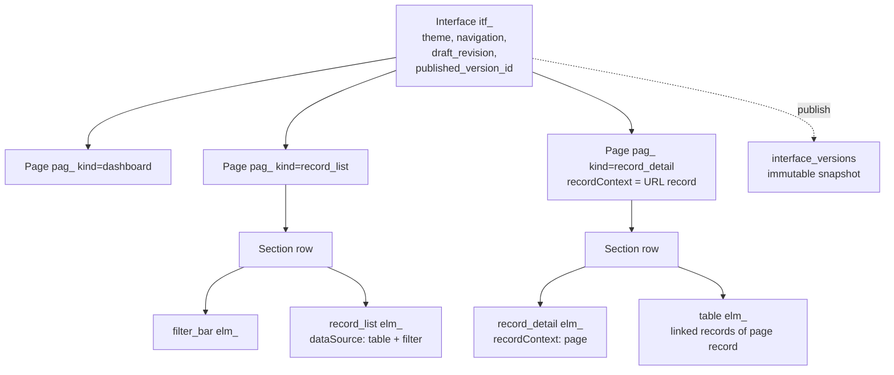
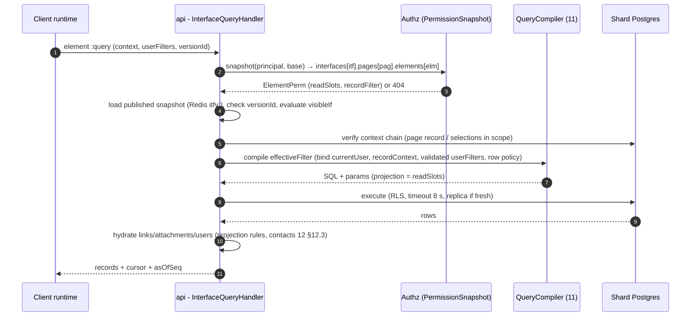
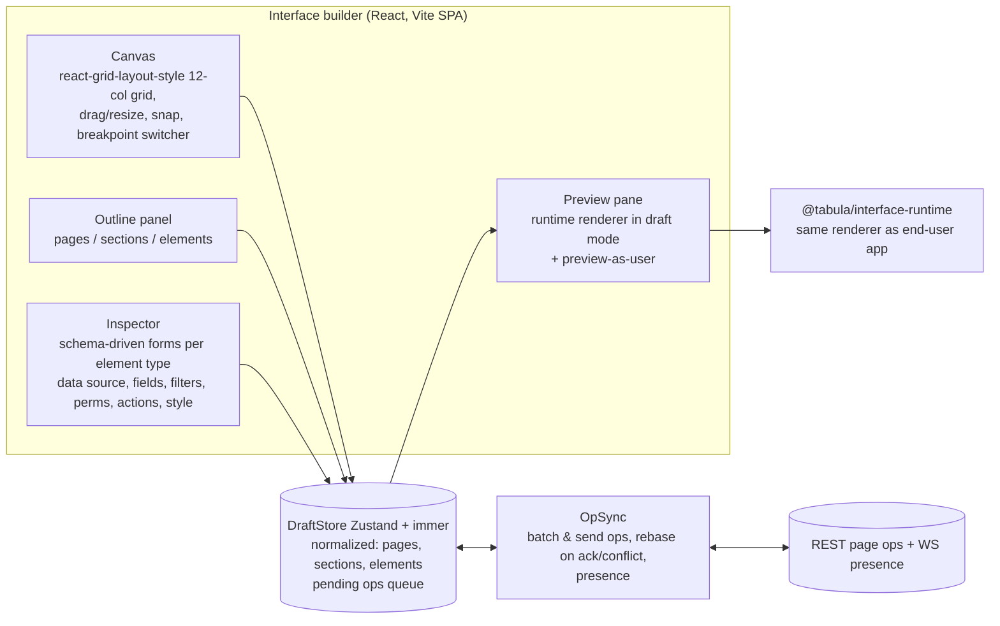

# 13 — Interface Builder

> **Status:** Proposed · **Owner:** Apps & Interfaces team · **Date:** 2026-10-03
> **Conforms to:** [`00-canonical-decisions.md`](./00-canonical-decisions.md) (normative): prefixes `itf`/`pag`/`elm` (§3), tables `interfaces`, `interface_pages`, `interface_versions`, `share_links` (§5.2), roles `interface_editor` / `interface_user` / base `interface_only` (§9), events `interface.*`, `button.clicked` (§6).

**Sections covered:** §16 Interface builder (Part 11) — interfaces, pages, sections, responsive 12-column layout, element catalogue (record_list, record_detail, form, chart, table, kanban, calendar, timeline, gallery, filter bar, search, button, metric, text, divider, tabs, navigation, image, embed), element model (id, type, config, data source with `recordContext`, user filters, permissions, actions, styling, layout, responsive behaviour, conditional visibility), JSON Schemas + example page, draft vs published (`interface_versions`), publishing flow, interface-only users, record-level visibility via current-user filters and its server-side enforcement, runtime element query API, dashboards & charts (aggregation, caching), navigation & URL state, cross-element selection, builder editor architecture, builder concurrency, deletion/restore, dependency on deleted fields.

**Related:** [`02-domain-model-and-erd.md`](./02-domain-model-and-erd.md) §3.8 · [`10-view-engine.md`](./10-view-engine.md) (views as data sources, forms, aggregation service) · [`11-filter-sort-group.md`](./11-filter-sort-group.md) (Filter AST incl. `recordContext`/`userFilter` value refs, evaluator) · [`14-automation-engine.md`](./14-automation-engine.md) (button-triggered automations) · [`16-realtime.md`](./16-realtime.md) · [`17-api-architecture.md`](./17-api-architecture.md) · [`19-permissions-and-multitenancy.md`](./19-permissions-and-multitenancy.md) (`InterfacePerm`, `ElementPerm`) · [`24-frontend-grid-state-design-system.md`](./24-frontend-grid-state-design-system.md) · [`31-api-specification.md`](./31-api-specification.md) (interface endpoints).

---

## 1. Concepts

**[Observed]** Spreadsheet-database products let builders compose "apps" on top of a base: dashboards, record review pages, portals with per-user data, and forms — for people who should not see the raw grid.

**[Ours]** An **interface** (`itf_`) is an app bound to **one base**. It contains ordered **pages** (`pag_`); each page has a tree of **sections** (layout rows) containing **elements** (`elm_`). Builders edit a **draft**; end users always run an immutable **published version** (`interface_versions`). Every element that shows data has a **data source** compiled *on the server* into a query that combines the element's table, optional base view, element filter, `recordContext` binding, exposed user filters, and the principal's permissions.



Interface vs view: a view is a persisted presentation of one table for base collaborators; an interface is a curated, permissioned **application** that can combine many tables and is the only way to give `interface_only` users data access.

---

## 2. Storage model

Aligned with [`02`](./02-domain-model-and-erd.md) §3.8 (column lists there are authoritative):

| Table | Key columns used here |
|---|---|
| `interfaces` | `id`, `workspace_id`, `base_id`, `name`, `icon`, `theme jsonb`, `navigation jsonb` (draft), `draft_revision int`, `published_version_id`, `published_at`, `status (draft_only|published|unpublished)`, soft delete |
| `interface_pages` | `id`, `interface_id`, `name`, `kind (dashboard|record_list|record_detail|form|overview|blank)`, `layout jsonb` (**draft** `PageDraft`: sections + elements), `page_revision int`, `order_key`, soft delete |
| `interface_versions` | `id`, `interface_id`, `version_no`, `snapshot jsonb` (`InterfaceSnapshot`: interface settings + navigation + all pages + compiled data-source digests), `schema_version` (base schema version at publish), `published_by`, `published_at`, `release_note` |

Decisions:

* **Draft per page row, published as one snapshot.** Builders edit pages concurrently (different rows, independent `page_revision`); publish freezes the whole interface atomically (cross-page navigation and record-detail links must be consistent).
* **Snapshot size** ≤ 4 MB (validated; typical 20–200 KB). Stored inline in `jsonb` (TOAST-compressed). Retention: last 50 versions + the current one ([`02`](./02-domain-model-and-erd.md)).
* Published snapshots are cached in Redis (`itfv:{versionId}`, immutable ⇒ no invalidation, LRU eviction) and in-process LRU on `api` pods.

---

## 3. Layout system

### 3.1 Grid and breakpoints

* Pages are a vertical list of **sections**; each section is a **12-column grid** with row-based placement. Elements occupy `{ x, y, w, h }` in grid units (`x ∈ 0..11`, `w ∈ 1..12`, `y` row index within the section, `h ∈ 1..60` rows of 24 px; `h: 'auto'` for content-sized elements like text, record_detail, form).
* Breakpoints: `lg ≥ 1200 px` (12 cols), `md 768–1199 px` (12 cols, narrower), `sm < 768 px` (**single column**).
* Each element stores an explicit `lg` placement; `md` and `sm` are **derived** unless overridden:
  * `md`: same as `lg` (12 cols scale), unless `md` override present.
  * `sm`: elements stacked in reading order (sort by `y`, then `x`), full width, `h` → `auto` or element-type mobile default (charts 12 rows, lists auto with internal virtualization); `hiddenOn: ['sm']` hides it.
* Collision rules (enforced by the editor and validated by the server): no overlap within a section at `lg`; a placement exceeding 12 columns is rejected.

### 3.2 Sections

```ts
interface SectionDraft {
  id: string;                        // 'sec_' local id (unique within page; not a global prefix)
  title?: string;
  collapsible?: boolean;
  background?: 'none' | 'subtle' | 'card';
  visibleIf?: VisibilityCondition;   // §8
  elementIds: string[];              // elements placed in this section (placement in element.layout)
  sticky?: 'none' | 'top';           // e.g., filter bars
}
```

Tabs (§4) contain their own nested sections (one level of nesting; tabs inside tabs are not allowed — UI complexity and mobile rendering).

---

## 4. Element catalogue

| Type | Data | Purpose | Record actions | User filters | Notes |
|---|---|---|---|---|---|
| `record_list` | records | Compact list (title + subtitle + fields), opens records | open, select, create, delete, inline update (per perms) | ✓ | default element of `record_list` pages |
| `table` | records | Grid-like (read/edit cells) | open, select, edit cells, create, delete | ✓ | uses the canvas grid with a restricted field set |
| `kanban` | records | Cards by stack field | move (stack field edit), open, create | ✓ | config like view kanban layout ([`10`](./10-view-engine.md) §3.3) |
| `calendar` | records | Date placement | reschedule (edit date), open, create | ✓ | |
| `timeline` | records | Bars over time (+ gantt mode) | reschedule, open | ✓ | |
| `gallery` | records | Cards with cover | open, select | ✓ | |
| `record_detail` | one record | Field layout of a single record, editable per field | update fields, comment, delete, run buttons | — | bound by `recordContext` |
| `form` | creates/edits | Form for create or edit-in-place | create / update | — | reuses form element model of [`10`](./10-view-engine.md) §3.3 |
| `chart` | aggregation | Bar/line/area/pie/donut/scatter/heatmap/number-over-time | drill-down → filter other elements / open list | ✓ | §10 |
| `metric` | aggregation | Big number (+ comparison, sparkline) | drill-down | ✓ | §10 |
| `filter_bar` | — | Exposes user filters that target one or more elements | — | defines | §6.3 |
| `search` | — | Text search applied to target elements | — | defines | |
| `button` | — | Actions: update record(s), run automation, open URL, create record, navigate | executes actions | — | §7 |
| `text` | — | Markdown-subset rich text with **tokens** (`{{currentUser.name}}`, `{{record.<fieldId>}}`) | — | — | tokens resolved server-side for record values |
| `divider` | — | Visual separator | — | — | |
| `tabs` | — | Tabbed container of sections | — | — | one nesting level |
| `navigation` | — | In-page nav (links to pages, anchors) | — | — | interface-level nav is in `navigation` |
| `image` | attachment/url | Static image or record attachment | — | — | |
| `embed` | url | Allow-listed iframe (video, maps, docs) | — | — | §11.4 security |

---

## 5. Element model (TypeScript)

```ts
// @tabula/interface-model/src/element.ts
import type { FilterNode, SortSpec, GroupSpec } from '@tabula/query';

export type ElementType =
  | 'record_list' | 'table' | 'kanban' | 'calendar' | 'timeline' | 'gallery'
  | 'record_detail' | 'form' | 'chart' | 'metric'
  | 'filter_bar' | 'search' | 'button' | 'text' | 'divider' | 'tabs' | 'navigation' | 'image' | 'embed';

export interface ElementBase<T extends ElementType, C> {
  id: ElementId;                      // 'elm_…' public form in API; uuid internally
  type: T;
  title?: string;
  description?: string;
  layout: ElementLayout;
  visibleIf?: VisibilityCondition;    // §8
  style?: ElementStyle;
  config: C;                          // type-specific
}

export interface ElementLayout {
  sectionId: string;
  lg: { x: number; y: number; w: number; h: number | 'auto' };
  md?: { x: number; y: number; w: number; h: number | 'auto' };
  sm?: { order?: number; h?: number | 'auto' };
  hiddenOn?: Array<'lg' | 'md' | 'sm'>;
}

export interface ElementStyle {
  variant?: 'plain' | 'card' | 'outlined';
  accent?: ColorToken;                // design tokens only — no raw CSS (security + theming)
  density?: 'comfortable' | 'compact';
  titleSize?: 'sm' | 'md' | 'lg';
  align?: 'start' | 'center' | 'end';
}

// ---------- data source ----------
export interface DataSource {
  tableId: TableId;
  baseViewId?: ViewId;                // optional: inherit the view's filter/sorts (AND-ed); NOT its visibility
  filter?: FilterNode | null;         // element filter; may use valueRef currentUser / recordContext / userFilter
  sorts?: SortSpec[];                 // overrides view sorts when present; ≤ 5
  groups?: GroupSpec[];               // list/table only; ≤ 2
  recordContext?: RecordContextBinding | null;
  limit?: number;                     // hard cap of records the element may ever load (≤ 10,000; default 1,000)
}

/** How this element's records relate to a "current record" on the page. */
export type RecordContextBinding =
  | { kind: 'page_record' }                                          // record_detail on a record_detail page
  | { kind: 'linked_from_page_record'; viaFieldId: FieldId }         // records linked from the page record via a link field
  | { kind: 'selected_in_element'; elementId: ElementId }            // master–detail on the same page
  | { kind: 'linked_from_selected'; elementId: ElementId; viaFieldId: FieldId };

// ---------- fields & permissions ----------
export interface ElementFieldSpec {
  fieldId: FieldId;
  label?: string;
  editable: boolean;                  // element-level edit permission (still bounded by base perms for non-interface-only users)
  required?: boolean;                 // for create/edit flows
  width?: number;                     // table
  visibleIf?: VisibilityCondition;    // field-level conditional visibility (record_detail/form)
}

export interface ElementPermissions {
  allowCreate: boolean;
  allowDelete: boolean;
  allowComment: boolean;
  allowOpenRecord: boolean;           // expanded record (shows only element fields)
  allowDownload: boolean;             // CSV export of the element's visible data
  editableBy?: 'all_users' | { principals: Array<{ type: 'user' | 'team'; id: string }> }; // narrows who can edit
}

export interface UserFilterSpec {     // filters the end user may set (exposed via filter_bar or element header)
  key: string;                        // referenced by valueRef {type:'userFilter', key}
  fieldId: FieldId;
  operators: FilterOperator[];        // subset allowed for this field
  control: 'select' | 'multi_select' | 'date_range' | 'text' | 'user' | 'checkbox' | 'number_range';
  defaultValue?: unknown;
  required?: boolean;
}

// ---------- record element configs ----------
export interface RecordCollectionConfig {
  dataSource: DataSource;
  fields: ElementFieldSpec[];         // ≤ 50; the ONLY fields the element can read/write
  permissions: ElementPermissions;
  userFilters?: UserFilterSpec[];     // ≤ 10
  searchFieldIds?: FieldId[];
  rowActions?: ActionSpec[];          // per-record buttons (≤ 5)
  emptyState?: { text: string };
  selection?: 'none' | 'single';      // publishes selection for other elements (§9.2)
}
export interface ListConfig extends RecordCollectionConfig { titleFieldId?: FieldId; subtitleFieldIds?: FieldId[]; cover?: CoverSpec; }
export interface KanbanConfig extends RecordCollectionConfig { stackFieldId: FieldId; stackOrder?: StackKey[]; card: CardSpec; }
export interface CalendarConfig extends RecordCollectionConfig { dateRanges: CalendarLayout['dateRanges']; defaultMode: 'month'|'week'|'agenda'; }
export interface TimelineConfig extends RecordCollectionConfig { start: TimelineLayout['start']; end: TimelineLayout['end']; scale: TimelineLayout['scale']; swimlaneFieldId?: FieldId; }
export interface GalleryConfig extends RecordCollectionConfig { card: CardSpec; }

export interface RecordDetailConfig {
  dataSource: DataSource & { recordContext: RecordContextBinding };   // required
  layout: Array<{ kind: 'field'; field: ElementFieldSpec } | { kind: 'heading'; text: string } | { kind: 'columns'; columns: 1 | 2 | 3 }>;
  permissions: Pick<ElementPermissions, 'allowDelete' | 'allowComment'>;
  showActivity: boolean;              // comments + revision history (only fields in layout)
  actions?: ActionSpec[];
}

export interface FormElementConfig {
  mode: 'create' | 'edit_context_record';
  tableId: TableId;
  recordContext?: RecordContextBinding;                // edit mode
  elements: FormElement[];                             // same as 10 §3.3 (visibleIf, required, prefill, link config)
  submit: { label?: string; afterSubmit: { kind: 'message'; text?: string } | { kind: 'navigate'; pageId: PageId; withRecord: boolean } | { kind: 'reset' } };
  defaults?: Array<{ fieldId: FieldId; value?: unknown; valueRef?: { type: 'currentUser' } | { type: 'recordContext'; source: 'page' } }>; // e.g. Requester = current user (hidden)
}

// ---------- aggregation ----------
export interface ChartConfig {
  source: DataSource;                                   // recordContext allowed (e.g., chart of linked records)
  kind: 'bar' | 'stacked_bar' | 'line' | 'area' | 'pie' | 'donut' | 'scatter' | 'heatmap';
  x: { fieldId: FieldId; bucket?: 'day'|'week'|'month'|'quarter'|'year'; numberBucket?: { size: number }; sort?: 'label'|'value_desc'|'value_asc'|'option_order'; limit?: number /* ≤ 100 */ };
  series?: { fieldId: FieldId; limit?: number /* ≤ 20 */ };          // grouping into series
  measures: Array<{ agg: 'count' | 'sum' | 'avg' | 'min' | 'max' | 'median' | 'count_unique'; fieldId?: FieldId; label?: string }>; // ≤ 4
  options?: { showLegend?: boolean; showValues?: boolean; cumulative?: boolean; yMin?: number; yMax?: number; goalLine?: number };
  userFilters?: UserFilterSpec[];
  drill?: { kind: 'none' } | { kind: 'filter_elements'; targetElementIds: ElementId[] } | { kind: 'open_list' };
}
export interface MetricConfig {
  source: DataSource;
  measure: { agg: ChartConfig['measures'][number]['agg']; fieldId?: FieldId };
  comparison?: { kind: 'previous_period'; dateFieldId: FieldId; period: 'week'|'month'|'quarter'|'year' } | { kind: 'target'; value: number };
  format?: { style: 'number'|'currency'|'percent'|'duration'; precision?: number; currencyCode?: string };
  sparkline?: { dateFieldId: FieldId; bucket: 'day'|'week'|'month'; points: number /* ≤ 60 */ };
  userFilters?: UserFilterSpec[];
}

// ---------- controls & static ----------
export interface FilterBarConfig { filters: Array<UserFilterSpec & { targets: Array<{ elementId: ElementId; fieldId: FieldId }> }>; layout: 'inline' | 'stacked'; }
export interface SearchConfig { placeholder?: string; targets: Array<{ elementId: ElementId; fieldIds: FieldId[] }>; }
export interface ButtonConfig { label: string; icon?: string; style: 'primary'|'secondary'|'danger'|'link'; actions: ActionSpec[]; confirm?: { title: string; body?: string }; recordContext?: RecordContextBinding; }
export interface TextConfig { body: RichTextDoc; }                                 // tokens allowed
export interface TabsConfig { tabs: Array<{ id: string; label: string; sectionIds: string[]; visibleIf?: VisibilityCondition }>; }
export interface NavigationConfig { items: Array<{ label: string; target: { kind: 'page'; pageId: PageId } | { kind: 'url'; url: string } | { kind: 'anchor'; sectionId: string } }>; orientation: 'horizontal' | 'vertical'; }
export interface ImageConfig { source: { kind: 'static'; attachmentId: AttachmentId } | { kind: 'record_field'; fieldId: FieldId; recordContext: RecordContextBinding } | { kind: 'url'; url: string }; fit: 'crop'|'fit'; alt: string; }
export interface EmbedConfig { url: string; provider: string /* resolved allow-list entry */; aspect: '16:9'|'4:3'|'1:1'|'custom'; height?: number; }

export type Element =
  | ElementBase<'record_list', ListConfig> | ElementBase<'table', RecordCollectionConfig>
  | ElementBase<'kanban', KanbanConfig> | ElementBase<'calendar', CalendarConfig>
  | ElementBase<'timeline', TimelineConfig> | ElementBase<'gallery', GalleryConfig>
  | ElementBase<'record_detail', RecordDetailConfig> | ElementBase<'form', FormElementConfig>
  | ElementBase<'chart', ChartConfig> | ElementBase<'metric', MetricConfig>
  | ElementBase<'filter_bar', FilterBarConfig> | ElementBase<'search', SearchConfig>
  | ElementBase<'button', ButtonConfig> | ElementBase<'text', TextConfig>
  | ElementBase<'divider', {}> | ElementBase<'tabs', TabsConfig>
  | ElementBase<'navigation', NavigationConfig> | ElementBase<'image', ImageConfig>
  | ElementBase<'embed', EmbedConfig>;
```

### 5.1 Actions

```ts
export type ActionSpec =
  | { kind: 'open_record'; target: 'expanded' | { pageId: PageId } }                    // record_detail page
  | { kind: 'update_record'; recordContext: RecordContextBinding | 'row';
      set: Array<{ fieldId: FieldId; value?: unknown; valueRef?: { type: 'currentUser' } | { type: 'now' } | { type: 'today' } }> }
  | { kind: 'create_record'; tableId: TableId; values: Array<{ fieldId: FieldId; value?: unknown; valueRef?: { type: 'currentUser' } | { type: 'recordContext'; source: 'page' | 'row' } }>;
      linkToContext?: { viaFieldId: FieldId }; thenOpen?: boolean }
  | { kind: 'run_automation'; automationId: AutomationId; recordContext?: RecordContextBinding | 'row' }  // automation must have a "button/interface" trigger
  | { kind: 'open_url'; urlTemplate: string /* https:, mailto:, tel: ; {{record.<fieldId>}} tokens url-encoded */; newTab: boolean }
  | { kind: 'navigate'; pageId: PageId; withRecord?: 'row' | 'page' | 'none' }
  | { kind: 'set_user_filter'; key: string; value: unknown };                            // e.g. preset buttons "My open tickets"
// ≤ 5 actions per button, executed sequentially; server-side actions in one request (§7.3)
```

---

## 6. Data sources, record context and user filters

### 6.1 Effective query of a record element

For principal `P`, published version `V`, element `E`, request state `S` (page record, selections, user filter values, search):

```text
effectiveFilter(E, P, S) =
      baseViewFilter(E.dataSource.baseViewId)                 -- view filter as of NOW (view is live), if set
  AND E.dataSource.filter                                      -- may contain currentUser / recordContext / userFilter refs
  AND contextConstraint(E.dataSource.recordContext, S)         -- e.g. record id IN links(pageRecord, viaField)
  AND userFilterPredicates(E.userFilters, S.userFilterValues)  -- validated against UserFilterSpec (operators, fields)
  AND searchPredicate(E.searchFieldIds, S.search)
  AND rowPolicy(P, E.dataSource.tableId)                       -- Enterprise row policies (19)
projection(E, P) = E.fields ∩ readableFields(P)                -- hidden-restricted fields removed even if listed
```

All of it is compiled by the **same** compiler as views ([`11`](./11-filter-sort-group.md) §6) with `FilterValidationContext.kind = 'interface_element'` (fail-closed, §16).

### 6.2 `recordContext` binding resolution

| Binding | Resolved from | Constraint emitted |
|---|---|---|
| `page_record` | URL `/r/{recordId}` on a `record_detail` page | `r.id = $rec` **and** the record must satisfy the *page's* source element filter (a user can't open an arbitrary record id by URL) |
| `linked_from_page_record` | page record + link field | `r.id IN (SELECT b_record_id FROM record_links WHERE relation_id=$rel AND a_record_id=$pageRec)` (side-aware) |
| `selected_in_element` | URL selection state `sel.<elmId>=<recId>` | `r.id = $sel` AND the selected record must be within the source element's effective filter (re-verified server-side) |
| `linked_from_selected` | selection + link field | as `linked_from_page_record` with the selected record |

**Chain verification.** Every record id coming from the client (URL, selection) is re-validated by evaluating the *source* element's effective query for that id (`SELECT 1 … AND r.id = $id`), recursively up the binding chain (max depth 3). A client that forges `?sel.elm_list=rec_secret` gets `404 RECORD_NOT_IN_SCOPE`.

### 6.3 User filters

* Declared by builders (`UserFilterSpec`) on elements or in a `filter_bar` targeting several elements (each target maps the filter to a field of *its* table, e.g. a "Region" filter applies to Deals.Region and Accounts.Region).
* Values come from the client in the query request (`userFilters: { [key]: { operator, value } }`) and are validated: key exists, operator ∈ allowed list, value matches the field family schema ([`11`](./11-filter-sort-group.md) §5). **They can only narrow**: compiled as additional `AND` conjuncts.
* Persistence: URL (`?f.<key>=<encoded>`, shareable) and per-user last values in the proposed `interface_user_state` (V1).
* Option lists for select-style user filters come from field options (no data query) or, for link fields, from an `:options` endpoint scoped by the target element's effective filter (prevents enumeration of linked records outside scope).

---

## 7. Permissions and server-side enforcement

### 7.1 Who can do what

| Principal | Can open interface | Data seen | Writes |
|---|---|---|---|
| Base `creator` | all interfaces of the base (draft + published) | element sources ∩ base perms | element permissions **and** base perms |
| Base `editor`/`commenter`/`viewer` | published interfaces (no draft) | same | element permissions ∩ base perms (a viewer can never write even if the element allows) |
| `interface_user` grant (base role `interface_only` when no base role) | granted interfaces, published only | **only** element data sources and their field allowlists | element permissions only (no base perms to intersect with) |
| `interface_editor` grant | draft + publish of that interface | element sources only; without a base role, an `interface_editor` can bind elements only to tables/fields already used by the published interface or explicitly whitelisted by a base creator in `interfaces.settings.editorDataScope` | as interface_user |
| Share link (`kind = 'interface'`) | published version, read-only (V1: optional form submission elements) | element sources, `currentUser` binds to nobody (false) unless domain-restricted link | forms only |

The rule for `interface_editor` without a base role prevents an interface editor from binding an element to a table they could otherwise never see — editing an interface must not be a privilege-escalation path. Base creators can widen the scope explicitly.

### 7.2 Compiled element permissions

On publish (and on any permission-relevant change), the server compiles per element an `ElementPerm` (shape owned by [`19`](./19-permissions-and-multitenancy.md) §20.4):

```ts
{ tableId, readSlots, editSlots, create, delete, comment, recordFilter /* effective filter minus per-request parts */ }
```

stored in the version snapshot (`snapshot.compiled.elements[elmId]`) and merged into each principal's `PermissionSnapshot.interfaces` at snapshot-compile time (bounded: ≤ 200 elements per interface). Runtime checks are bitset lookups.

### 7.3 Writes through elements

`PATCH …/elements/{elmId}/records/{recordId}` (edit), `POST …/elements/{elmId}/records` (create), `DELETE …` and `POST …/elements/{elmId}:runAction` (buttons):

1. Load published version, element perm.
2. Verify the record is **in scope**: evaluate the element's effective query for that record id *before* the write (`404 RECORD_NOT_IN_SCOPE` otherwise).
3. Verify changed fields ⊆ `editSlots` (and, for base members, base field restrictions) → `403 FIELD_NOT_EDITABLE`.
4. Apply via the normal record write path (validation, compute, `base_changes`, events with `actor.via = 'ui'` and `context: { interfaceId, elementId }`).
5. **Post-write scope**: if the record leaves the element's scope after the write (e.g., user changed `Status` so the element filter no longer matches), the write is still allowed (the user had edit rights on that field) — the response includes `leftScope: true` and the client removes it from the element. Exception: builders may set `permissions.preventLeavingScope: true` (e.g., portals where `Owner = current user` must not be changed to someone else) → the server evaluates the post-image and rolls back with `409 WRITE_WOULD_LEAVE_SCOPE`.
6. Creates: values for fields outside `editSlots` are rejected except **defaults** defined by the element (e.g., `Requester = currentUser`, links to the page record), which the server sets itself — the client cannot spoof them.

### 7.4 Record-level visibility via "current user" filters — and the caveat

Builders implement portals with element filters such as `Requester is_any_of currentUser` or `Account.Members has_any_of currentUser` (through a lookup). The server binds `currentUser` from the authenticated session — never from the client — so an `interface_only` user can only ever receive records passing that filter, via every element of every page.

**Security caveats (documented in the builder UI and admin docs):**

1. **It is interface-scoped, not table-scoped.** Base collaborators (viewer+) can still read all records via the grid/API. For record-level security against base collaborators, use Enterprise row policies ([`19`](./19-permissions-and-multitenancy.md) §20.9).
2. **Every element is its own door.** A page with a correctly filtered list and an unfiltered chart leaks aggregate data. The publish validator **warns** (blocking when the builder enables `interfaces.settings.strictScoping`) when elements on the same interface use the same table with different `currentUser` constraints, and shows an "effective access preview" (§13.5).
3. **Linked data.** Elements bound via `linked_from_*` inherit the scope of the parent record — but lookups shown on a record expose target-table values; the builder sees which fields come from other tables.
4. **Clients never receive raw table access.** The runtime API has no "query this table" endpoint for interface principals; only element queries with server-compiled filters and field allowlists exist. Realtime subscriptions for interface principals are element-scoped (§12).
5. **Aggregations are permissioned like rows**: chart/metric queries apply the same effective filter and row policies; `count_unique` etc. never run on fields outside `readSlots` (charts declare their fields; validated).

---

## 8. Conditional visibility

```ts
export type VisibilityCondition =
  | { kind: 'user'; filter: UserConditionNode }            // over the current user
  | { kind: 'record'; recordContext: RecordContextBinding; filter: FilterNode } // over the context record's fields (Filter AST)
  | { kind: 'all' | 'any'; conditions: VisibilityCondition[] };              // ≤ 10, depth ≤ 3

export type UserConditionNode =
  | { op: 'is_any_of'; users: UserId[] }
  | { op: 'in_team'; teamIds: TeamId[] }
  | { op: 'has_role'; roles: Array<'creator'|'editor'|'commenter'|'viewer'|'interface_only'|'interface_editor'> }
  | { op: 'email_domain_in'; domains: string[] };
```

* **Visibility is presentation, not security.** Hiding an element does not grant or remove data access; a hidden element's endpoints still enforce its own data source. Therefore conditions are evaluated **server-side when resolving the page** (`GET …/pages/{pageId}:resolve`), and hidden elements are **omitted from the page payload** (their configs — which may name tables/fields — are not sent to the client). Elements whose condition depends on the context record are re-resolved when the record changes (client asks `:resolve` with the record id; evaluation uses the in-memory evaluator on the server-side record image).
* For **field-level** `visibleIf` in `record_detail`/`form`, the same evaluator runs on the client for responsiveness (forms: answers) and on the server for validation (forms drop answers to invisible questions, [`10`](./10-view-engine.md) §16.3).
* Element queries for elements hidden to the principal return `404 ELEMENT_NOT_FOUND` (consistent with omission).

---

## 9. Navigation, URL state and cross-element selection

### 9.1 URL scheme

```
/i/{itf}/p/{pag}                                  page
/i/{itf}/p/{pag}/r/{rec}                          record_detail page with page record
?sel.{elm}={rec}                                  selection published by element elm (single select)
&f.{key}={base64url(json)}                        user filter values
&q.{elm}={text}                                   search per element (or q for page-level search bar)
&tab.{elm}={tabId}                                active tab
&view.{elm}=month|week&d.{elm}=2026-10            calendar/timeline navigation
```

* All state needed to reproduce what a user sees is in the URL (shareable deep links within the interface's audience); none of it is trusted (§6.2 chain verification, §6.3 user filter validation).
* Interface-level **navigation** (`interfaces.navigation`): ordered page list with optional groups and icons; pages can be hidden from nav (reachable only via buttons/record links, typical for `record_detail` pages). Mobile: bottom tab bar for ≤ 5 top-level pages, drawer otherwise.

### 9.2 Cross-element selection

* An element with `selection: 'single'` publishes its selected record id to the URL (`sel.<elmId>`), replaced (not pushed) in history to avoid back-button spam; pushes only on explicit "open".
* Dependent elements (`recordContext: selected_in_element | linked_from_selected`) re-query when the selection changes. The client page runtime keeps a small dependency graph (element → elements depending on it); cycles are rejected by the builder validator.
* No selection ⇒ dependent elements show their empty state ("Select a record"), **not** unconstrained data.

### 9.3 Client runtime state

`InterfaceRuntimeStore` (Zustand) per open page: `{ pageRecordId, selections: Map<elmId, recId>, userFilters, searches, elementData: Map<elmId, ElementQueryState> }`; element data uses TanStack Query keyed by `(versionId, elmId, hash(request state))`; the URL is the source of truth (two-way sync via TanStack Router search params).

---

## 10. Dashboards and charts

### 10.1 Aggregation query (shared with views' summary bar, [`10`](./10-view-engine.md) §11.3)

```ts
export interface AggregationQuery {
  source: { tableId: TableId; effectiveFilter: Pred };          // compiled as in §6.1
  groupBy: Array<{ fieldId: FieldId; bucket?: DateBucket; numberBucket?: { size: number }; multiValue?: 'split' | 'combination' }>; // ≤ 2 (x + series)
  measures: Array<{ agg: AggFn; fieldId?: FieldId }>;          // ≤ 4
  limitGroups: number;                                          // ≤ 100 x-values × 20 series
  order?: 'label' | 'value_desc' | 'value_asc' | 'option_order';
}
```

Compiled SQL (example: Deals by close month (x) and stage (series), sum of Amount, base tz):

```sql
SELECT
  to_char(date_trunc('month', ((r.cells->>'10')::timestamptz AT TIME ZONE $tz)), 'YYYY-MM') AS x,
  (r.cells->>'7')                                                                         AS series,
  sum((r.cells->>'4')::numeric)                                                           AS m0,
  count(*)                                                                                AS n
FROM data.records r
WHERE r.table_id = $t AND r.deleted_at IS NULL
  AND /* effective filter: element filter AND user filters AND row policy … */ TRUE
  AND (r.cells ? '10')                                                                    -- empty x excluded unless showEmpty
GROUP BY 1, 2
ORDER BY 1, array_position($optOrder::text[], (r.cells->>'7'))
LIMIT 2001;                                                                               -- limitGroups + 1 → "other" bucket flag
```

* Multi-valued x (`multi_select`, link) defaults to **split** for charts (counting "deals per tag" is the expected meaning) — totals are labelled "may exceed record count"; `combination` available.
* Excess groups beyond `x.limit` are folded into an "Other" bucket (second query or window function `row_number() OVER (ORDER BY m0 DESC)`).
* Above `INDEX_SIDECAR_THRESHOLD`, group keys and measures read sidecars where available (narrow scans).
* `cumulative` and comparisons (`previous_period`) are computed in the application from the bucketed result.
* Statement timeout 8 s; result cap 2,000 cells.

### 10.2 Caching

| Key | Value | Invalidation |
|---|---|---|
| `iagg:{versionId}:{elmId}:{scopeHash}:{stateHash}` | aggregation result + `asOfSeq` | TTL 60 s **and** freshness check: served only if no `base_changes` touching the source table *and the fields used* since `asOfSeq` (checked via a per-table `last_change_seq` counter kept in Redis by the realtime fan-out: `tchg:{tableId}` → seq); otherwise recomputed (single-flight lock `lock:iagg:…` to prevent stampede) |

`scopeHash` = hash of the bound effective filter (includes `currentUser` only if the filter references it) + row-policy digest + tz. So a company-wide dashboard is computed once for all viewers, while a "my pipeline" dashboard is per user. Dashboards with heavy charts can opt into `refresh: 'interval'` (minimum 5 min) — served from cache regardless of changes, with "updated 3 min ago" label.

### 10.3 Metric element

Single aggregate + optional comparison: two aggregation queries (current period, previous period on `dateFieldId`), or one query with `FILTER` clauses:

```sql
SELECT sum((r.cells->>'4')::numeric) FILTER (WHERE (r.cells->>'9') >= $curFrom AND (r.cells->>'9') < $curTo)  AS cur,
       sum((r.cells->>'4')::numeric) FILTER (WHERE (r.cells->>'9') >= $prevFrom AND (r.cells->>'9') < $prevTo) AS prev
FROM data.records r WHERE r.table_id = $t AND r.deleted_at IS NULL AND /* effective filter */ TRUE;
```

---

## 11. Runtime API

### 11.1 Endpoints (paths per [`31`](./31-api-specification.md); the brief's shorthand `/v1/interfaces/{id}/…` is served as an alias that resolves the base from `itf_`)

| Method & path | Purpose |
|---|---|
| `GET /v1/bases/{b}/interfaces/{itf}/runtime` | Published version manifest: navigation, theme, pages (ids, names, kinds) — no element configs |
| `GET /v1/bases/{b}/interfaces/{itf}/pages/{pag}:resolve?record=&sel.*=` | Page payload for this principal: visible sections/elements with **client-safe configs** (field ids + labels + display config; no raw filters beyond what the client needs for UX — user filter specs yes, element filter ASTs no) |
| `POST /v1/bases/{b}/interfaces/{itf}/pages/{pag}/elements/{elm}:query` | Records for record elements (keyset or windows) |
| `POST …/elements/{elm}:aggregate` | Chart/metric data |
| `POST …/elements/{elm}:options` | Option lists for user filters / link pickers (scoped) |
| `POST …/elements/{elm}/records` · `PATCH …/records/{rec}` · `DELETE …/records/{rec}` | Writes via element |
| `POST …/elements/{elm}:runAction` | Button / row action |
| `POST …/elements/{elm}:submit` | Form element submission |
| `GET …/elements/{elm}/records/{rec}/comments` · `POST …` | Comments if `allowComment` |
| `?draft=true` on the above | Builders previewing the draft (requires `interface.edit`) |

### 11.2 Element query request/response

```json
POST /v1/bases/bas_…/interfaces/itf_…/pages/pag_…/elements/elm_…:query
{
  "context": { "pageRecordId": "rec_…", "selections": { "elm_list": "rec_…" } },
  "userFilters": { "region": { "operator": "is_any_of", "value": ["opt_emea"] } },
  "search": "acme",
  "sort": [{ "fieldId": "fld_close", "direction": "asc" }],
  "pageSize": 100,
  "cursor": null,
  "versionId": "…"
}
```

* `sort` from the client is allowed only among `fields` of the element (user-sortable list headers); filters cannot be passed except via declared `userFilters`.
* `versionId` must equal the current published version (or the request gets `409 INTERFACE_VERSION_CHANGED` with the new manifest; the client reloads the page) — avoids mixing old configs with new permissions.
* Response: `{ records: [{ id, fields: { <fld>: value } }], nextCursor, asOfSeq, totalCount? }` with only `readSlots` fields; link values hydrated as `[{id, displayValue}]` (target records not navigable unless another element shows them); attachments with short-lived signed URLs.

### 11.3 Server pipeline



### 11.4 Static/embedded content security

* `text` tokens: `{{record.<fieldId>}}` only for fields in an element's `readSlots` on the page; rendered as text (HTML-escaped); Markdown subset with sanitization (no raw HTML).
* `embed`: URL must match the **embed allow-list** (YouTube, Vimeo, Loom, Google Maps/Docs/Slides, Figma, Miro, Typeform…; org policy can extend/restrict); rendered in a sandboxed iframe (`sandbox="allow-scripts allow-same-origin allow-popups allow-forms"` per provider profile, `referrerpolicy="no-referrer"`), CSP `frame-src` built from the allow-list.
* `open_url` actions: `https:`, `mailto:`, `tel:` only; tokens URL-encoded; external links open with `rel="noopener noreferrer"`.
* `image` from URL: proxied through our image proxy (no third-party tracking of viewers; size/type limits).

---

## 12. Realtime in the runtime

* Interface principals subscribe to **element-scoped channels**: `subscribe { itf, versionId, pag, elements: [elm…], context }`. The realtime gateway ([`16`](./16-realtime.md)) filters the base change stream per subscription: changes to the element's table are evaluated against the element's compiled filter (in-memory evaluator on the change's after-image, server-side) and projected to `readSlots` before sending. Changes to fields outside `readSlots` are dropped; records leaving scope produce `remove` events.
* Base collaborators using an interface reuse the normal base channel but the client still applies element projections.
* Charts: the gateway emits `aggregate_stale { elm }` (debounced 2 s) when a change touches the source table & fields; the client refetches (cache absorbs bursts).
* Version publish: gateway broadcasts `interface.published { versionId }` to all runtime subscribers → client shows "This app was updated — reload" (auto-reload when no unsaved input).
* Permission change (`perm_epoch` bump): subscriptions are re-authorized; revoked principals are disconnected from the interface channel.

---

## 13. Draft vs published; publishing flow

### 13.1 Lifecycle

`draft_only → published ⇄ unpublished`, `→ trashed → purged` ([`02`](./02-domain-model-and-erd.md)). Interface users only ever see `published_version_id`. Builders edit drafts (`interface_pages.layout`, `interfaces.navigation/theme`) and preview them (`?draft=true`, optionally "preview as user X" — §13.5).

### 13.2 Publish algorithm (`POST …/interfaces/{itf}:publish`)

```text
1. Acquire lock:itfpub:{itf} (Redis, 60 s) — concurrent publish → 409.
2. Read interface + all non-deleted pages at their current page_revision (REPEATABLE READ snapshot).
3. Validate (all errors collected, 422 with per-element diagnostics):
   - JSON Schema of every page/element (§14);
   - references: tables/fields/views/automations/pages exist and are not deleted; field families compatible with element usage;
   - filters: validateFilter(kind='interface_element', failClosed=true) — no incomplete or dangling conditions;
   - recordContext graph: acyclic, bindings type-correct (link field connects the right tables);
   - permissions: publisher has interface.publish; interface_editor scope rule (§7.1);
   - limits (§17); strictScoping checks (§7.4) as warnings or errors.
4. Compile: per element ElementPerm digest + dataSource digest (normalized filter hash, readSlots, editSlots).
5. Build InterfaceSnapshot { interface settings, navigation, pages[], compiled }.
6. Transaction: INSERT interface_versions (version_no = max+1); UPDATE interfaces SET published_version_id, published_at, status='published';
   bump base_runtime.perm_epoch (element perms changed) ; base_changes entry ; outbox interface.published.
7. Warm caches (itfv:{versionId}); realtime broadcast.
```

### 13.3 Revert and history

`POST …/versions/{v}:revert` copies the snapshot's pages back into the **draft** (new page rows for pages deleted since, page_revision bumps) — it does not republish automatically. Unpublish (`status = 'unpublished'`) keeps versions but blocks runtime access (`410 INTERFACE_UNPUBLISHED`).

### 13.4 Why immutable snapshots (vs. publishing a flag on draft rows)

Immutable snapshots give: atomic multi-page releases; runtime reads of one cached document; safe concurrent editing after publish; auditability (who published what); instant rollback. The cost — duplicated JSON per version — is small (≤ 4 MB, 50 versions).

### 13.5 Effective access preview

Builders can open "Preview as…" a specific user or role. The server resolves pages and runs element queries **as that principal** (requires `base.manage_members` or interface creator; audited as `interface.previewed_as`), and the builder shows, per table, the union of fields and an estimated record count accessible across all elements — making leaks like §7.4(2) visible before publishing.

---

## 14. JSON Schemas and example page

### 14.1 Interface snapshot (abridged JSON Schema, draft 2020-12; generated from TypeBox into `schemas/interface.schema.json`)

```json
{
  "$schema": "https://json-schema.org/draft/2020-12/schema",
  "$id": "https://schemas.tabula.example/v1/interface-snapshot.json",
  "type": "object",
  "required": ["schemaVersion", "interfaceId", "theme", "navigation", "pages"],
  "properties": {
    "schemaVersion": { "const": 1 },
    "interfaceId": { "type": "string", "pattern": "^itf_[0-9A-Za-z]{22}$" },
    "theme": {
      "type": "object", "additionalProperties": false,
      "properties": {
        "accent": { "$ref": "#/$defs/colorToken" },
        "logoAttachmentId": { "type": "string" },
        "density": { "enum": ["comfortable", "compact"] },
        "appearance": { "enum": ["system", "light", "dark"] }
      }
    },
    "navigation": {
      "type": "object", "required": ["items"],
      "properties": {
        "items": { "type": "array", "maxItems": 50, "items": {
          "type": "object", "required": ["pageId"],
          "properties": { "pageId": { "$ref": "#/$defs/pageId" }, "group": { "type": "string", "maxLength": 100 },
                          "icon": { "type": "string", "maxLength": 40 }, "hidden": { "type": "boolean" } } } }
      }
    },
    "pages": { "type": "array", "maxItems": 50, "items": { "$ref": "#/$defs/page" } },
    "compiled": { "type": "object" }
  },
  "$defs": {
    "pageId": { "type": "string", "pattern": "^pag_[0-9A-Za-z]{22}$" },
    "elementId": { "type": "string", "pattern": "^elm_[0-9A-Za-z]{22}$" },
    "fieldId": { "type": "string", "pattern": "^fld_[0-9A-Za-z]{22}$" },
    "tableId": { "type": "string", "pattern": "^tbl_[0-9A-Za-z]{22}$" },
    "colorToken": { "type": "string", "pattern": "^(gray|blue|cyan|teal|green|yellow|orange|red|pink|purple)(_(light|dark))?$" },
    "page": {
      "type": "object", "additionalProperties": false,
      "required": ["id", "name", "kind", "sections", "elements"],
      "properties": {
        "id": { "$ref": "#/$defs/pageId" },
        "name": { "type": "string", "minLength": 1, "maxLength": 200 },
        "kind": { "enum": ["dashboard", "record_list", "record_detail", "form", "overview", "blank"] },
        "pageRecord": {
          "type": "object", "description": "record_detail pages: which table the URL record belongs to and the scope it must satisfy",
          "required": ["tableId", "scopeElementId"],
          "properties": { "tableId": { "$ref": "#/$defs/tableId" }, "scopeElementId": { "$ref": "#/$defs/elementId" } }
        },
        "visibleIf": { "$ref": "#/$defs/visibility" },
        "sections": { "type": "array", "maxItems": 50, "items": { "$ref": "#/$defs/section" } },
        "elements": { "type": "array", "maxItems": 100, "items": { "$ref": "#/$defs/element" } }
      }
    },
    "section": {
      "type": "object", "additionalProperties": false, "required": ["id", "elementIds"],
      "properties": {
        "id": { "type": "string", "pattern": "^sec_[A-Za-z0-9]{1,16}$" },
        "title": { "type": "string", "maxLength": 200 },
        "collapsible": { "type": "boolean" },
        "background": { "enum": ["none", "subtle", "card"] },
        "sticky": { "enum": ["none", "top"] },
        "visibleIf": { "$ref": "#/$defs/visibility" },
        "elementIds": { "type": "array", "items": { "$ref": "#/$defs/elementId" }, "maxItems": 40 }
      }
    },
    "placement": {
      "type": "object", "required": ["x", "y", "w", "h"],
      "properties": {
        "x": { "type": "integer", "minimum": 0, "maximum": 11 },
        "y": { "type": "integer", "minimum": 0, "maximum": 1000 },
        "w": { "type": "integer", "minimum": 1, "maximum": 12 },
        "h": { "oneOf": [ { "type": "integer", "minimum": 1, "maximum": 60 }, { "const": "auto" } ] }
      }
    },
    "layout": {
      "type": "object", "required": ["sectionId", "lg"],
      "properties": {
        "sectionId": { "type": "string" },
        "lg": { "$ref": "#/$defs/placement" },
        "md": { "$ref": "#/$defs/placement" },
        "sm": { "type": "object", "properties": { "order": { "type": "integer" }, "h": { "oneOf": [ { "type": "integer" }, { "const": "auto" } ] } } },
        "hiddenOn": { "type": "array", "items": { "enum": ["lg", "md", "sm"] }, "uniqueItems": true }
      }
    },
    "visibility": { "type": "object", "required": ["kind"], "properties": { "kind": { "enum": ["user", "record", "all", "any"] } } },
    "dataSource": {
      "type": "object", "additionalProperties": false, "required": ["tableId"],
      "properties": {
        "tableId": { "$ref": "#/$defs/tableId" },
        "baseViewId": { "type": "string", "pattern": "^viw_[0-9A-Za-z]{22}$" },
        "filter": { "$ref": "https://schemas.tabula.example/v1/filter.json" },
        "sorts": { "type": "array", "maxItems": 5 },
        "groups": { "type": "array", "maxItems": 2 },
        "recordContext": {
          "oneOf": [
            { "type": "null" },
            { "type": "object", "required": ["kind"], "properties": { "kind": { "const": "page_record" } }, "additionalProperties": false },
            { "type": "object", "required": ["kind", "viaFieldId"], "properties": { "kind": { "const": "linked_from_page_record" }, "viaFieldId": { "$ref": "#/$defs/fieldId" } }, "additionalProperties": false },
            { "type": "object", "required": ["kind", "elementId"], "properties": { "kind": { "const": "selected_in_element" }, "elementId": { "$ref": "#/$defs/elementId" } }, "additionalProperties": false },
            { "type": "object", "required": ["kind", "elementId", "viaFieldId"], "properties": { "kind": { "const": "linked_from_selected" }, "elementId": { "$ref": "#/$defs/elementId" }, "viaFieldId": { "$ref": "#/$defs/fieldId" } }, "additionalProperties": false }
          ]
        },
        "limit": { "type": "integer", "minimum": 1, "maximum": 10000 }
      }
    },
    "fieldSpec": {
      "type": "object", "required": ["fieldId", "editable"],
      "properties": { "fieldId": { "$ref": "#/$defs/fieldId" }, "label": { "type": "string", "maxLength": 200 },
                      "editable": { "type": "boolean" }, "required": { "type": "boolean" },
                      "width": { "type": "integer", "minimum": 60, "maximum": 1200 }, "visibleIf": { "$ref": "#/$defs/visibility" } }
    },
    "permissions": {
      "type": "object",
      "properties": { "allowCreate": { "type": "boolean" }, "allowDelete": { "type": "boolean" }, "allowComment": { "type": "boolean" },
                      "allowOpenRecord": { "type": "boolean" }, "allowDownload": { "type": "boolean" }, "preventLeavingScope": { "type": "boolean" } }
    },
    "action": {
      "type": "object", "required": ["kind"],
      "properties": { "kind": { "enum": ["open_record", "update_record", "create_record", "run_automation", "open_url", "navigate", "set_user_filter"] } }
    },
    "element": {
      "type": "object", "required": ["id", "type", "layout", "config"],
      "properties": {
        "id": { "$ref": "#/$defs/elementId" },
        "type": { "enum": ["record_list","table","kanban","calendar","timeline","gallery","record_detail","form","chart","metric",
                           "filter_bar","search","button","text","divider","tabs","navigation","image","embed"] },
        "title": { "type": "string", "maxLength": 200 },
        "layout": { "$ref": "#/$defs/layout" },
        "visibleIf": { "$ref": "#/$defs/visibility" },
        "style": { "type": "object" },
        "config": { "type": "object" }
      },
      "allOf": [
        { "if": { "properties": { "type": { "enum": ["record_list","table","kanban","calendar","timeline","gallery"] } } },
          "then": { "properties": { "config": { "type": "object", "required": ["dataSource", "fields", "permissions"],
            "properties": { "dataSource": { "$ref": "#/$defs/dataSource" },
                            "fields": { "type": "array", "minItems": 1, "maxItems": 50, "items": { "$ref": "#/$defs/fieldSpec" } },
                            "permissions": { "$ref": "#/$defs/permissions" },
                            "userFilters": { "type": "array", "maxItems": 10 },
                            "rowActions": { "type": "array", "maxItems": 5, "items": { "$ref": "#/$defs/action" } },
                            "selection": { "enum": ["none", "single"] } } } } } },
        { "if": { "properties": { "type": { "const": "record_detail" } } },
          "then": { "properties": { "config": { "type": "object", "required": ["dataSource", "layout"],
            "properties": { "dataSource": { "allOf": [ { "$ref": "#/$defs/dataSource" }, { "required": ["recordContext"] } ] } } } } } },
        { "if": { "properties": { "type": { "enum": ["chart", "metric"] } } },
          "then": { "properties": { "config": { "type": "object", "required": ["source"],
            "properties": { "source": { "$ref": "#/$defs/dataSource" } } } } } },
        { "if": { "properties": { "type": { "const": "button" } } },
          "then": { "properties": { "config": { "type": "object", "required": ["label", "actions"],
            "properties": { "actions": { "type": "array", "minItems": 1, "maxItems": 5, "items": { "$ref": "#/$defs/action" } } } } } } }
      ]
    }
  }
}
```

Per-type configs not detailed above are validated by the TypeBox schemas generated from §5 (the published JSON Schema includes all of them; abridged here for length).

### 14.2 Example — "My tickets" portal page (record list + detail with linked comments)

```json
{
  "id": "pag_2Vb3sXc9Lk1QwErTyUi0Pa",
  "name": "My tickets",
  "kind": "record_list",
  "sections": [
    { "id": "sec_top", "sticky": "top", "elementIds": ["elm_hdr", "elm_filters", "elm_new"] },
    { "id": "sec_main", "elementIds": ["elm_list", "elm_detail", "elm_updates"] }
  ],
  "elements": [
    { "id": "elm_hdr", "type": "text",
      "layout": { "sectionId": "sec_top", "lg": { "x": 0, "y": 0, "w": 8, "h": "auto" } },
      "config": { "body": { "type": "doc", "content": [ { "type": "heading", "level": 2, "text": "Hi {{currentUser.firstName}}, here are your tickets" } ] } } },

    { "id": "elm_filters", "type": "filter_bar",
      "layout": { "sectionId": "sec_top", "lg": { "x": 0, "y": 1, "w": 8, "h": 2 } },
      "config": { "layout": "inline", "filters": [
        { "key": "status", "fieldId": "fld_status", "operators": ["is_any_of"], "control": "multi_select",
          "defaultValue": ["opt_open", "opt_waiting"], "targets": [ { "elementId": "elm_list", "fieldId": "fld_status" } ] }
      ] } },

    { "id": "elm_new", "type": "button",
      "layout": { "sectionId": "sec_top", "lg": { "x": 9, "y": 0, "w": 3, "h": 2 }, "sm": { "order": 0 } },
      "config": { "label": "New ticket", "style": "primary",
        "actions": [ { "kind": "navigate", "pageId": "pag_7Hn2…NewTicketForm", "withRecord": "none" } ] } },

    { "id": "elm_list", "type": "record_list",
      "layout": { "sectionId": "sec_main", "lg": { "x": 0, "y": 0, "w": 5, "h": 30 } },
      "config": {
        "dataSource": {
          "tableId": "tbl_tickets…",
          "filter": { "kind": "group", "op": "and", "children": [
            { "kind": "cond", "fieldId": "fld_requester", "operator": "is_any_of", "valueRef": { "type": "currentUser" } },
            { "kind": "cond", "fieldId": "fld_status", "operator": "is_any_of", "valueRef": { "type": "userFilter", "key": "status" } }
          ] },
          "sorts": [ { "fieldId": "fld_updated", "direction": "desc" } ],
          "limit": 2000
        },
        "fields": [
          { "fieldId": "fld_title", "editable": false },
          { "fieldId": "fld_status", "editable": false },
          { "fieldId": "fld_updated", "editable": false }
        ],
        "titleFieldId": "fld_title", "subtitleFieldIds": ["fld_status", "fld_updated"],
        "permissions": { "allowCreate": false, "allowDelete": false, "allowComment": false, "allowOpenRecord": false, "allowDownload": false },
        "selection": "single",
        "searchFieldIds": ["fld_title"]
      } },

    { "id": "elm_detail", "type": "record_detail",
      "layout": { "sectionId": "sec_main", "lg": { "x": 5, "y": 0, "w": 7, "h": "auto" } },
      "config": {
        "dataSource": { "tableId": "tbl_tickets…", "recordContext": { "kind": "selected_in_element", "elementId": "elm_list" } },
        "layout": [
          { "kind": "columns", "columns": 2 },
          { "kind": "field", "field": { "fieldId": "fld_title", "editable": false } },
          { "kind": "field", "field": { "fieldId": "fld_status", "editable": false } },
          { "kind": "field", "field": { "fieldId": "fld_description", "editable": true } },
          { "kind": "field", "field": { "fieldId": "fld_priority", "editable": true,
              "visibleIf": { "kind": "record", "recordContext": { "kind": "selected_in_element", "elementId": "elm_list" },
                             "filter": { "kind": "cond", "fieldId": "fld_status", "operator": "neq", "value": "opt_closed" } } } }
        ],
        "permissions": { "allowDelete": false, "allowComment": true },
        "showActivity": true,
        "actions": [ { "kind": "update_record", "recordContext": { "kind": "selected_in_element", "elementId": "elm_list" },
                       "set": [ { "fieldId": "fld_status", "value": "opt_closed" } ] } ]
      } },

    { "id": "elm_updates", "type": "table",
      "layout": { "sectionId": "sec_main", "lg": { "x": 5, "y": 20, "w": 7, "h": 12 } },
      "config": {
        "dataSource": { "tableId": "tbl_updates…", "recordContext": { "kind": "linked_from_selected", "elementId": "elm_list", "viaFieldId": "fld_ticket_updates" },
                        "sorts": [ { "fieldId": "fld_created", "direction": "desc" } ] },
        "fields": [ { "fieldId": "fld_msg", "editable": false }, { "fieldId": "fld_created", "editable": false } ],
        "permissions": { "allowCreate": true, "allowDelete": false, "allowComment": false, "allowOpenRecord": false, "allowDownload": false },
        "selection": "none"
      } }
  ]
}
```

Server-side consequences of this example: the list only ever returns tickets whose Requester is the authenticated user; `elm_detail` and `elm_updates` re-verify that the selected ticket satisfies `elm_list`'s effective filter; `elm_updates` creates rows in Updates **linked to the selected ticket** automatically (link default from `recordContext`), and the user can only fill `fld_msg` (the only field listed; `editable` must be true on that field to allow input — builder validation flags `allowCreate: true` without any editable field); the "Close ticket" action can only set `fld_status` to `opt_closed` on an in-scope record.

---

## 15. Builder editor architecture (frontend)

### 15.1 Structure



* **One renderer** (`@tabula/interface-runtime`) for preview and production — no "looks different after publish" bugs. Builder chrome (selection outlines, drop zones) is an overlay layer.
* **Schema-driven inspector**: each element type registers `{ schema (TypeBox), inspectorSections, defaultConfig, validate(config, schema), migrate(config, from) }` in an `ElementRegistry` (also used server-side for validation — isomorphic package `@tabula/interface-model`).
* **Filter builder** component is shared with views ([`24`](./24-frontend-grid-state-design-system.md)); in interface mode it adds `currentUser`, `recordContext`, `userFilter` value pickers.
* **Undo/redo**: command stack of ops with inverses (client-side, per editing session); undo emits inverse ops to the server like any edit.
* **Diagnostics** panel: live validation (same validator as publish) with click-to-navigate.
* **Performance**: canvas virtualizes element previews (only elements in viewport render live data); data previews use draft element queries with small limits (50 records).

### 15.2 Concurrency in the builder

Edits are **ops on a page** (not whole-layout PUTs; the `PUT layout` with `If-Match` of [`31`](./31-api-specification.md) remains for API clients):

```ts
export type PageOp =
  | { op: 'addElement'; element: Element; sectionId: string }
  | { op: 'removeElement'; elementId: ElementId }
  | { op: 'moveElement'; elementId: ElementId; sectionId: string; layout: ElementLayout }  // placement replace
  | { op: 'setElementProp'; elementId: ElementId; path: string[]; value: unknown }          // path into config/style/title/visibleIf
  | { op: 'addSection' | 'updateSection' | 'removeSection' | 'moveSection'; section: Partial<SectionDraft> & { id: string }; afterId?: string | null }
  | { op: 'setPageProp'; path: string[]; value: unknown };

interface PagePatchRequest { basePageRevision: number; ops: PageOp[]; clientId: string; clientSeq: number; }
```

`PATCH /v1/bases/{b}/interfaces/{itf}/pages/{pag}/layout:ops`:

1. `SELECT … FOR UPDATE` the page row.
2. If `basePageRevision == page_revision` → apply. Else **rebase**: ops on *different* elements/sections commute and are applied; `setElementProp` on the same element and **disjoint paths** commute; same path → last-writer-wins (the request being processed wins; the earlier writer gets the new value via broadcast); ops referencing a removed element/section are dropped and reported as `rejectedOps` (client shows "X removed this element"). Layout collisions created by concurrent moves are resolved by the server's compaction step (push-down of overlapping elements, deterministic by element id).
3. Validate structurally (schema per element; references are validated at publish time, not per op, so builders can work through transient invalid states — diagnostics show them).
4. `page_revision += 1`, `interfaces.draft_revision += 1`; `base_changes` entry (kind `interface_draft`, ops + inverse ops); broadcast `interface.updated { pageId, revision, ops }` on the base channel to builders who have the interface open.
5. Presence: builders see each other's cursor/selected element (Redis `presence:{baseId}` sub-key per interface); selecting an element someone else is editing shows a soft lock indicator (advisory only).

This mirrors the view config op model ([`10`](./10-view-engine.md) §13) for consistency of mental model and code (shared rebase utilities).

---

## 16. Dependencies on deleted fields; deletion and restore

### 16.1 Field / table / view / automation deleted

| Dependency | Draft behaviour | Published runtime behaviour |
|---|---|---|
| Field in `fields` list | Diagnostic "field deleted"; builder can remove or restore | Field omitted from projection (`readSlots`/`editSlots` recompiled on `field.deleted` without republishing — the compiled perms only shrink); UI shows nothing for it |
| Field referenced by an element **filter**, `recordContext.viaFieldId`, user filter, `visibleIf` | Diagnostic (error) | **Fail closed**: element returns `ELEMENT_CONFIG_INVALID` (renders "This section is unavailable"), zero records/aggregates — never drops the condition (would widen access, cf. [`10`](./10-view-engine.md) §14.2). Field-level `visibleIf` referencing a deleted field → field hidden |
| Chart x/series/measure field | Diagnostic | Chart shows "unavailable" |
| `baseViewId` deleted | Diagnostic | Fail closed for that element |
| Table deleted | Diagnostic for all elements on it | Elements unavailable; pages with only such elements show an empty state |
| Automation of a button deleted/paused | Diagnostic | Button disabled with tooltip |
| Page referenced by `navigate` deleted | Diagnostic | Action hidden |

Mechanics: on `field.deleted` / `table.deleted` / `view.deleted`, a consumer finds affected interfaces via a reverse-reference index (`interface_pages` and `interface_versions` maintain a derived `refs` array like views, [`10`](./10-view-engine.md) §5.1) and **recompiles the published version's `ElementPerm`s** (marking affected elements invalid) → `perm_epoch` bump; no new version is created. **Restore** of the field/table/view → recompile again → elements valid again with no builder action (IDs are stable). **Purge** → elements stay invalid until the builder fixes and republishes (the snapshot is immutable; we never rewrite published versions).

### 16.2 Deleting interfaces and pages

* Interface delete → soft delete with `deletion_batches` (kind `interface`), runtime returns `404`; grants kept (restored with it); share links of `kind='interface'` revoked in the same batch; purge after `TRASH_RETENTION` removes pages, versions, grants.
* Page delete (draft) → soft delete; stays in the published version until the next publish; restore brings the draft page back.
* Element delete = draft op (undoable); deleting an element that others depend on (selection source, filter_bar target) produces diagnostics on dependents.

---

## 17. Limits

| Item | Limit |
|---|---|
| Interfaces per base | 100 |
| Pages per interface | 50 |
| Sections per page | 50 |
| Elements per page | 100 (≤ 200 data elements per interface for compiled perms) |
| Fields per element | 50 |
| User filters per element / per filter bar | 10 / 10 |
| Actions per button | 5 |
| recordContext chain depth | 3 |
| Visibility condition depth / count | 3 / 10 |
| Element record cap (`dataSource.limit`) | 10,000 (default 1,000); paging inside |
| Chart groups | 100 x-values × 20 series; 4 measures |
| Snapshot size | 4 MB |
| Draft ops per request | 100; ≤ 20 requests/s per builder |
| Element query rate | 20 req/s per user per interface (burst 50) |

---

## Proposed additions

| Kind | Item | Purpose |
|---|---|---|
| Table (data) | `interface_user_state (interface_id, user_id, workspace_id, state jsonb, updated_at)` | Per-user last user-filter values, collapsed sections, calendar positions (V1; MVP uses URL only) |
| Columns | `interface_pages.refs` / `interface_versions.refs` derived arrays + GIN index | Reverse lookup for deleted field/table/view dependencies (§16.1) |
| Column/JSON | `interfaces.settings.editorDataScope`, `interfaces.settings.strictScoping` (in existing settings/theme JSON if no settings column exists) | interface_editor data scope rule (§7.1); strict scoping validation (§7.4) |
| Redis keys | `itfv:{versionId}`, `iagg:{versionId}:{elmId}:{scopeHash}:{stateHash}`, `tchg:{tableId}`, `lock:itfpub:{itf}`, `lock:iagg:…` | Snapshot cache, chart cache, freshness counters, locks |
| Events | `interface.previewed_as` (audit), `interface.unpublished`, internal realtime `aggregate_stale`, `interface.updated` with ops | §§10, 12, 13 |
| Filter value refs (11) | `recordContext`, `userFilter` (already in 11 §2) | Data source binding |
| Endpoints (31) | `…/pages/{pag}:resolve`, `…/elements/{elm}:aggregate`, `:options`, `:runAction`, `:submit`, `…/layout:ops`, `/v1/interfaces/{itf}/…` alias | Runtime & builder |
| Error codes | `ELEMENT_NOT_FOUND`, `ELEMENT_CONFIG_INVALID`, `RECORD_NOT_IN_SCOPE`, `WRITE_WOULD_LEAVE_SCOPE`, `INTERFACE_VERSION_CHANGED`, `INTERFACE_UNPUBLISHED`, `FIELD_NOT_EDITABLE` (shared) | |
| Org policy | embed allow-list extensions, `interfaces.publicShare` toggle | §11.4 |

## 18. TableOS implementation status (MVP, 2026-10)

What is built today, and where it deliberately differs from §1–§17.

**Storage** (`packages/db/migrations/0066_interfaces.sql`): `data.interfaces` (draft revision, published version pointer, `status` ∈ `draft_only | published | unpublished`, soft delete), `data.interface_pages` (`kind`, `layout` jsonb, `page_revision`, `order_key`) and `data.interface_versions` (immutable snapshot of all pages per publish, unique `(interface_id, version_no)`). Public ids use the `itf_` / `pag_` prefixes over UUIDv7.

**Page model** (`apps/server/src/modules/interfaces/model.ts`): one section (`sec_main`) with a 12-column flow layout (`lg.w` = width, `x/y` are packed by the builder). Element types: `text`, `divider`, `metric`, `chart` (bar / line / pie / donut), `table` (grid), `record_list`, `gallery`, `record_detail` (bound to the record selected in another element), `form` (create mode) and `button` (`open_url` limited to `https:`/`mailto:`/`tel:`, or `navigate` to a page). Element ids are opaque `elm_…` strings minted by the builder (not UUID public ids).

**API** (`apps/server/src/modules/interfaces/routes.ts`, all under `/v1/bases/:baseId/interfaces`):

| Method + path | Purpose |
|---|---|
| `GET /` , `POST /` | List (builders see drafts; others only published) / create with optional template pages |
| `GET /:itf`, `PATCH /:itf`, `DELETE /:itf` | Draft detail, rename, soft delete |
| `POST /:itf/pages`, `PATCH /:itf/pages/:pag`, `DELETE …`, `POST /:itf/pages/reorder` | Page CRUD. `PATCH` takes `expectedRevision` → `409 PAGE_REVISION_CONFLICT`; last page → `409 LAST_PAGE` |
| `POST /:itf/publish` | Validates every page (§16 reference diagnostics). Errors → `422 INTERFACE_INVALID` with `meta.diagnostics`; otherwise writes a new version snapshot |
| `POST /:itf/unpublish`, `GET /:itf/versions`, `POST /:itf/versions/:n/revert` | Unpublish (runtime → `410`), history, restore a version into the draft (does not republish) |
| `GET /:itf/runtime` | Published snapshot for consumers |
| `POST …/elements/:elm/query` | Records for grid / list / gallery / record detail — server applies the element's table, view, filter and sort, and projects **only the element's fields** (§11.2). `record_detail` re-checks the selected record through the source element's filter (`RECORD_NOT_IN_SCOPE`) |
| `POST …/elements/:elm/aggregate` | Metric value / chart points computed server-side with the element's filter (§10) |

Element `query`/`aggregate` are read-only POSTs and are exempt from idempotency storage. `draft: true` (builders only) reads the saved draft; otherwise the published snapshot is used, so viewers never see unpublished config.

**Builder** (`apps/web/src/features/interfaces/`): Interfaces tab with an interface list, page tabs, **Edit / Preview / Published** modes, a palette of the element types above, an inspector per element (title, width, table, base view, filter via the shared filter builder, field picker with order + editable/required flags, chart/metric settings, button actions), templates (Dashboard, Record review, Form, Blank), debounced autosave with `expectedRevision`, Publish with diagnostics dialog, version history with restore, unpublish, rename/delete interface and pages.

**Deviations from the full design (tracked for later):**

* Consumers must be base members; interface-only users, interface share links and per-interface permissions (§7) are not built. Writes from record details and forms go through the normal records API with base permissions.
* The runtime snapshot (including element config) is sent to base members; config is not stripped per role.
* No Redis caching (`itfv:` / `iagg:`) or realtime invalidation of aggregates; the client refetches on revision change and every 15 s staleness window.
* Single section, flow layout (no free-form drag/resize grid, no breakpoints other than a mobile stack).
* Record context limited to `selected_in_element`; `page_record`, `linked_from_page_record` and current-user filters (§6) are not built.
